# QR-in-QR Phishing

## 1. QR Code là gì?

**QR Code** (Quick Response Code) là loại mã vạch 2 chiều được phát triển năm **1994** bởi kỹ sư Masahiro Hara tại công ty **Denso Wave** (Nhật Bản), ban đầu phục vụ theo dõi linh kiện ô tô trong dây chuyền sản xuất Toyota. Tên gọi "Quick Response" xuất phát từ khả năng đọc tốc độ cao — thiết kế để dây chuyền sản xuất scan nhanh mà không cần canh chỉnh hướng như mã vạch 1D truyền thống.

Khác với barcode thông thường chỉ chứa tối đa ~20 ký tự số theo chiều ngang, QR code mã hóa dữ liệu theo **cả hai chiều** (ngang + dọc), cho phép lưu trữ đến **7.089 ký tự số** hoặc **4.296 ký tự alphanumeric** trong một hình vuông nhỏ.

### Tại sao QR code bùng nổ trở lại sau 2020?

QR code tồn tại từ 1994 nhưng chưa phổ biến với người dùng phổ thông cho đến khi đại dịch COVID-19 (2020) thúc đẩy nhu cầu không chạm toàn cầu. Các nhà hàng thay menu giấy bằng QR, bệnh viện dùng QR check-in, chính phủ dùng QR cho vaccine certificate. Thói quen quét QR được thiết lập rộng rãi — và đây chính xác là điều kẻ tấn công khai thác.

> Năm 2025, **41,77 triệu lượt quét QR** được ghi nhận toàn cầu — tăng gấp 4 lần so với 2021. Gần **2% trong số đó là mã QR độc hại**.
> 

---
## 2. Cấu tạo và cơ chế hoạt động

Một mã QR không phải ma trận ô ngẫu nhiên — mỗi vùng có chức năng kỹ thuật riêng biệt. Hiểu cấu trúc này là nền tảng để hiểu tại sao kỹ thuật QR-in-QR có thể đánh lừa scanner.

### 2.1 Các thành phần chính

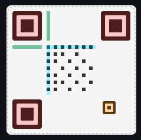

<aside>
🟥 Finder Pattern (3 góc)

3 hình vuông lồng nhau ở 3 góc của QR. Cho phép scanner nhận diện và định hướng QR code từ mọi góc độ, kể cả khi ảnh bị nghiêng hoặc méo. Đây là phần *quan trọng nhất* — scanner decode bắt đầu từ đây.

</aside>

<aside>
🟧 Alignment Pattern

Xuất hiện từ version 2 trở lên. Giúp scanner hiệu chỉnh lại khi QR bị biến dạng (cong, méo do chụp từ góc). Số lượng tăng theo version của QR code.

</aside>

<aside>
🟦 Timing Pattern

Chuỗi ô đen/trắng xen kẽ chạy ngang và dọc giữa 2 finder pattern. Giúp scanner xác định kích thước của module (ô vuông) và vị trí của data cells.

</aside>

<aside>
🟩 Format Information

Lưu trữ loại error correction (L/M/Q/H) và mask pattern được dùng. Scanner đọc thông tin này đầu tiên để biết cách giải mã phần dữ liệu.

</aside>

<aside>
⬛ Data & Error Correction

Phần còn lại của matrix chứa dữ liệu thực (URL, text...) đã được mã hóa Reed-Solomon. Error correction cho phép QR vẫn đọc được dù bị che khuất lên đến 30% diện tích.

</aside>

### 2.2 Các phiên bản (Version) và dung lượng

QR code có **40 version**, kích thước tăng từ 21×21 đến 177×177 module:

| Version | Kích thước | Dung lượng số | Dung lượng text | Dùng cho |
| --- | --- | --- | --- | --- |
| 1 | 21×21 | 41 | ~17 ký tự | Số điện thoại ngắn |
| 3 | 29×29 | 127 | ~53 ký tự | URL rút gọn |
| 7 | 45×45 | 510 | ~196 ký tự | URL thông thường |
| 10 | 57×57 | 914 | ~346 ký tự | URL dài + tham số |
| 20 | 97×97 | 3.391 | ~1.270 ký tự | Văn bản, thông tin |
| 40 | 177×177 | 7.089 | ~4.296 ký tự | Dữ liệu lớn |

### 2.3 Error Correction Level — chi tiết kỹ thuật quan trọng

| Level | Ký hiệu | Phục hồi được | Khi nào dùng |
| --- | --- | --- | --- |
| Low | L | ~7% | Môi trường sạch, in chất lượng cao |
| Medium | M | ~15% | Mặc định hầu hết ứng dụng |
| Quartile | Q | ~25% | Công nghiệp, có thể bị bẩn |
| **High** | **H** | **~30%** | **Logo nhúng vào QR, quảng cáo ngoài trời** |

> ⚠️ **Liên quan trực tiếp đến tấn công:** Kẻ tấn công tạo QR-in-QR **dùng ECC Level H** cho outer QR. Vì inner QR che khuất trung tâm outer QR (~25–30% diện tích), outer QR vẫn decode được nhờ Error Correction 30%.
> 

---

## 3. Ứng dụng thực tế và điểm yếu bảo mật

### 3.1 QR code được dùng ở đâu?

| Lĩnh vực | Ứng dụng cụ thể |
| --- | --- |
| Nhà hàng / F&B | Menu, đặt món, thanh toán |
| Thanh toán | VietQR, QR Pay, WeChat Pay, Alipay |
| Vé điện tử | Boarding pass, concert, sự kiện |
| Xác thực (MFA) | Google Authenticator setup, Signal device link |
| Logistics | Tracking, kho bãi, truy xuất nguồn gốc |
| Marketing | Link download app, landing page, danh thiếp |
| Y tế | Vaccine certificate, check-in bệnh viện |

### 3.2 Điểm yếu bảo mật vốn có — so sánh với hyperlink

| Đặc điểm | Hyperlink thông thường | QR Code |
| --- | --- | --- |
| Người dùng thấy URL trước khi truy cập | Có  | Không — bị ẩn hoàn toàn |
| Thiết bị xử lý | Máy tính (có EDR, proxy) | Điện thoại cá nhân (thường không có) |
| Bị chặn bởi email filter | URL được quét trực tiếp | Phải decode ảnh trước |
| Người dùng có thể kiểm tra | Copy URL, check domain | Không check trước khi quét |
| Thay đổi đích sau khi tạo | Chỉ nếu dùng redirect | Dễ qua URL shortener |
| Nhận thức người dùng về nguy cơ | Cao — được giáo dục nhiều | Thấp — thói quen "cứ quét" |

> **Điểm mù tâm lý:** Người dùng đã hình thành phản xạ quét QR mà không do dự (menu, vé, thanh toán). Kẻ tấn công khai thác chính phản xạ này — nhận QR từ email công ty → quét ngay.
> 

---

## 4. Quishing

**Quishing** (QR + Phishing) là kỹ thuật tấn công sử dụng mã QR để phân phối URL độc hại, dụ nạn nhân truy cập trang giả mạo nhằm đánh cắp thông tin đăng nhập hoặc dữ liệu tài chính.

### 4.1 Tại sao kẻ tấn công chọn QR thay vì URL trực tiếp?

1.  **Bypass email scanner**
URL dạng text bị email gateway quét và blocklist ngay lập tức. QR code là ảnh — hệ thống phải decode ảnh, extract URL, rồi mới phân tích. Một vài hệ thống bỏ qua hoàn toàn bước decode QR.
2.  **Chuyển sang thiết bị không được bảo vệ**
Quét QR = chuyển từ máy tính công ty (có EDR, proxy, policy) sang điện thoại cá nhân. Điện thoại cá nhân thường thiếu: endpoint security, corporate proxy, MDM enforcement.
3. **Không có URL preview**
Với hyperlink, người dùng hover để thấy URL trước khi click. Với QR điện thoại không thấy url trước khi quét. Điểm yếu này được khắc phục bằng 1 vài app cho ta thấy url sau khi quét sau đó mới quyết định vào hat không.
4. **Tận dụng thói quen đã hình thành**
Quét QR = hành động tự nhiên không cần suy nghĩ, giơ lên quét và vô. Attacker lợi dụng phản xạ này.

### 4.2 Timeline tiến hóa của Quishing

- **2021 — Giai đoạn sơ khai (0.8%)**
QR đơn giản nhúng URL trực tiếp trong email. Hầu hết scanner chưa xử lý được QR. Tấn công còn thủ công, chưa tự động hóa.
- **2023 — Bùng nổ (tăng 433%)**
PhaaS platforms (Tycoon 2FA, Greatness) tích hợp QR để bypass MFA qua AiTM. Executive bị nhắm 42 lần nhiều hơn nhân viên. 5.063 sự cố được ghi nhận chỉ trong tháng 6/2023.
- **2024 — QR trong PDF attachment**
Barracuda phát hiện hơn 500.000 email phishing nhúng QR trong PDF — thêm một tầng bypass. ASCII QR code (dùng ký tự Unicode thay ảnh) xuất hiện để qua mặt OCR scanner.
- **2025 — Thế hệ mới: Split QR & Nested QR-in-QR**
Gabagool PhaaS ra mắt Split QR (tách 2 ảnh). Tycoon 2FA triển khai Nested QR-in-QR. Đây là trọng tâm của bài nghiên cứu này.
- **2026 — AI-powered Quishing**
Tycoon 2FA bị triệt phá (3/2026). AI tự động hóa tạo nested QR cá nhân hóa. Quishing kết hợp deepfake audio/video. QR trong physical world (dán đè lên QR thật ở nhà hàng, ATM) mở rộng attack surface.
---
### 4.3 Phân tích kịch bản Quishing thực tế

Để hình dung rõ hơn sự nguy hiểm của Quishing trong môi trường doanh nghiệp, chúng ta hãy cùng mổ xẻ một cảnh báo thực tế được ghi nhận trên hệ thống SIEM thông qua bài lab **SOC251** của nền tảng huấn luyện LetsDefend.

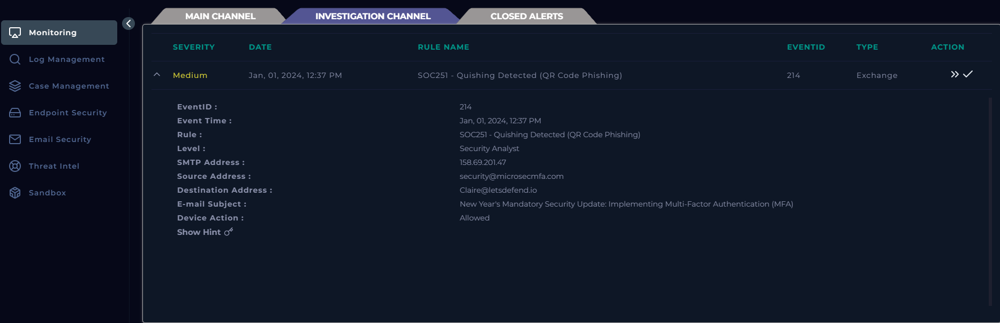

**Phân tích bề mặt cảnh báo (Alert Triage):**
Từ thông tin Ticket hiển thị, một SOC Analyst cần ngay lập tức khoanh vùng các trường dữ liệu tĩnh để thiết lập không gian và thời gian của cuộc tấn công. Đây là bước sống còn để định hướng điều tra:

- **Event Time:**  `Jan, 01, 2024, 12:37 PM`.
- **Destination Address:** `Claire@letsdefend.io`.
- **Source Address:** `security@microsecmfa.com`.
- **SMTP Address (IP Nguồn):** `158.69.201.47`.
- **E-mail Subject:** *"New Year's Mandatory Security Update: Implementing Multi-Factor Authentication (MFA)"*.
- **Device Action:** `Allowed`.

Tất cả những thông tin sau cần được ghi lại để tiến hành khám xét.

#### Khởi chạy Playbook và Xác minh cảnh báo (Verify)

Sau khi hoàn tất phân tích bề mặt, chuyên gia SOC không được phép hành động cảm tính mà phải bám sát theo một Sổ tay hướng dẫn xử lý sự cố (Incident Response Playbook / Handbook) đã được thiết kế sẵn cho kịch bản Phishing.

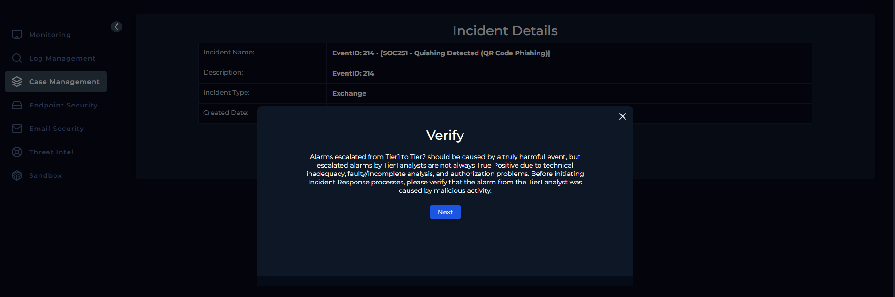

Hệ thống hiển thị một thông điệp cảnh báo rất rõ ràng: *"Escalated alarms by Tier1 analysts are not always True Positive..."*. Điều này nhắc nhở Tier 2 Analyst rằng: Trước khi thực hiện các hành động can thiệp sâu (như block IP, cách ly máy tính), chúng ta bắt buộc phải đi tìm **IOC (Indicator of Compromise)** để chứng minh đây là một cuộc tấn công thật sự.

Ngay sau khi xác nhận cần điều tra, Playbook yêu cầu SOC Analyst thực hiện một bước cực kỳ quan trọng: Kiểm tra dấu hiệu do thám mạng (Reconnaissance).

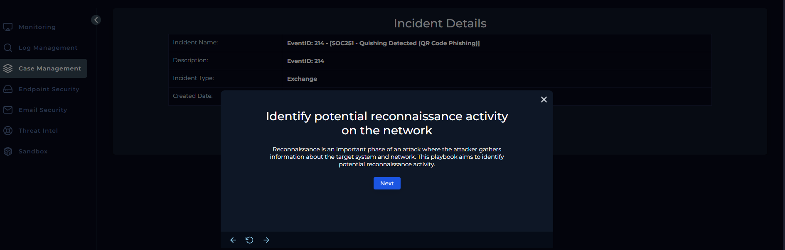

**Tại sao phải làm bước này trong một ca lừa đảo qua email?**
Trong các chiến dịch tấn công có chủ đích (APT), kẻ tấn công hiếm khi nhắm mắt gửi bừa. Chúng thường thực hiện scan hạ tầng mạng, tìm kiếm các cổng mở hoặc thu thập danh sách email trước khi thả payload. Việc kiểm tra bước này giúp SOC trả lời câu hỏi: *Đây là một email rác gửi hàng loạt hay một chiến dịch nhắm mục tiêu tinh vi?*

Trên hệ thống SIEM, chúng ta chuyển sang công cụ **Log Management** và thực hiện truy vấn với địa chỉ IP nguồn của kẻ tấn công: `158.69.201.47`.
Mục tiêu là tìm kiếm các kết nối mạng bất thường xuất phát từ IP này quét vào tường lửa hoặc máy chủ Web nội bộ trước mốc thời gian nhận email (12 : 37 PM).

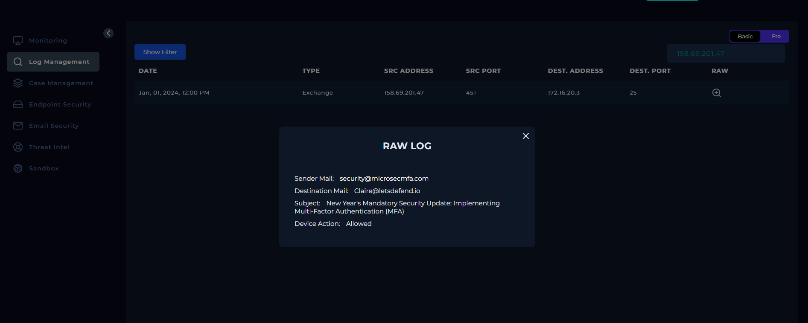

**Kết quả phân tích Log (Log Analysis Results):**
Khi thực hiện truy vấn địa chỉ IP `158.69.201.47` trên công cụ Log Management, hệ thống chỉ trả về record duy nhất.

Chi tiết bản ghi này cho thấy một bức tranh rất rõ ràng:

- Chỉ có một luồng giao tiếp duy nhất nhắm vào cổng `25` .
- Đích đến là máy chủ Email Exchange nội bộ của công ty (`172.16.20.3`).
- Hoàn toàn vắng bóng các log chặn bắt từ Firewall liên quan đến rà quét cổng hay dò tìm lỗ hổng web từ dải IP này.

**Kết luận:** Kẻ tấn công không hề đi dạo hay do thám hạ tầng mạng của chúng ta. Bọn chúng đã nhắm thẳng mục tiêu từ trước và thực hiện một đòn tấn công trực diện thông qua Phishing. Nút thắt của toàn bộ sự cố này nằm trọn vẹn bên trong nội dung bức thư.

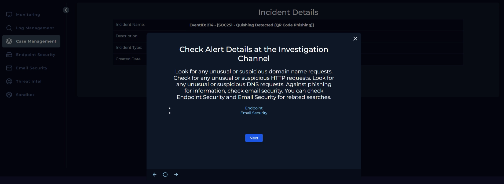

Sau khi loại trừ khả năng hệ thống bị rà quét từ bên ngoài, Playbook yêu cầu chúng ta tiến hành khám nghiệm hiện trường tại các kênh giao tiếp nội bộ, cụ thể là **Endpoint** và **Email Security**.

Đầu tiên khi check mail thì ta chỉ thấy Claire nhận 1 mail duy nhất 


Nhấn vô xem chi tiết ta có:


**Phân tích chiến thuật thao túng tâm lý:**
Đọc lướt qua nội dung bức thư sẽ dễ dàng nhận ra ngay kịch bản lừa đảo qua 2 yếu tố:

1. **Mạo danh uy tín:** Kẻ tấn công tự xưng là "The Microsoft team" kết hợp với tiêu đề "Multi Factor Authentication Setup" để tạo vỏ bọc hợp pháp.
2. **Đe dọa và thúc ép:** Dòng chữ chí mạng *"Failure to authenticate the security information will lead to loss of email privileges"* (Không xác thực sẽ dẫn đến mất quyền sử dụng email). Lời đe dọa này đánh trúng điểm yếu tâm lý của nhân viên văn phòng, ép họ phải cầm điện thoại lên quét mã ngay lập tức mà bỏ qua mọi sự nghi ngờ.

Vũ khí chính của kẻ tấn công là mã QR nằm chễm chệ giữa màn hình. Lúc này, nguyên tắc của mọi Blue Teamer được kích hoạt: **Tuyệt đối không sử dụng điện thoại cá nhân để quét các mã QR nghi ngờ trong quá trình điều tra.** Việc quét bằng camera cá nhân có thể khiến chính thiết bị của chuyên gia phân tích bị dính bẫy.

Ta sử dụng những trình decode qr để tiến hành giải mã


**Kết quả giải mã (Decoded Payload):**
Sau khi đưa bức ảnh qua công cụ phân tích tĩnh ta đã xác định được mã QR thực chất chứa một đường dẫn (URI):
`https://ipfs.io/ipfs/Qmbr8wmr41C35c3K2GfiP2F8YGzLhYpKpb4K66KU6mLmL4#`

Ta sử dụng virustotal để xem xét url trên


Từ những thông tin trên ta có thể suy ra trang web mà qr code dẫn tới khi quét là 1 trang web phishing và máy chủ thực sự đang host trang phishing có địa chỉ IP là `209.94.90.1`.


Để chắc chắn, chúng ta tiếp tục đưa IP `209.94.90.1` lên VirusTotal. Kết quả có 10/91 vendor bảo mật đánh dấu IP này là Malicious/Phishing.

Thử kiểm tra Log với địa chỉ web và địa chỉ ip mal trên trong Log thì không ghi nhận trường hợp nào. Có lẽ chỉ duy nhất mỗi Claire bị dính.

Oke giờ qua kiểm tra endpoint


Để củng cố kết luận với độ chắc chắn 100%, chúng ta tiến hành soi trực tiếp máy tính của nạn nhân thông qua module **Endpoint Security**.

- Truy cập vào máy trạm `Claire` (IP: `172.16.17.181`).
- Kiểm tra **Browser History**: Hoàn toàn không có dấu vết truy cập vào đường link IPFS lừa đảo.
- Kiểm tra **Processes  & Terminal History**: Không có bất kỳ tiến trình lạ hay mã độc nào được thực thi.

Có vẻ như Claire không hề mở URL phishing bằng máy tính công ty. Tuy nhiên, đây chính là sự nguy hiểm đáng sợ nhất của Quishing: **Nạn nhân thường dùng điện thoại di động cá nhân kết nối mạng 4g để quét mã.** Toàn bộ hành vi này nằm hoàn toàn ngoài vùng phủ sóng của các hệ thống giám sát mạng doanh nghiệp. Ta thực sự không thể biết chắc chắn liệu nạn nhân đã bị lừa nhập mật khẩu trên điện thoại hay chưa nếu chỉ nhìn vào log SIEM.

Đứng trước điểm mù này, quy trình xử lý sự cố bắt buộc chúng ta phải hành động dứt khoát:

Trên thực tế ta sẽ  gọi điện trực tiếp hoặc liên hệ qua kênh nội bộ an toàn với Claire để xác nhận tình trạng thao tác trên điện thoại cá nhân.

**Cách ly phòng ngừa (Containment):** Trong lúc chờ xác nhận, để đề phòng rủi ro tin tặc đã lấy được phiên đăng nhập (Session Token) và chuẩn bị xâm nhập, tôi quyết định bật chế độ **Containment** đối với máy trạm của nạn nhân.


**Tiêu hủy Payload:** Truy cập lại tab Email Security và thực thi lệnh Delete bức email mạo danh Microsoft, triệt tiêu hoàn toàn rủi ro lây lan.


Tiếp theo Playbook yêu cầu chúng ta xác định kỹ thuật Do thám (Reconnaissance) mà kẻ tấn công đã sử dụng. Dựa trên toàn bộ quá trình phân tích, lựa chọn chính xác ở đây là **Phishing for Information (T1598)**.


Hệ thống tiếp tục yêu cầu phân loại nguồn gốc của IP tấn công. Với địa chỉ ``158.69.201.47`` thu thập được từ Header của email, đây rõ ràng là một Public IP được định tuyến trên Internet.


Như chúng ta đã phân tích từ trước, địa chỉ IP ``158.69.201.47`` là nguồn trực tiếp phát tán email lừa đảo. Khi đối chiếu chéo IP này trên các nền tảng tình báo mối đe dọa như VirusTotal nó bị cộng đồng gắn cờ đe với các dấu hiệu của hành vi Spam/Phishing.


Trong môi trường doanh nghiệp thực tế, khi phát hiện một email lừa đảo, câu hỏi lớn nhất của đội ngũ SOC là: *"Liệu kẻ tấn công có gửi email này cho hàng loạt nhân viên khác không?"*.

Dựa vào các kết quả truy vấn IOC trên hệ thống:

- **Email Security:** Chỉ ghi nhận duy nhất một email độc hại gửi đến hòm thư của Claire. Không có chiến dịch phát tán diện rộng nào khác.
- **Log Management & Endpoint Security:** Hoàn toàn trống trơn, không có bất kỳ thiết bị nào trong công ty kết nối đến`209.94.90.1`.

Do đó, chúng ta tự tin kết luận rằng phạm vi ảnh hưởng của cuộc tấn công này rất hẹp, và không có thiết bị nào khác trong hệ thống bị đe dọa.


Tiếp tục theo sát Playbook, hệ thống đặt ra một câu hỏi định đoạt: *"Thiết bị có cần được cách ly để giảm thiểu hậu quả của cuộc tấn công không?".* Ta đã cách ly trước đó !!


Bước cuối cùng và mang lại giá trị dài hạn nhất cho doanh nghiệp chính là trả lời các câu hỏi trong bảng **Lesson Learned**.

- Cuộc tấn công đã xảy ra như thế nào? (How did it happen?)
- Nhân sự và hệ thống đã phản ứng ra sao? (Performance & Response)
- Hành động khắc phục để ngăn chặn trong tương lai? (Corrective Actions)
- Cần theo dõi các Dấu hiệu (Indicators) nào trong tương lai?


Oke đóng alert với lựa chọn “True Positive” thôi


Vậy là ta đã hoàn thành bài lab. Qua bài trên ta có thể thấy việc endpoint là thiết bị điện thoại cá nhân của nạn nhân sẽ gây ra rất nhiều khó khăn cho các nhà phân tích SOC vì không hề ghi lại log, qua đó ta cần hết sức cẩn thận với các thủ đoạn QR phishing.

---

## 5. Kỹ thuật QR-in-QR (Nested QR Code)

Oke với bài lab trước đó ta đã thấy nạn nhân nhận được mail chứa mã QR độc hại, nhưng thực tế hầu hết hệ thống mail sẽ scan ảnh QR trước nếu độc hại sẽ báo ngay và block ngay lập tức. Để bypass qua nó thì ta sẽ đến với kỹ thuật: **nhúng một mã QR độc hại bên trong hoặc xung quanh một mã QR hợp lệ**, tạo ra sự mơ hồ lừa được cả hệ thống bảo mật lẫn người dùng. Kỹ thuật này được xác nhận do **Tycoon 2FA PhaaS** triển khai trong thực tế.


### 5.1 Cấu trúc kỹ thuật

Outer QR (độc hại) + Inner QR (hợp lệ → google.com) = một ảnh duy nhất. Scanner email decode inner QR → thấy google.com → đánh dấu SAFE. Camera điện thoại người dùng decode outer QR → redirect đến trang phishing. **Cùng một ảnh, hai kết quả hoàn toàn khác nhau.**


### 5.2 Tại sao camera điện thoại đọc outer còn scanner đọc inner?

Đây là điểm mấu chốt kỹ thuật:

**Email scanner (phân tích tĩnh):** 

- Scanner quét từng hàng ngang từ trên xuống, tìm pattern 1: 1: 3: 1: 1 để xác định Finder Pattern. Khi gặp candidate, nó xác nhận thêm bằng cách quét dọc tại chính điểm đó — nếu chiều dọc cũng có 1: 1: 3: 1: 1 thì confirm là Finder Pattern thật, sau đó tiếp tục quét hàng tiếp theo. 

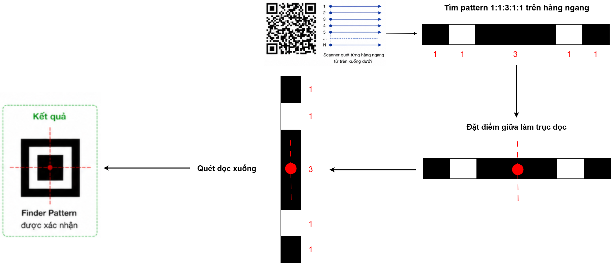

- Trong Nested QR-in-QR, scanner tìm được Finder Pattern của cả outer lẫn inner. Nhưng vì inner QR nhỏ và nằm ở giữa ảnh, 3 Finder Pattern của nó nằm gần nhau — scanner đủ 3 FP của inner tại row ~179. Outer QR trải rộng toàn ảnh, FP thứ 3 nằm tận row ~238. Scanner decode inner xong và trả về kết quả trước khi kịp tìm đủ 3 FP của outer.
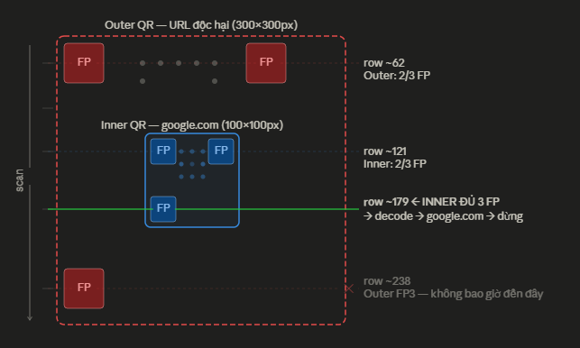

**Camera điện thoại:** 

- Nhận diện Bounding Box: Camera smartphone hiện đại (dùng Apple Vision hoặc Google ML Kit) không quét từng dòng pixel rập khuôn. AI phân tích toàn bộ khung hình, nhận diện 3 khối vuông lớn nhất ở rìa ngoài và lập tức vẽ một Bounding Box (khung giới hạn) bao trọn Outer QR làm mục tiêu chính.

- Cơ chế sửa lỗi Reed-Solomon (ECC Level H): AI đọc dải bit cấu hình tĩnh (Format Information) nằm sát các ô định vị ở rìa ngoài và biết được Outer QR này mang chuẩn sửa lỗi ECC Level H. Khi nhìn thấy Inner QR, hệ thống coi đó chỉ là một cục nhiễu phá vỡ lưới dữ liệu. Ngay lập tức, vi xử lý kích hoạt mức sửa lỗi phần cứng cao nhất (ECC Level H), sử dụng nội suy toán học để tự động khôi phục lên đến 30% diện tích bị thủng ở trung tâm. Nhờ đó, nó đọc trót lọt URL Phishing của Outer QR.

### 5.3 Luồng tấn công từng bước

- **Bước 1 — Chuẩn bị:**
Tạo outer QR (version cao, ECC Level H) chứa URL phishing. Tạo inner QR (finder pattern sắc nét, size ~30–35% outer). Paste inner vào trung tâm outer.
- **Bước 2 — Delivery:**
Email giả mạo Microsoft/DocuSign/Adobe + urgency ("hết hạn 24h"). QR thường nhúng trong PDF attachment để thêm một tầng bypass scanner.
- **Bước 3 — Scanner bị đánh lừa:**
Email security decode QR → thấy google.com → đánh dấu SAFE.
- **Bước 4 — Nạn nhân quét:**
Camera điện thoại đọc outer QR → redirect phishing → nhập credentials + MFA token.
- **Bước 5 — Account Takeover:**
AiTM proxy relay MFA token trong real-time trước khi hết hạn → chiếm quyền tài khoản.

### 5.4 Tại sao đây là bước ngoặt kỹ thuật?

QR-in-QR không chỉ là một kỹ thuật bypass thông thường — nó đảo ngược hoàn toàn logic bảo mật truyền thống: **thứ được xem là bằng chứng an toàn (inner QR → google.com) chính là vỏ bọc cho mối đe dọa thực**. Scanner không thể tin vào kết quả decode của chính nó nữa.

### 5.5 Thực nghiệm: Chế tạo và Vượt mặt Scanner (Proof of Concept)

Để minh chứng cho mức độ nguy hiểm của kỹ thuật này, chúng ta sẽ tự tay tạo ra một mã Nested QR và tiến hành kiểm thử nó trên cả hai góc nhìn: Hệ thống bảo mật (Scanner) và Người dùng cuối (Camera điện thoại).

#### 5.5.1. Xây dựng mã nguồn

Mục tiêu là nhúng một mã QR sạch (`google.com`) vào vùng an toàn của một mã QR độc hại (`malicious-phishing-site_Hoang_Do.com`). Điểm mấu chốt ở đây là lợi dụng khả năng sửa lỗi tối đa (ECC Level H - 30%) của mã bên ngoài.

Dưới đây là đoạn mã Python sử dụng thư viện `qrcode` và `Pillow` để thực hiện kỹ thuật cấy ghép (Splicing) này:

> *Lưu ý: Đoạn code dưới đây được cung cấp hoàn toàn vì mục đích nghiên cứu và giáo dục.*
> 

```python
import qrcode
from PIL import Image

def generate_nested_qr():
    # Tạo mã QR viền ngoài
    qr_outer = qrcode.QRCode(
        version=5,
        error_correction=qrcode.constants.ERROR_CORRECT_H,
        box_size=10,
        border=4,
    )
    qr_outer.add_data("https://malicious-phishing-site_Hoang_Do.com")
    qr_outer.make(fit=True)
    img_outer = qr_outer.make_image(fill_color="black", back_color="white").convert('RGB')

    # Tạo mã QR lõi bên trong
    qr_inner = qrcode.QRCode(
        version=1,
        error_correction=qrcode.constants.ERROR_CORRECT_L,
        box_size=4,
        border=2,
    )
    qr_inner.add_data("https://google.com")
    qr_inner.make(fit=True)
    img_inner = qr_inner.make_image(fill_color="black", back_color="white").convert('RGB')

    outer_w, outer_h = img_outer.size
    inner_w, inner_h = img_inner.size

    # Tính toán tọa độ tâm chính xác
    pos_x = (outer_w - inner_w) // 2
    pos_y = (outer_h - inner_h) // 2

    # Kiểm tra ngưỡng an toàn sửa lỗi (Diện tích Inner không được vượt quá 30% Outer)
    area_ratio = (inner_w * inner_h) / (outer_w * outer_h)
    print(f"Tỷ lệ diện tích che khuất: {area_ratio:.2%} (Ngưỡng an toàn là <= 30%)")

    if area_ratio <= 0.30:
        # Ghi đè pixel của mã Inner lên mã Outer
        img_outer.paste(img_inner, (pos_x, pos_y))
        img_outer.save("nested_qr_poc.png")
        print("Tạo mã QR in QR thành công! Hãy mở file nested_qr_poc.png để kiểm tra.")
    else:
        print("Cảnh báo: Mã Inner quá to, sẽ làm hỏng khả năng tự sửa lỗi của mã Outer!")

if __name__ == "__main__":
    generate_nested_qr()

```

Khi chạy script trên, hệ thống sẽ tự động tính toán tỷ lệ diện tích che khuất để đảm bảo không vượt quá ngưỡng 30% làm hỏng mã định vị. Kết quả, chúng ta thu được bức ảnh `nested_qr_poc.png` như sau:
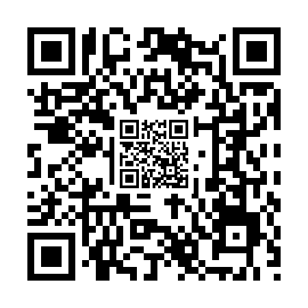

#### 5.5.2. Kiểm thử thực tế

Đây là lúc điều kỳ diệu (và đáng sợ) xảy ra. Cùng một bức ảnh, nhưng lại cho ra hai góc nhìn khác nhau.

**Góc nhìn 1: Email Security Scanner (Bị đánh lừa)** 

Giờ thử đã tải bức ảnh trên lên trang scan Qr bất kì thử, ở đây tôi dùng [ZXing.org](https://zxing.org/) — một trong những engine giải mã mã vạch tĩnh phổ biến nhất được nhiều hệ thống Email Gateway sử dụng.

- **Kết quả:** Thuật toán dò tìm nhanh chóng bắt được Finder Pattern của mã Inner ở trung tâm, giải mã ra `https://google.com` và dừng lại ngay lập tức.
- **Hậu quả:** Hệ thống đánh dấu email này là "SAFE" và chuyển thẳng vào Inbox của nạn nhân.

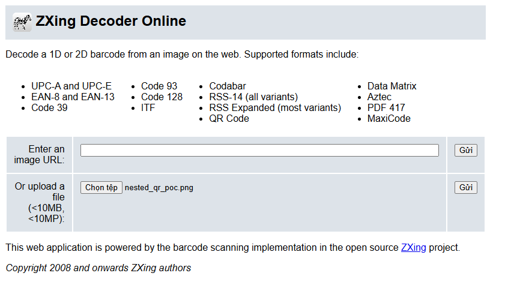

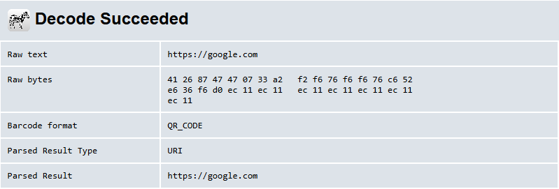

**Góc nhìn 2: Người dùng quét bằng điện thoại (Mắc bẫy)**

Bây giờ, hãy thử dùng ứng dụng Zalo hoặc Camera iPhone của bạn để quét chính bức ảnh PoC ở trên với khoảng cách vừa đủ.

- **Kết quả:** Nhờ thuật toán Auto-focus và khả năng sửa lỗi ECC Level H, điện thoại bỏ qua phần nhiễu ở lõi và nhận diện mã lớn bên ngoài. Một Pop-up hiện lên chuyển hướng bạn thẳng tới trang phishing. Thực tế nếu dí sát điện thoại vô thì khả năng vẫn bắt được qr ở giữa nhưng hầu hết sẽ bắt cả cái qr to bên ngoài thôi.
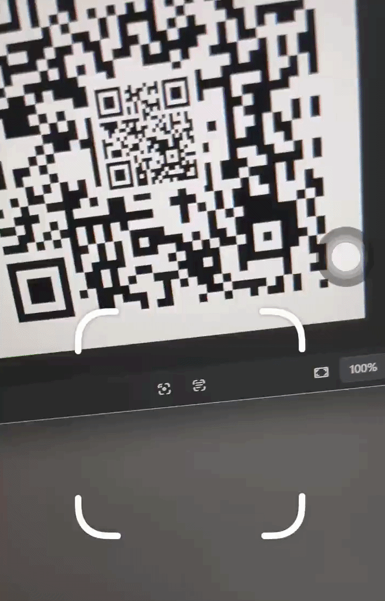
*(Bạn có thể đưa điện thoại lên quét thử)*

Qua thực nghiệm nhỏ này, chúng ta thấy rõ lỗ hổng hệ thống phân tích tĩnh khi Scanner không có khả năng nhận thức toàn cục như mắt người hoặc các mô hình AI Computer Vision, chúng dễ dàng bị qua mặt chỉ bằng vài dòng code cấy ghép đơn giản.

---

## 6. Hệ sinh thái kỹ thuật tấn công

QR-in-QR là kỹ thuật tinh vi nhất, nhưng nằm trong hệ sinh thái rộng hơn:

### 6.1 Split QR Code (Gabagool PhaaS)


**Cơ chế:** QR bị tách thành 2 ảnh PNG/JPEG riêng biệt, nhúng liên tiếp trong email HTML. Scanner thấy 2 ảnh độc lập (vô hại). Khi render trong email client, 2 ảnh ghép nhau thành QR hoàn chỉnh.

**Tại sao bypass:** Scanner email xử lý từng ảnh độc lập, không ghép vô nên hông có QR hoàn chỉnh để decode và kiểm tra URL.

#### Thực nghiệm: Tái hiện kịch bản Split QR

Để hiểu rõ cách Gabagool PhaaS qua mặt các bộ lọc email, chúng ta sẽ tự tay dựng lại một kịch bản phát tán Split QR đơn giản bằng Python. 

**Bước 1: Chặt đôi mã QR**

Chúng ta tạo một mã QR chứa payload và dùng thư viện `Pillow` để cắt nó thành 2 nửa hoàn hảo theo chiều dọc.

```python
import qrcode
from PIL import Image

def generate_split_qr():
    # Tạo một mã QR chứa link Phishing
    qr = qrcode.QRCode(
        version=2,
        error_correction=qrcode.constants.ERROR_CORRECT_M,
        box_size=10,
        border=4,
    )
    qr.add_data("https://duyhoang05.github.io/")
    qr.make(fit=True)
    img_qr = qr.make_image(fill_color="black", back_color="white").convert('RGB')

    # Lấy kích thước ảnh
    width, height = img_qr.size

    # Tính toán tọa độ để cắt đôi (Top và Bottom)
    box_top = (0, 0, width, height // 2)
    box_bottom = (0, height // 2, width, height)

    # Thực hiện cắt ảnh
    img_top = img_qr.crop(box_top)
    img_bottom = img_qr.crop(box_bottom)

    img_top.save("qr_top.png")
    img_bottom.save("qr_bottom.png")
    print("Đã cắt mã QR thành 2 phần: qr_top.png và qr_bottom.png")

if __name__ == "__main__":
    generate_split_qr()
```

**Bước 2: Cú lừa thị giác trên Email Client**

Vấn đề khó nhất của attacker không phải là cắt, mà là ghép. Nếu gửi 2 ảnh thông thường, các email client (Gmail, Outlook) sẽ tự động chèn các khoảng trắng giữa 2 ảnh, làm hỏng cấu trúc QR. Kẻ tấn công giải quyết việc này bằng việc nhúng CSS nội tuyến.

Dưới đây là đoạn script Python mô phỏng việc phát tán email chứa mã Split QR:

```python
import smtplib
from email.mime.multipart import MIMEMultipart
from email.mime.text import MIMEText
from email.mime.image import MIMEImage

# ── Cấu hình ──────────────────────────────────────────────
MY_EMAIL    = "############"
APP_PASS    = "#### #### ####" 
SEND_TO     = "############"
# ──────────────────────────────────────────────────────────

# Khởi tạo email
msg            = MIMEMultipart("related")
msg["Subject"] = "[Khẩn cấp] Yêu cầu cập nhật bảo mật tài khoản"
msg["From"]    = MY_EMAIL
msg["To"]      = SEND_TO

# HTML body (Kỹ thuật ép ảnh không khe hở)
html = """
<html>
<head>
    <style>
        /* CSS nội tuyến bắt buộc để triệt tiêu mọi khoảng trắng */
        body { font-family: sans-serif; padding: 20px; }
        .qr-wrapper {
            display: block; 
            line-height: 0;
            font-size: 0;
        }
        .qr-wrapper img {
            display: block;
            margin: 0; 
            padding: 0; 
            border: none;
            width: 250px;
        }
    </style>
</head>
<body>
    <h2>Yêu cầu xác thực MFA!</h2>
    <p>Vui lòng dùng điện thoại quét mã QR bên dưới để duy trì quyền truy cập:</p>
    
    <div class="qr-wrapper">
        
        
    </div>
    
    <p><em>*Nếu không phản hồi trong 24h, tài khoản sẽ bị khóa.</em></p>
</body>
</html>
"""
msg.attach(MIMEText(html, "html"))

# Hàm tiện ích để nhúng ảnh
def attach_inline_image(msg, file_path, cid):
    try:
        with open(file_path, "rb") as f:
            img = MIMEImage(f.read())
            img.add_header("Content-ID", f"<{cid}>")
            # Set disposition là inline để nó hiển thị trong nội dung, không phải đính kèm
            img.add_header("Content-Disposition", "inline", filename=file_path)
            msg.attach(img)
    except FileNotFoundError:
        print(f"Lỗi: Không tìm thấy file {file_path}. Hãy chạy script cắt ảnh trước!")
        exit(1)

# Đính kèm 2 nửa mã QR
attach_inline_image(msg, "qr_top.png", "qr_top_part")
attach_inline_image(msg, "qr_bottom.png", "qr_bottom_part")

# Thực thi gửi
print("Đang khởi tạo kết nối SMTP...")
try:
    with smtplib.SMTP_SSL("smtp.gmail.com", 465) as smtp:
        smtp.login(MY_EMAIL, APP_PASS)
        smtp.send_message(msg)
    print("Đã phát tán email Split QR! Kiểm tra hộp thư của bạn.")
except Exception as e:
    print(f"Lỗi gửi email: {e}")
```
**Kết quả thực tế:**
Khi nạn nhân mở email, CSS đã làm rất tốt nhiệm vụ của nó. Mắt thường và Camera điện thoại nhìn thấy một mã QR duy nhất, nguyên vẹn. Tuy nhiên, nếu chúng ta click vô sẽ thấy đây là 2 nửa tấm ảnh được ghép vào nhau
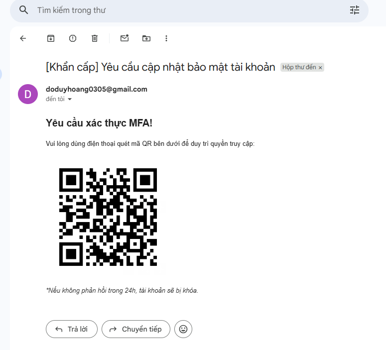
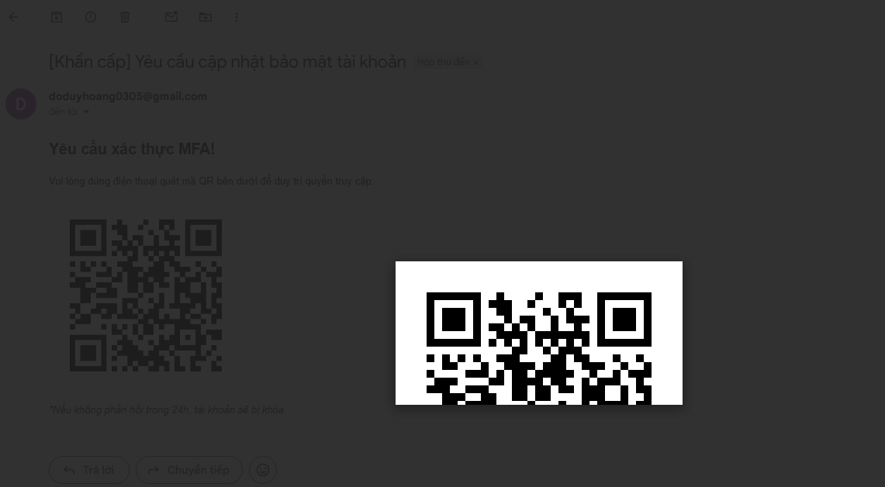
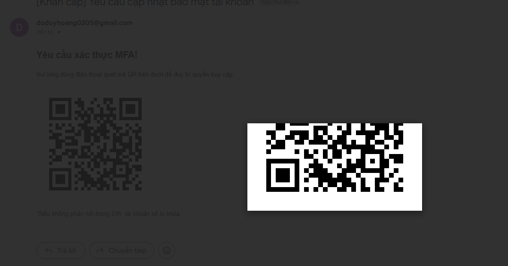

### 6.2 ASCII / UTF-8 QR Code

**Cơ chế:** QR được xây dựng từ ký tự Unicode block (█ ▀ ▄ ░ ▌...) thay vì file ảnh. OCR engine nhìn thấy text; mắt người nhìn thấy QR.

**Tại sao bypass:** Hầu hết email security scanner dùng image-based QR detection — tìm kiếm file ảnh trong email, extract, rồi decode. ASCII QR không phải file ảnh, không có `` tag, không có binary image data. Scanner xử lý nó như văn bản thuần túy và bỏ qua. 

**Hạn chế:** Kỹ thuật này phụ thuộc vào font rendering của email client. Gmail, Outlook và Apple Mail render font monospace khác nhau — tỷ lệ chiều rộng/chiều cao của ký tự có thể làm lệch module QR, khiến camera không quét được. Đây là lý do ASCII QR ít phổ biến hơn Split QR hay Nested QR trong các chiến dịch thực tế, chủ yếu được dùng kết hợp với các kỹ thuật khác.

### 6.3 QR + URL Shortener (Dynamic Redirect)

**Cơ chế:** QR code trỏ đến URL shortener (bit.ly, qr.io, rb.gy...) thay vì URL phishing trực tiếp. Điểm đặc biệt: URL shortener là **dynamic endpoint** — kẻ tấn công có thể thay đổi destination URL bất kỳ lúc nào sau khi email đã được gửi đi và nằm trong inbox nạn nhân.

**Tại sao bypass:** URL shortener sử dụng reputation của domain uy tín (bit.ly, qr.io đều có domain score cao). Tại thời điểm email scanner kiểm tra, đích là URL sạch → không bị flag. Sau khi email đã qua filter và vào inbox, kẻ tấn công mới kích hoạt phishing destination. Cơ chế time-delay này vô hiệu hóa hoàn toàn point-in-time URL scanning.

---

## 7. Case Studies thực tế

### Case 1: Sophos Employee Attack (2024)

**Bối cảnh:** Nhân viên Sophos — công ty an ninh mạng — nhận email giả về quyền lợi hưu trí.

**Diễn biến:** Email chứa PDF attachment với QR code và thông báo *"tài liệu hết hạn trong 24 giờ"*. Nhân viên quét QR bằng điện thoại cá nhân. Attacker relay MFA token **trong real-time** để truy cập ứng dụng nội bộ. Các kiểm soát bổ sung của Sophos ngăn được thiệt hại lớn hơn, nhưng credentials + MFA token đã bị đánh cắp thành công.

**Bài học:** Ngay cả nhân viên công ty bảo mật cũng bị lừa. Urgency (24h) + PDF attachment + QR là combo social engineering cực kỳ hiệu quả.

Đọc thêm tại: [https://www.sophos.com/en-us/blog/quishing](https://www.sophos.com/en-us/blog/quishing)

---

### Case 2: Microsoft Password Reset — Gabagool Split QR (2025)

**Bối cảnh:** Barracuda threat analysts phát hiện và phân tích chiến dịch này từ các mẫu email phishing trong cơ sở dữ liệu của họ, công bố tháng 8/2025.

**Diễn biến:** Gabagool PhaaS triển khai kỹ thuật Split QR trong chiến dịch giả mạo thông báo "password reset" của Microsoft. Kỹ thuật tách QR thành 2 ảnh riêng biệt nhúng trong email — khi email security scanner quét, chúng thấy 2 ảnh riêng lẻ trông bình thường thay vì 1 QR hoàn chỉnh. Với người nhận, QR trong email trông hoàn chỉnh và có thể quét được, dẫn đến trang phishing thu thập Microsoft credentials. Khi kiểm tra HTML source mới thấy rõ đây là 2 ảnh khác nhau được đặt sát nhau. 

Đọc thêm tại: [https://cybersecurityasia.net/barracuda-split-nested-qr-codes-detection](https://cybersecurityasia.net/barracuda-split-nested-qr-codes-detection/)

---

### Case 3:  Dán đè mã QR tại cửa hàng — Bắc Ninh (4/2026)

**Bối cảnh:** Cơ quan Cảnh sát điều tra Công an tỉnh Bắc Ninh khởi tố và tạm giam Nguyễn Duy Minh (SN 2004) và Tướng Đình Trực (SN 2007), cùng trú tại Lào Cai, về tội lừa đảo chiếm đoạt tài sản. 

**Diễn biến:** Minh in sẵn mã QR tài khoản ngân hàng của mình, sau đó rủ Trực dán đè lên các mã QR thanh toán tại nhiều cửa hàng trên địa bàn tỉnh Bắc Ninh. Khi khách hàng quét mã để thanh toán, tiền không chuyển đến chủ cửa hàng mà chuyển vào tài khoản của Minh. 

**Thiệt hại:** Chỉ trong 4 ngày (tháng 4/2026), tài khoản Minh ghi nhận 86 giao dịch từ nhiều tài khoản khác nhau, tổng cộng hơn 6,4 triệu đồng. 

**Điểm đáng chú ý:** Case này khác với các case quốc tế ở chỗ không cần kỹ thuật tinh vi — chỉ cần in QR và dán đè. Công an Hà Nội cảnh báo người dân tuyệt đối không quét mã QR không rõ nguồn gốc, đặc biệt tại nơi công cộng, và phải kiểm tra kỹ mã QR tại điểm thanh toán để đảm bảo không bị can thiệp. Tại Việt Nam, nơi thanh toán QR đã trở thành thói quen từ hàng rong đến siêu thị, đây là attack surface rộng nhất và dễ khai thác nhất.

---

### Lưu ý về Nested QR-in-QR

Không giống Split QR (đã được xác nhận 
trong chiến dịch Gabagool 2025), Nested 
QR-in-QR hiện được ghi nhận ở dạng mẫu 
email phân tích bởi Barracuda Networks — 
chưa có case study end-to-end được công bố 
công khai.

---

## 8. Chiến lược phòng thủ

**Multimodal AI + Multi-pass QR Scanning**

Email scanner truyền thống chỉ decode QR một lần → thất bại hoàn toàn trước Split QR và Nested QR. Giải pháp hiện đại hoạt động theo 3 lớp:

- **Nhìn như người:** AI phân tích toàn bộ email — nhận ra QR dù là ảnh PNG, ký tự ASCII, hay nằm trong PDF. Không chỉ tìm file ảnh mà hiểu ngữ cảnh xung quanh.
- **Quét nhiều góc:** Scan toàn ảnh + 4 góc + vùng trung tâm. Nếu center scan tìm được URL khác full-image scan → phát hiện Nested QR.
- **Mở URL thật:** Thay vì chỉ so blocklist, mở URL trong browser thật trong môi trường cô lập — có fingerprint hợp lệ, vượt qua được Cloudflare Turnstile, thấy được nội dung phishing thực sự.

Đọc thêm tại: [https://blog.barracuda.com/2025/08/20/threat-spotlight-split-nested-qr-codes-quishing-attacks](https://blog.barracuda.com/2025/08/20/threat-spotlight-split-nested-qr-codes-quishing-attacks)

**Mobile Device Management (MDM) + Zero Trust**

Áp dụng Zero Trust cho thiết bị cá nhân. URL filtering trên mobile kiểm tra trước khi mở browser, bất kể URL đến từ QR, SMS, hay email.

Đọc thêm tại: [https://www.sophos.com/en-us/blog/quishing](https://www.sophos.com/en-us/blog/quishing)

**FIDO2 / Passkeys — giải pháp kỹ thuật mạnh nhất**

MFA truyền thống (TOTP, SMS) bị bypass vì token có thể relay. FIDO2 và Passkeys giải quyết tận gốc bằng một nguyên lý đơn giản: **token được bind với origin domain**, không thể dùng ở domain khác.

Kể cả khi nạn nhân bị lừa vào trang phishing hoàn hảo — giao diện giống hệt Microsoft 365, có HTTPS, có logo đầy đủ — FIDO2 key vẫn từ chối xác thực vì origin domain không khớp. Đây là điểm khác biệt căn bản: bảo vệ ở tầng cryptographic, không phụ thuộc vào nhận thức người dùng.

Đọc thêm tại: [https://www.sophos.com/en-us/blog/strengthening-authentication-with-passkeys-a-ciso-playbook](https://www.sophos.com/en-us/blog/strengthening-authentication-with-passkeys-a-ciso-playbook)

---

## 9. Kết luận và xu hướng 2026

### Ý nghĩa chiến lược

QR-in-QR đánh dấu một bước ngoặt: kẻ tấn công không chỉ giấu payload độc hại mà còn **chủ động dùng nội dung hợp lệ làm lá chắn** cho mối đe dọa thực. Đây là logic đảo ngược hoàn toàn giả định bảo mật truyền thống — scanner không thể tin vào kết quả decode của chính nó nữa.

Với thương mại hóa qua PhaaS ($100/tháng), kỹ thuật từng chỉ thuộc tầm với APT groups nay phổ cập cho bất kỳ kẻ tấn công nào.

### Sự kiện Tycoon 2FA (3/2026)

Liên minh quốc tế triệt phá Tycoon 2FA là chiến thắng đáng kể. Nhưng lịch sử an ninh mạng cho thấy: mỗi khi một PhaaS bị hạ, platform thay thế xuất hiện trong vài tuần với kỹ thuật cải tiến hơn.

### Xu hướng dự báo 2026–2027

**AI-generated Quishing:** AI tự động hóa tạo nested QR cá nhân hóa theo OSINT (LinkedIn profile, công ty, chức vụ). Email phishing không còn generic mà hyper-personalized.

**Quishing + Deepfake:** Video deepfake CEO/quản lý yêu cầu nhân viên quét QR "khẩn cấp". Kết hợp social engineering mạnh nhất với kỹ thuật bypass tinh vi nhất.

**QR trong physical world:** Mã QR dán đè lên QR hợp lệ tại nhà hàng, ATM, trạm xe bus — attack surface mở rộng ra ngoài email.

**Mobile-first targeting:** Tấn công chuyển hướng sang hệ sinh thái mobile — deep links vào banking apps, crypto wallets, ứng dụng nhắn tin.

---

### Thuật ngữ

| Thuật ngữ | Định nghĩa |
| --- | --- |
| **Quishing** | QR + Phishing — tấn công phishing dùng QR code độc hại |
| **AiTM** | Adversary-in-the-Middle — kẻ tấn công đứng giữa nạn nhân và server thật |
| **PhaaS** | Phishing-as-a-Service — nền tảng cho thuê công cụ phishing |
| **Nested QR / QR-in-QR** | QR độc hại nhúng bên trong/xung quanh QR hợp lệ |
| **Split QR** | QR tách thành 2+ ảnh riêng để bypass scanner |
| **Session Cookie Theft** | Đánh cắp cookie xác thực để chiếm tài khoản không cần mật khẩu |
| **False Negative** | Scanner báo "safe" nhưng thực tế nội dung độc hại |
| **FIDO2 / Passkeys** | Tiêu chuẩn xác thực bound với origin domain, không thể relay qua AiTM |
| **ECC Level H** | Error Correction High — QR chịu được che khuất 30% và vẫn decode được |

---

*Blog này được viết cho mục đích nghiên cứu bảo mật và giáo dục.*