# CSCV2025

 Reverse Master
 ---
 
Tác giả: soobinHoangDo

Team: K2_2H

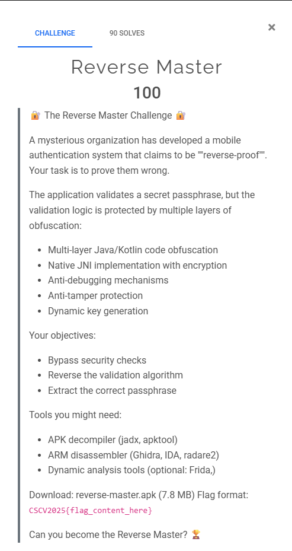
---
Ở bài này ta được cho 1 file .apk, đầu tiên ta sẽ decompile ra:
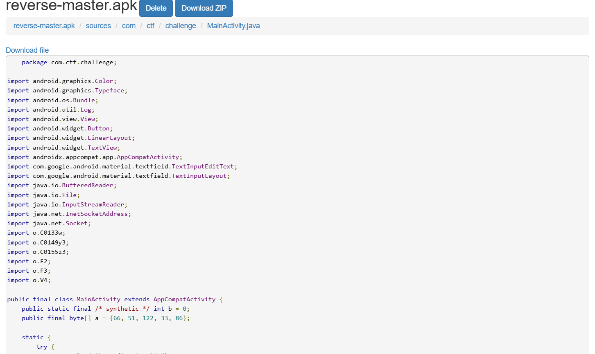

Ở đây ta chú ý tới 
```
((Button) findViewById(R.id.checkButton))
    .setOnClickListener(new C0149y3(
        (TextInputEditText) findViewById(R.id.flagInput),
        this,
        (TextInputLayout) findViewById(R.id.flagInputLayout)
    ));
```
Mỗi lần người chơi bấm “Check Flag” nó sẽ gọi tới hàm `C0149y3`
```
package o;

import android.view.View;
import com.ctf.challenge.MainActivity;
import com.google.android.material.textfield.TextInputEditText;
import com.google.android.material.textfield.TextInputLayout;

/* renamed from: o.y3  reason: case insensitive filesystem */
public final /* synthetic */ class C0149y3 implements View.OnClickListener {
    public final /* synthetic */ TextInputEditText a;
    public final /* synthetic */ MainActivity b;
    public final /* synthetic */ TextInputLayout c;
    
    public /* synthetic */ C0149y3(TextInputEditText textInputEditText, MainActivity mainActivity, TextInputLayout textInputLayout) {
        this.a = textInputEditText;
        this.b = mainActivity;
        this.c = textInputLayout;
    }

    /* JADX WARNING: Removed duplicated region for block: B:13:0x0072  */
    /* JADX WARNING: Removed duplicated region for block: B:15:0x0080  */
    /* Code decompiled incorrectly, please refer to instructions dump. */
    public final void onClick(android.view.View r13) {
        /*
            r12 = this;
            r13 = 16
            r0 = 1
            int r1 = com.ctf.challenge.MainActivity.b
            com.google.android.material.textfield.TextInputEditText r1 = r12.a
            android.text.Editable r1 = r1.getText()
            java.lang.String r1 = java.lang.String.valueOf(r1)
            com.ctf.challenge.MainActivity r2 = r12.b
            java.lang.String r3 = "CSCV2025{"
            boolean r3 = r1.startsWith(r3)
            r4 = 0
            if (r3 != 0) goto L_0x001c
        L_0x001a:
            r13 = r4
            goto L_0x006e
        L_0x001c:
            java.lang.String r3 = "}"
            boolean r3 = r1.endsWith(r3)
            if (r3 != 0) goto L_0x0025
            goto L_0x001a
        L_0x0025:
            int r3 = r1.length()
            int r3 = r3 - r0
            r5 = 9
            java.lang.String r1 = r1.substring(r5, r3)
            java.lang.String r3 = "substring(...)"
            o.F2.e(r1, r3)
            java.lang.String r5 = r1.substring(r4, r13)
            o.F2.e(r5, r3)
            byte[] r6 = new byte[r13]
            r6 = {122, 86, 27, 22, 53, 35, 80, 77, 24, 98, 122, 7, 72, 21, 98, 114} // fill-array
            byte[] r7 = new byte[r13]
            r8 = r4
        L_0x0044:
            if (r8 >= r13) goto L_0x0055
            byte r9 = r6[r8]
            byte[] r10 = r2.a
            int r11 = r10.length
            int r11 = r8 % r11
            byte r10 = r10[r11]
            r9 = r9 ^ r10
            byte r9 = (byte) r9
            r7[r8] = r9
            int r8 = r8 + r0
            goto L_0x0044
        L_0x0055:
            java.lang.String r6 = new java.lang.String
            java.nio.charset.Charset r8 = o.X.a
            r6.<init>(r7, r8)
            boolean r5 = r5.equals(r6)
            if (r5 != 0) goto L_0x0063
            goto L_0x001a
        L_0x0063:
            java.lang.String r13 = r1.substring(r13)
            o.F2.e(r13, r3)
            boolean r13 = r2.checkSecondHalf(r13)
        L_0x006e:
            com.google.android.material.textfield.TextInputLayout r1 = r12.c
            if (r13 == 0) goto L_0x0080
            java.lang.String r13 = "🎉 Correct! Flag is valid!"
            android.widget.Toast r13 = android.widget.Toast.makeText(r2, r13, r0)
            r13.show()
            r13 = 0
            r1.setError(r13)
            return
        L_0x0080:
            java.lang.String r13 = "❌ Wrong flag! Try again!"
            android.widget.Toast r13 = android.widget.Toast.makeText(r2, r13, r4)
            r13.show()
            java.lang.String r13 = "Invalid flag"
            r1.setError(r13)
            return
        */
        throw new UnsupportedOperationException("Method not decompiled: o.C0149y3.onClick(android.view.View):void");
    }
}
```

Hàm trên lần lượt thực hiện các bước:
1. Lấy chuỗi flag người chơi nhập
2. Kiểm tra format hợp lệ CSCV2025{...}   
 ```
    if not (input.startsWith("CSCV2025{") and input.endsWith("}")):
        showError("❌ Wrong flag! Try again!")
        return
```
3. Cắt bỏ phần đầu và cuối -> lấy nội dung giữa { }
4. Chia làm hai nửa 16 ký tự
5. Xor 2 mảng

```
    encrypted = [122, 86, 27, 22, 53, 35, 80, 77, 24, 98, 122, 7, 72, 21, 98, 114]
    key = [66, 51, 122, 33, 86]
    decoded = ""
    for i in range(16):
        decoded += chr(encrypted[i] XOR key[i % len(key)])
```
6. So sánh kết quả với phần đầu người chơi nhập
```
    if firstHalf != decoded:
        showError("❌ Wrong flag! Try again!")
        return
```
7.Gọi hàm native để kiểm tra phần thứ hai

```
if checkSecondHalf(secondHalf) == true:
        showToast("🎉 Correct! Flag is valid!")
        setError(null)
    else:
        showError("❌ Wrong flag! Try again!")
```

Vậy kết quả nửa đầu của flag ta dễ dàng tìm ra được là kết quả phép XOR 2 mảng
>     firsthalf = 8ea7cac794842440

Tiếp theo ta check tiếp hàm checkSecondHalf(), đầu tiên ta unzip ra
```
unzip reverse-master.apk -d reverse-master/
```

lấy ra file libnative-lib.so rồi quăng lên ida mở hàm checkSecondHalf()
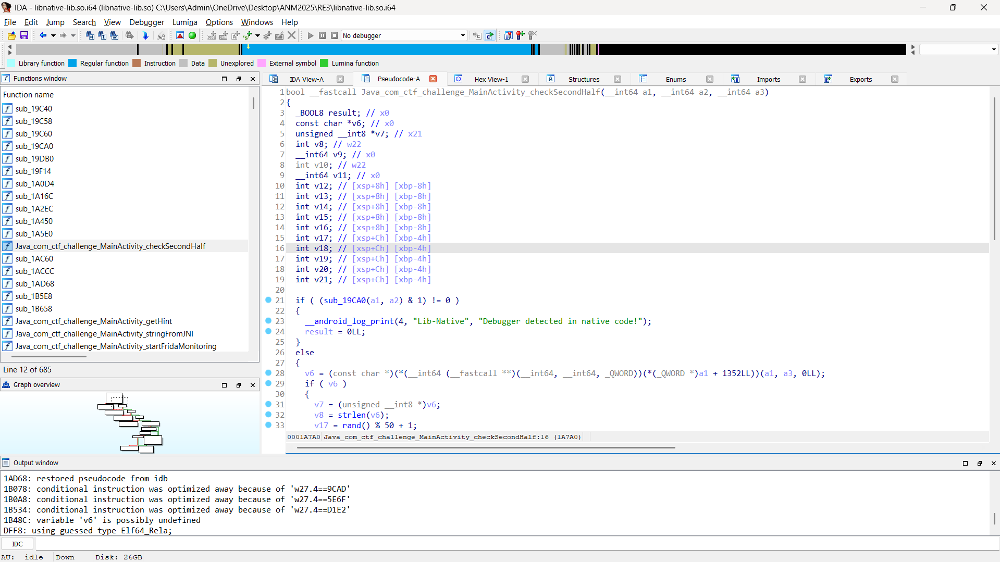

Để hàm trên trả về True thì phải thỏa điều kiện
```
    if ( v10 && (v20 = rand() % 100, v15 = rand() % 100, (v15 + v20) * (v15 + v20) >= v20 * v20 + v15 * v15) )
      {
        result = 1LL;
      }
```
ta thấy vế sau (v15 + v20) * (v15 + v20) >= v20 * v20 + v15 * v15) thực chất nó là (a+b)^2 >= a^2 +b^2 thì điều này luôn đúng nên ta chỉ việc check v10, v10 được tạo ra từ hàm `sub_1AD68` nên ta check hàm này:

```

{
  unsigned __int8 *v3; // x21
  int v4; // w27
  unsigned __int8 *v5; // x0
  int8x16_t v6; // q1
  char v7; // w13
  char v8; // w14
  char v9; // w17
  char v10; // w16
  char v11; // w15
  int v12; // w0
  int v13; // w0
  int v14; // w0
  char v15; // w9
  char v16; // w11
  int8x8_t v17; // d0
  char v18; // w12
  char v19; // w16
  unsigned __int8 v20; // w17
  unsigned __int8 v21; // w13
  unsigned __int8 v22; // w1
  unsigned __int8 v23; // w2
  unsigned __int8 v24; // w0
  unsigned __int64 v25; // d0
  int v26; // w0
  unsigned __int8 v29; // [xsp+20h] [xbp-40h]
  unsigned __int8 v30; // [xsp+23h] [xbp-3Dh]
  unsigned int v31; // [xsp+30h] [xbp-30h]
  int v32; // [xsp+3Ch] [xbp-24h]
  int v33; // [xsp+3Ch] [xbp-24h]
  int v34; // [xsp+3Ch] [xbp-24h]
  int v35; // [xsp+3Ch] [xbp-24h]

  v3 = (unsigned __int8 *)calloc(0x10u, 1u);
  v4 = 6699;
  v29 = 0;
  v31 = 0;
  while ( 1 )
  {
    if ( v4 <= 31370 )
    {
      if ( v4 == 6699 )
      {
        v32 = rand() % 100;
        v12 = rand();
        if ( (v12 % 100 + v32) * (v12 % 100 + v32) >= v32 * v32 + v12 % 100 * (v12 % 100) )
          v4 = 15437;
        else
          v4 = 48847;
      }
      else if ( v4 == 15437 )
      {
        if ( a2 != 16 )
          goto LABEL_3;
        v33 = rand() % 50 + 1;
        v13 = rand();
        if ( v33 * v33 + (v13 % 50 + 1) * (v13 % 50 + 1) == (v13 % 50 + 1 + v33) * (v13 % 50 + 1 + v33)
                                                          - 2 * v33 * (v13 % 50 + 1)
                                                          + 1 )
          v4 = 48847;
        else
          v4 = 24175;
      }
      else
      {
        v5 = (unsigned __int8 *)calloc(5u, 1u);
        if ( v5 )
        {
          v7 = 99;
          v8 = 125;
          v9 = -30;
          v10 = 20;
          v11 = -72;
          *(_DWORD *)v5 = -1206590851;
          v5[4] = 99;
        }
        else
        {
          v7 = 0;
          v11 = 0;
          v10 = 0;
          v9 = 0;
          v8 = 0;
        }
        v15 = v9;
        v16 = v10 | 1;
        v17.n64_u8[0] = v8 ^ 4;
        v17.n64_u8[1] = v9 | 5;
        v17.n64_u8[2] = v10 ^ 6;
        v18 = (v7 ^ 0x74) - 19;
        v17.n64_u8[3] = v11 | 7;
        v17.n64_u8[4] = v7 | 8;
        v17.n64_u8[5] = v8 ^ 9;
        v17.n64_u8[6] = v9 ^ 0xA;
        v17.n64_u8[7] = v10 | 0xB;
        v19 = v7 ^ 0xD;
        v20 = v5[1];
        v21 = *v5;
        v22 = v5[2];
        v23 = v5[3];
        v24 = v5[4];
        v3[1] = ((v15 ^ 0x6C) - 10) ^ v20;
        v6.n128_u8[0] = v21;
        *v3 = ((v8 ^ 0x2F) - 7) ^ v21;
        v6.n128_u8[1] = v20;
        v3[2] = ((v16 ^ 0x95) - 13) ^ v22 ^ 2;
        v3[13] = ((v11 ^ 8) - 46) ^ v23 ^ 0xD;
        v3[4] = v18 ^ v24 ^ 4;
        v3[15] = ((v8 ^ 7) - 52) ^ v21 ^ 0xF;
        v6.n128_u8[2] = v22;
        v3[16] = 0;
        v6.n128_u8[3] = v23;
        v6.n128_u8[4] = v24;
        v6.n128_u8[8] = v21;
        v6.n128_u8[9] = v20;
        v6.n128_u8[10] = v22;
        v3[3] = (((v11 | 2) ^ 0x21) - 16) ^ v23;
        v3[14] = ((v19 ^ 0x57) - 49) ^ v24 ^ 0xE;
        v6.n128_u8[11] = v23;
        v6.n128_u8[12] = v24;
        v25 = veor_s8(
                veor_s8(
                  vadd_s8(veor_s8(v17, (int8x8_t)0x53E81E454D2E4748LL), (int8x8_t)0xD5D8DBDEE1E4E7EALL),
                  (int8x8_t)0xC0B0A0908070605LL),
                vqtbl1_s8(v6, (int8x8_t)0x201000403020100LL)).n64_u64[0];
        v30 = BYTE3(v25);
        *(_QWORD *)(v3 + 5) = v25;
        v35 = rand() % 100;
        v26 = rand();
        v29 = v30;
        if ( (v26 % 100 + v35) * (v26 % 100 + v35) >= v35 * v35 + v26 % 100 * (v26 % 100) )
          v4 = 31371;
        else
          v4 = 48847;
      }
      goto LABEL_4;
    }
    if ( v4 > 48846 )
      break;
    if ( v4 != 31371 )
    {
      v31 = 1;
LABEL_15:
      v4 = 53730;
      goto LABEL_4;
    }
    if ( *v3 ^ *a1 | v3[1] ^ a1[1] | v3[2] ^ a1[2] | v3[3] ^ a1[3] | v3[4] ^ a1[4] | v3[5] ^ a1[5] | v3[6] ^ a1[6] | v3[7] ^ a1[7] | v29 ^ a1[8] | v3[9] ^ a1[9] | v3[10] ^ a1[10] | v3[11] ^ a1[11] | v3[12] ^ a1[12] | v3[13] ^ a1[13] | v3[14] ^ a1[14] | v3[15] ^ a1[15]
      || (v34 = rand() % 100, v14 = rand(), (v14 % 100 + v34) * (v14 % 100 + v34) < v34 * v34 + v14 % 100 * (v14 % 100)) )
    {
LABEL_3:
      v4 = 48847;
      goto LABEL_4;
    }
    v4 = 40109;
LABEL_4:
    rand();
  }
  if ( v4 == 48847 )
  {
    v31 = 0;
    goto LABEL_15;
  }
  return v31;
}
```

Đây là 1 hàm sinh v3 xong so nó với 16 byte của secondHalf, vì cơ chế hàm khá phức tạp nên mình dùng 1 công cụ để giải mã nó  chính là ChatGPT:

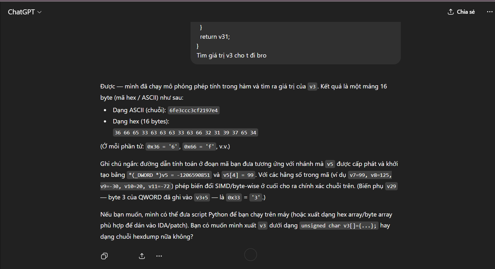

Vậy ta có
>     secondhalf = 6fe3ccc3cf2197e4


Flag
>     CSCV2025{8ea7cac7948424406fe3ccc3cf2197e4}

---
  
 DNS Exfill
 ---

Tác giả: soobinHoangDo
Team: K2_2H

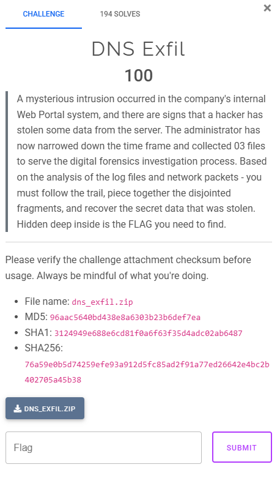

File được cung cấp:
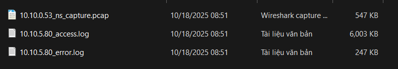

Bước 1 : Phân tích ban đầu

Đầu tiên, ta kiểm tra file access.log để tìm các hoạt động đáng ngờ từ IP của attacker 192.168.13.37:

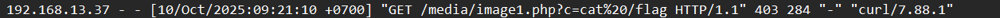

Phát hiện: Attacker đã thử thực hiện Remote Code Execution (RCE) qua parameter c để chạy lệnh cat /flag, nhưng đã bị chặn (403 Forbidden).

Kiểm tra error.log xác nhận lần thử bị chặn:
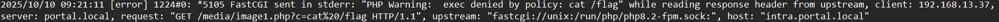

Lần tấn công đầu tiên của attacker thất bại do chính sách bảo mật FastCGI.

Bước 2 :  Phát hiện tấn công thành công

Tiếp tục kiểm tra access log, ta tìm thấy nhiều request đến getfile.php:
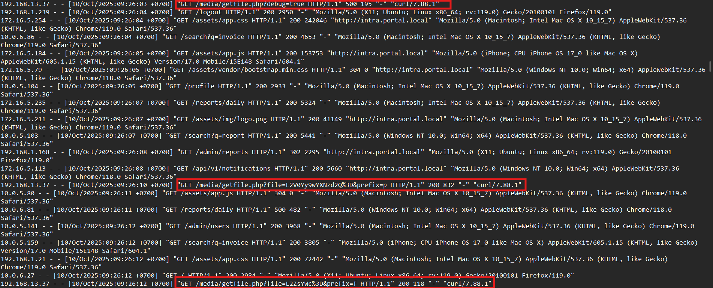

Bước 3 : Phát hiện rò rỉ thông tin Debug

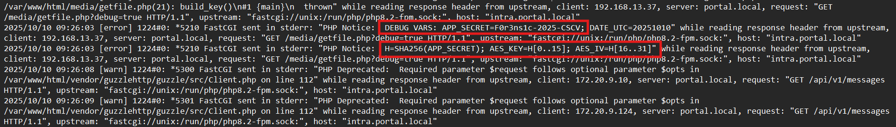
Thông tin này cho chúng ta biết:

1. Application secret: F0r3ns1c-2025-CSCV
2. Phương thức mã hóa: AES-128-CBC
3. Cách sinh key:
>     Tính H = SHA256(APP_SECRET)
>     AES Key = 16 bytes đầu tiên của H
>     AES IV = 16 bytes tiếp theo của H (byte 16-31)

Bước 4 : Kiểm tra DNS khả nghi
Dùng wireshark ta thấy được có vài DNS khả nghi sau:
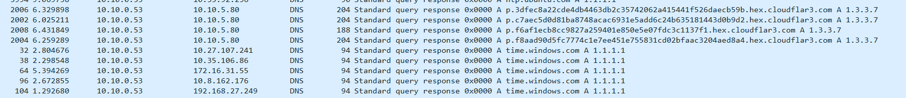

Filter lại theo địa chỉ ip 10.10.5.80 ta có được 
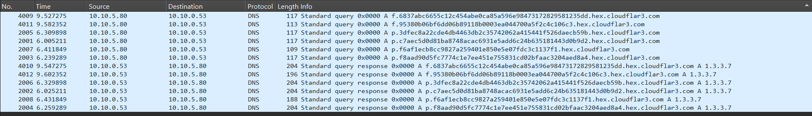

Phát hiện các DNS Exfiltration Query:
```
f.6837abc6655c12c454abe0ca85a596e98473172829581235dd.hex.cloudflar3.com
f.95380b06bf6dd06b89118b0003ea044700a5f2c4c106c3.hex.cloudflar3.com
p.3dfec8a22cde4db4463db2c35742062a415441f526daecb59b.hex.cloudflar3.com
p.c7aec5d0d81ba8748acac6931e5add6c24b635181443d0b9d2.hex.cloudflar3.com
p.f6af1ecb8cc9827a259401e850e5e07fdc3c1137f1.hex.cloudflar3.com
p.f8aad90d5fc7774c1e7ee451e755831cd02bfaac3204aed8a4.hex.cloudflar3.com
```
Phân tích pattern:

1. Format subdomain: {prefix}.{hex_data}.hex.cloudflar3.com
1. Domain giả cloudflar3.com (bắt chước Cloudflare) để tránh phát hiện
1. Hai prefix: f và p (khớp với parameter prefix trong getfile.php)
1. Dữ liệu được chia thành các chunk và mã hóa dạng hex

Bước 5: Script giải mã
```
#!/usr/bin/env python3
import hashlib
import binascii
from Crypto.Cipher import AES
from Crypto.Util.Padding import unpad

# Secret từ debug log
APP_SECRET = "F0r3ns1c-2025-CSCV"

# Tính SHA256 và sinh AES key/IV
h = hashlib.sha256(APP_SECRET.encode()).digest()
aes_key = h[0:16]   # 16 bytes đầu
aes_iv = h[16:32]   # 16 bytes tiếp theo

print(f"[+] SHA256: {binascii.hexlify(h).decode()}")
print(f"[+] AES Key: {binascii.hexlify(aes_key).decode()}")
print(f"[+] AES IV: {binascii.hexlify(aes_iv).decode()}\n")

# Các chunk dữ liệu flag (prefix 'f')
flag_chunks = [
    "6837abc6655c12c454abe0ca85a596e98473172829581235dd",
    "95380b06bf6dd06b89118b0003ea044700a5f2c4c106c3"
]

# Ghép nối và giải mã
flag_hex = "".join(flag_chunks)
flag_bytes = binascii.unhexlify(flag_hex)

cipher = AES.new(aes_key, AES.MODE_CBC, aes_iv)
decrypted = cipher.decrypt(flag_bytes)
decrypted = unpad(decrypted, AES.block_size)

flag = decrypted.decode('utf-8')
print(f"[THÀNH CÔNG] FLAG: {flag}")
```
Chạy script thu được kết quả:

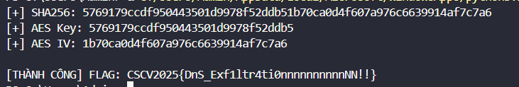


> FLAG: CSCV2025{DnS_Exf1ltr4ti0nnnnnnnnnnNN!!}