# Anti-Reverse Engineering
## Phần 1 Anti-Disassembly
## Giới thiệu chung
Trong quá trình phân tích mã độc (Malware Analysis) hay giải quyết các thử thách Reverse Engineering, chúng ta thường trao niềm tin vào các công cụ dịch ngược mạnh mẽ như IDA Pro, Ghidra hay x64dbg. Chúng ta ném một file thực thi vào, nhìn đồ thị Control Flow Graph được vẽ ra đẹp như mơ và nghĩ rằng: "Những gì công cụ hiển thị chính là những gì CPU sẽ chạy".

Nhưng sự thật lại không màu hồng như vậy. Những người viết mã độc hiểu rất rõ cách các công cụ này hoạt động, và họ hoàn toàn có thể thao túng chúng. Đó là lúc nghệ thuật Anti-Disassembly ra đời.
## Table of Contents

- [1. Anti-Disassembly là gì?](#1-Anti-Disassembly-là-gì)
- [2. Các trường phái Disassembly](#2-Các-trường-phái-Disassembly)
- [3. Code hay data?](#3-Code-hay-data?)
- [Anti-Disassembly Techniques](#Các-kỹ-thuật-Anti-disasembly)
### 1. Anti-Disassembly là gì?
Nói một cách đơn giản, Anti-Disassembly là tập hợp các kỹ thuật được chèn vào trong mã máy nhằm mục đích đánh lừa các công cụ Disassembler.
Mục tiêu của kẻ tấn công không phải là làm hỏng chương trình, mà là ép các công cụ dịch ngược như IDA Pro hay objdump phải:
* Hiển thị sai các lệnh Assembly.
* Gộp chung mã lệnh (Code) và dữ liệu (Data) một cách lộn xộn.
* Làm đứt gãy hoặc tạo ra các nhánh ma trong đồ thị luồng thực thi (CFG), khiến nhà phân tích bị rối trí và mất phương hướng.

Để hiểu cách mã độc lừa được công cụ, trước hết chúng ta phải hiểu cách các công cụ này đọc hiểu mã máy.
### 2. Các trường phái Disassembly
Các file thực thi (.exe, .elf) thực chất chỉ là một chuỗi các byte thập lục phân (Hex) vô tri. Nhiệm vụ của Disassembler là dịch chuỗi byte đó thành các lệnh Assembly (Opcode) dễ đọc đối với con người.

Hiện nay có 2 thuật toán chính được sử dụng:

#### A. Linear Sweep (Quét tuyến tính)
Đây là thuật toán ngây thơ và máy móc nhất, thường được sử dụng bởi các công cụ như objdump hay gdb (khi chưa có plugin).

* Cách hoạt động: Nó bắt đầu từ byte đầu tiên của vùng nhớ Code và cứ thế dịch mù quáng từ trên xuống dưới, byte này nối tiếp byte kia cho đến khi hết file.
* Điểm yếu: Nó mặc định mọi thứ nằm trong vùng .text (phân vùng chứa code) đều là lệnh thực thi. Nếu malware cố tình nhét một chuỗi ký tự (Data) vào giữa vùng Code, Linear Sweep sẽ cố gắng ép chuỗi ký tự đó thành các lệnh Assembly vô nghĩa.

#### B. Flow-Oriented (Dịch đệ quy theo luồng)
Đây là thuật toán thông minh hơn rất nhiều, đại diện bởi các ông lớn như IDA Pro hay Ghidra.

* Cách hoạt động: Thay vì quét mù quáng, nó đóng vai trò như một thám tử. Nó bắt đầu từ điểm Entry Point của chương trình, đọc từng lệnh một. Khi gặp các lệnh chuyển luồng thực thi như JMP (nhảy vô điều kiện), CALL (gọi hàm), hay JZ/JNZ (nhảy có điều kiện), nó sẽ ghi chú lại các địa chỉ đích và bám theo các luồng đó để dịch tiếp. Những vùng byte bị bỏ qua (không có luồng nào trỏ tới) sẽ được nó coi là Dữ liệu (Data) chứ không phải Code.
* Điểm yếu: Thuật toán này rất thông minh, nhưng lại bị trói buộc bởi chính những giả định logic của nó.
### 3. Code hay data?
Cốt lõi của mọi kỹ thuật Anti-Disassembly đều xoay quanh một đặc điểm chí mạng của kiến trúc phần cứng x86/x64: CPU không hề phân biệt được sự khác nhau giữa Code (mã lệnh) và Data (dữ liệu).

Dưới góc nhìn của vi xử lý, tất cả chỉ là những byte thập lục phân. Một byte 0x90 có thể là lệnh NOP (không làm gì cả), nhưng cũng có thể chỉ là con số 144 vô hại trong một phép toán cộng trừ. Mã độc khai thác triệt để vùng này để tấn công vào chính những giả định logic làm nên sự thông minh của Flow-Oriented Disassembler (như IDA Pro).

Cụ thể, dù xây dựng danh sách luồng thực thi rất tinh vi, IDA Pro vẫn có hai điểm mù mang tính nguyên tắc:

* Lỗ hổng trong thứ tự ưu tiên xử lý (Processing Order): Khi gặp một lệnh rẽ nhánh có điều kiện (JZ, JNZ) hoặc lệnh gọi hàm (CALL), IDA Pro buộc phải đưa ra lựa chọn xem nên dịch ở đâu trước. Trong nhiều trường hợp, IDA ưu tiên phân tích fall-through trước target, tùy theo loại instruction và chiến lược xử lý nội bộ. Nắm được thói quen này, kẻ tấn công chỉ cần nhét một chuỗi dữ liệu vào ngay dưới lệnh CALL. IDA Pro sẽ dính bẫy và cố ép chuỗi Dữ liệu đó thành những lệnh Assembly vô nghĩa.
* Sự cố chấp với kết quả ban đầu (Trust Initial Interpretation): Khi IDA lỡ dịch sai chuỗi Dữ liệu thành Code, các lệnh rác này có thể vô tình nuốt mất các byte mã lệnh hợp lệ nằm phía sau. IDA có xu hướng giữ nguyên các boundary đã được xác định trước đó nếu không có bằng chứng rõ ràng để thay đổi.

Ta cùng đến với 1 ví dụ minh họa:
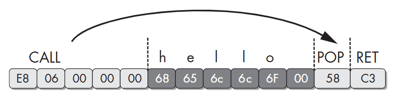

Kẻ tấn công cố tình đặt chuỗi ký tự "hello\0" (Hex: 68 65 6C 6C 6F 00) ngay sát bên dưới một lệnh CALL. Đích đến thực sự của lệnh CALL là hai mã lệnh: POP EAX (Hex: 58) và RET (Hex: C3).
Lúc này, IDA Pro sẽ sập bẫy:

* Sập bẫy thứ tự ưu tiên: Thay vì đi theo địa chỉ đích của CALL, IDA ưu tiên đọc ngay các byte bên dưới. Nó gặp byte 68 (ký tự 'h'). Trong tập lệnh x86, 68 chính là Opcode của lệnh PUSH DWORD. Thế là IDA vội vàng "nuốt" trọn 4 byte tiếp theo 65 6C 6C 6F ('ello') làm tham số. Câu lệnh rác đầu tiên ra đời: push 6F6C6C65h.
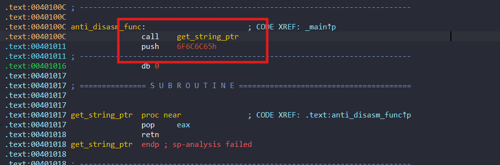
* Các bản IDA cũ thường lấy luôn byte 00 (Null) ghép với byte 58 và C3 bên dưới để tạo ra một lệnh rác thứ hai (lệnh add). Tuy nhiên, IDA hiện đại đã thông minh hơn: Nó tách riêng byte 00 ra thành db 0, và nhận diện đúng hàm get_string_ptr bên dưới với hai lệnh pop eax và retn.
* Dấu hiệu cảnh báo chí mạng: Dù dịch đúng được lệnh ở dưới, IDA vẫn không nhận ra push ở trên là giả mạo. Việc một lệnh CALL đẩy dữ liệu vào Stack, nhưng hàm bên dưới lại dùng POP rút ra ngay lập tức khiến hệ thống theo dõi Stack của IDA bị rối loạn tiền đình. Kết quả là nó in ra một dòng cảnh báo màu đỏ rực: sp-analysis failed (Phân tích Stack Pointer thất bại).
Ở đây ta có thể di chuột vào dòng lệnh Push ấn phím D để xem dữ liệu thô
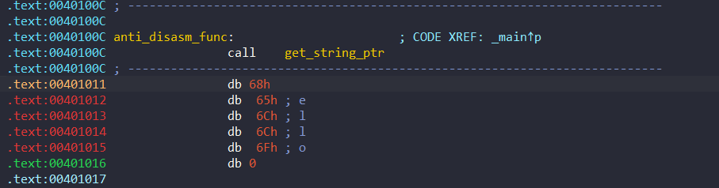
Ta đã thấy dữ liệu, tiếp tục ấn phím A để gộp lại xem cho dễ
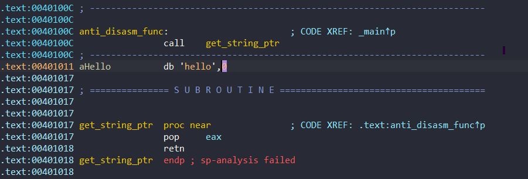
Đến đây chuỗi "hello" đã hiện ra rõ ràng. Tiếp theo ta cùng tiếp hiểu đến các kỹ thuật Anti-Disassembly.
## Các kỹ thuật Anti-disasembly
### 1. Jump Instructions with the Same Target
Kỹ thuật này sử dụng điều kiện giả cùng với byte rác để đánh lừa trình disasembly. Thông thường, khi gặp một lệnh nhảy có điều kiện như JZ (Jump if Zero) hay JNZ (Jump if Not Zero), Disassembler (như IDA Pro) luôn phải dịch cả 2 nhánh:
* Nhánh True (Đích nhảy tới).
* Nhánh False (Lệnh nằm ngay sát bên dưới).

Về mặt toán học, giá trị của cờ Zero (ZF) chỉ có thể là 0 hoặc 1. Do đó, chắc chắn 100% một trong hai lệnh nhảy này sẽ được kích hoạt. Luồng thực thi thực tế của CPU sẽ luôn luôn nhảy đến cùng một đích đến. Tuy nhiên thuật toán phân tích của các trình phân tích không đánh giá là "à cái này luôn nhảy vào điều kiện true" mà sẽ nghĩ là nhánh false hoàn toàn có thể xảy ra và nó bắt đầu dịch cả nhánh false đó.

Kẻ tấn công lợi dụng điều này của IDA, nên họ đã thả một cái bẫy ngay bên dưới lệnh JNZ. Giả sử ở đây họ thả một byte 0xE8. Nếu bắt đầu decode tại byte E8, nó sẽ diễn giải nó như opcode của CALL và lấy thêm 4 byte kế tiếp làm toán hạng.
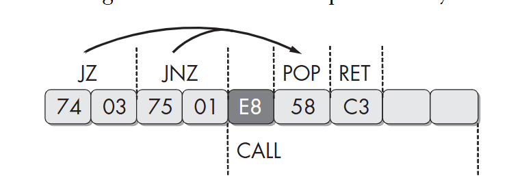
Chương trình bình thường khi chạy thì CPU sẽ nhảy thẳng tới 0x58 và bỏ qua byte 0xE8 (ảnh minh họa trên), tuy nhiên Ida (ở đây tôi dùng ida để minh họa) sẽ bị lừa dịch byte 0xE8 thành lệnh call và vô tình nuốt mất các byte phía sau là 0x58, 0xC3,... vô hình chung dẫn đến việc chương trình biên ra sai hoàn toàn.

Ví dụ minh họa:
> Lưu ý: kỹ thuật này nó kinh điển quá nên các bản IDA pro hiện tại đã fix được. Ví dụ sau chỉ để mô phỏng lại nhằm mục đích học tập.

Ở đây tôi có 1 chương trình trông như sau:
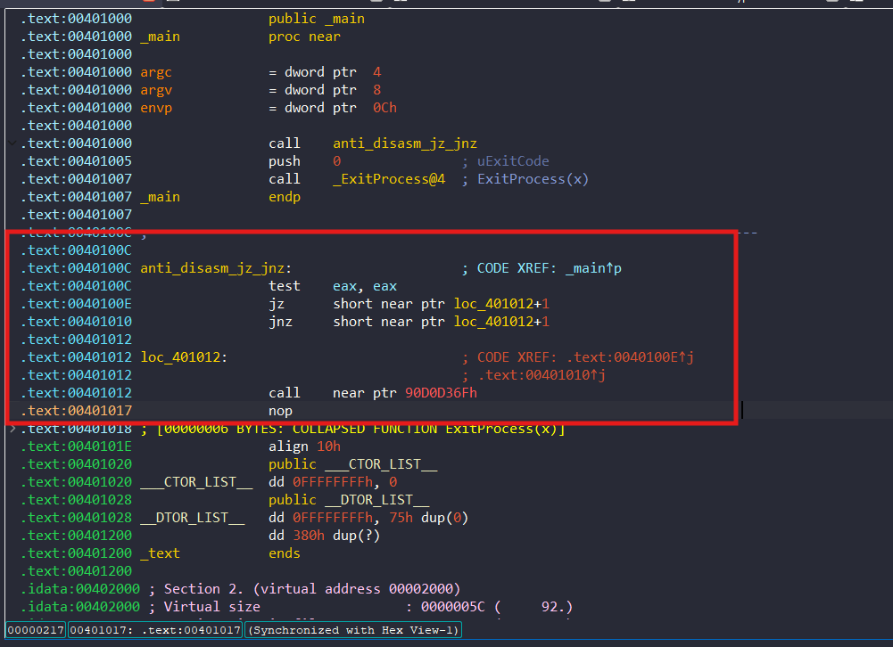
Có thể thấy ở đây nó đang gọi 1 lệnh call tới 1 địa chỉ tào lao nào đó, nếu ta ấn f5 xem pseudo code thì nó cũng vậy
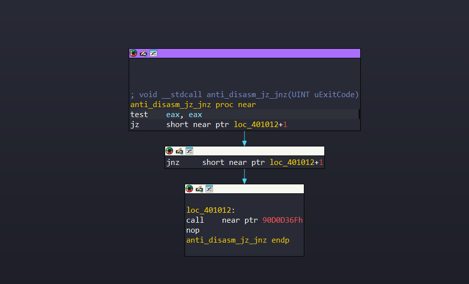

Ở đây để xem code thật ta cũng thực hiện tương tự thao tác tôi đã giới thiệu trước đó, đặt chuột vào lệnh call nhấn D để trả về data 
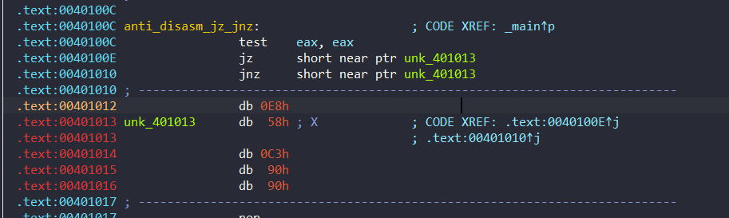
Giờ thì ta đã thấy byte rác mà tác giả chèn vào, tiếp tục đặt chuột byte sau ấn C để make code xem code thật
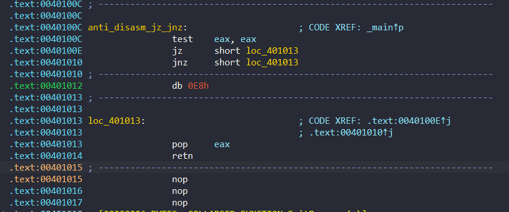
Đây mới là luồng thực hiện đúng của chương trình chứ không có lệnh Call nào được thực hiện. 

Điều đáng sợ không phải là IDA dịch sai một lệnh. Điều nguy hiểm là khi bị lệch dù chỉ một byte, toàn bộ các instruction phía sau có thể bị giải mã theo một cách hoàn toàn khác, khiến luồng hoạt động của chương trình ta thấy bị bóp méo nghiêm trọng.

### 2. A Jump Instruction with a Constant Condition
Nếu ở kỹ thuật đầu tiên, mã độc dùng cặp lệnh JZ/JNZ để tạo ra các ngã rẽ giả thì ở kỹ thuật này, kẻ tấn công tinh vi hơn một chút: Tự tay dàn xếp trước kết quả của một phép toán để đảm bảo lệnh nhảy duy nhất chắc chắn sẽ được thực thi.

Kỹ thuật này tiếp tục lợi dụng điểm yếu chí mạng của phân tích tĩnh (Static Analysis): Trình Disassembler thường phân tích từng dòng lệnh độc lập theo luồng, chứ không mô phỏng sự thay đổi trạng thái của các thanh ghi hay cờ (flags) theo thời gian thực.
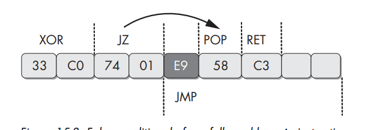

1. Dàn xếp điều kiện: Lệnh xor eax, eax là một thủ thuật kinh điển để gán giá trị của thanh ghi EAX về 0. Đồng thời, như một "tác dụng phụ" bắt buộc của phần cứng, nó sẽ tự động bật cờ Zero (Zero Flag - ZF) lên 1.
1. Cú nhảy định mệnh: Ngay bên dưới là lệnh jz (Jump if Zero - Nhảy nếu cờ ZF = 1). Vì cờ ZF vừa được bật lên 1 ở lệnh ngay trước đó, nên thực tế đây không còn là lệnh nhảy có điều kiện nữa. Chắc chắn 100% CPU sẽ nhảy!
1. Rogue Byte: Như đã phân tích, IDA Pro luôn ưu tiên dịch nhánh False (nhánh đi thẳng xuống dưới) trước. Kẻ tấn công chờ sẵn ở đó với một byte rác là 0xE9. Nếu 0xE8 là Opcode của CALL, thì 0xE9 là Opcode của lệnh JMP (Nhảy vô điều kiện) dài 5 byte. Nó sẽ lập tức "nuốt" trọn 4 byte liền kề phía sau.

> Lưu ý: kỹ thuật này nó y chang trên, các bản IDA pro hiện tại đã fix được. Ví dụ sau chỉ để mô phỏng lại nhằm mục đích học tập.

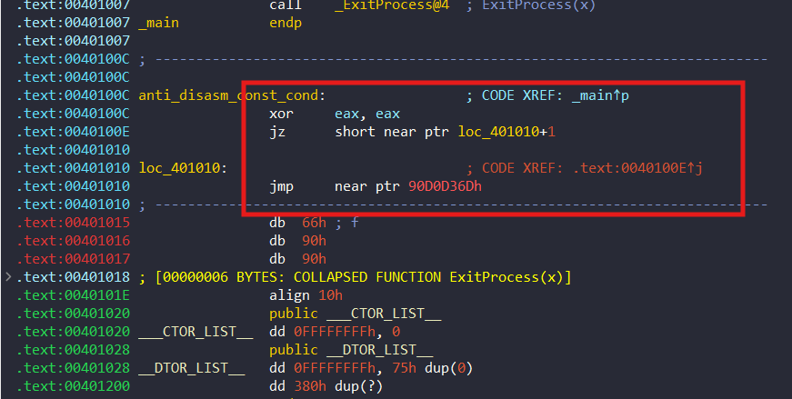
ta thấy nó cũng giống ở ví dụ trên nên ta cũng tiến hành giải mã như những bước đã làm
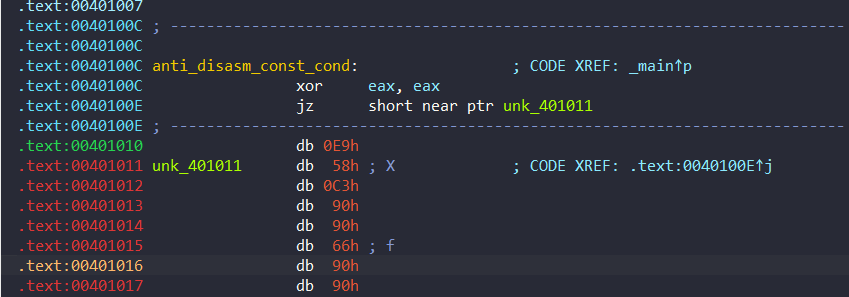
ấn D xem data raw và ấn C ở hàng dưới để make code
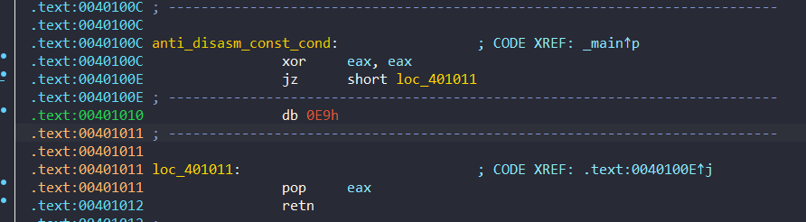
2 kỹ thuật trên nó hơi na ná nhau nên cũng dễ hình dung.

### 3. Impossible Disassembly
Oke ở các phần trước, chúng ta đã phá giải thành công các bẫy JMP/CALL bằng phím D và C. Lý do chúng ta có thể làm điều đó dễ dàng là vì các byte rác (Rogue Byte) trong những kỹ thuật đó thực chất không thuộc về luồng thực thi thật và có thể bị vứt bỏ. Nhưng sẽ ra sao nếu kẻ tấn công không dùng byte rác vô nghĩa nữa? Điều gì sẽ xảy ra nếu một byte lại vừa là tham số của lệnh này, lại vừa là mã lệnh của một lệnh khác được CPU thực thi lúc runtime? Đó là lúc chúng ta phải đối mặt với một kỹ thuật tinh vi mang tên: `Impossible Disassembly`.
Nói lý thuyết thì hơi khó hiểu nên phần này sẽ mô phỏng bằng ví dụ là nhiều nhé

Đầu tiên  xét một ví dụ cơ bản với chuỗi 4 byte: `EB FF C0 48`. Kẻ viết mã độc có thể chèn chuỗi này ở gần như bất kỳ đâu trong chương trình để bẻ gãy luồng dịch ngược.

Các Disassembler hiện nay  quản lý bộ nhớ bằng một cơ sở dữ liệu nội bộ. Khi IDA phân tích tĩnh và quyết định ghép EB và FF lại thành lệnh jmp short -1, nó lập tức dán nhãn cho 2 byte này là "Đã phân tích xong". IDA sẽ không lôi nó ra dùng lại. Nó bắt buộc phải đi tiếp đến byte chưa được phân tích tiếp theo, chính là C0 lúc này chương trình sẽ đi sai luồng
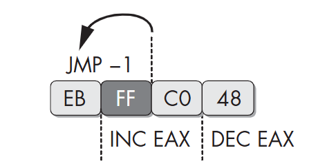


Nhưng còn CPU vẫn hoạt động bình thường theo cơ chế
1. Đọc lệnh: Giả sử CPU đứng ở 0x1000, đọc byte EB (JMP). Lệnh này cần thêm 1 byte tham số nên nó lôi luôn byte FF (giá trị -1) ở 0x1001 lên. Lúc này, con trỏ EIP lập tức trượt đến địa chỉ tiếp theo: 0x1002.
1. Nhảy lùi: CPU thực thi phép tính nhảy tới địa chỉ -1: EIP mới = 0x1002 + (-1) = 0x1001. Lập tức, CPU vòng ngược lại đáp đúng xuống tọa độ 0x1001.
1. Khi này CPU mất trí nhớ: Đứng ở 0x1001 (chứa byte FF), CPU quên sạch chuyện hồi nãy, không quan tâm byte này ở tập lệnh nào hay đã dùng chưa, thấy là dịch thôi. Nó lấy FF ghép với byte kế tiếp C0 tạo thành lệnh mới tinh: INC EAX . 
1. Kết thúc: Chạy xong, nó tiến đến 0x1003 chứa byte 48 và thực hiện lệnh DEC EAX. Tăng rồi giảm về cơ bản là chả làm gì (NOP).

Oke cùng xem ví dụ chương trình khi quăng vào ida sẽ sao nhé
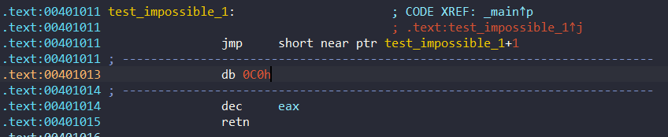
Dĩ nhiên như bao lần ta không thể f5 xem pseudo-code, ở đây ta thấy ida đã biên thành lệnh nhảy như ta đã đề cập trước đó. Vấn đề ở đây là nếu ta áp dụng D rồi C như 2 kỹ thuật trước đó ta sẽ trông như sau
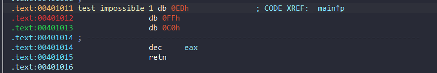
Giả sử ta D lệnh jump sau đó make code lại từ `00401012` để thấy lệnh inc thì sẽ trông như sau:
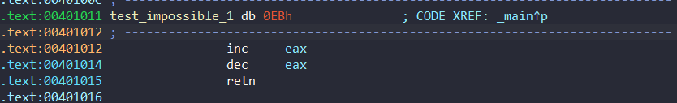
Như đã thấy nhìn như này cũng vẫn không đẹp lắm cũng như không hiểu được luồng thực thi chương trình (lạc quan mà nghĩ vẫn có thể nghĩ 0EBh là byte rác rồi tăng giảm không làm gì).

Đến với 1 ví dụ loằng ngoằng hơn để thấy kỹ thuật này hay ho thế nào. Chuỗi lệnh gồm 13 byte trông như sau: `66 B8 EB 05 31 C0 74 FA E8 58 C3 90 90`

Tôi hơi lười giải thích kỹ code nên có thể xem ảnh dưới tham khảo nhé
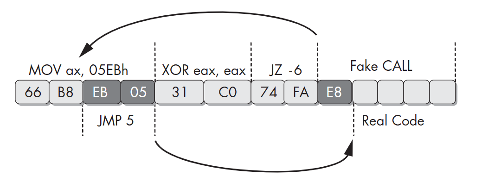

Luồng trên là xử lý của CPU, gán ax giá trị 05EBh xong reset nó về lại 0 bật cờ zf để thực hiện jz -6 tới byte EB 05 nhảy tiếp 5 byte qua byte E8 và thực thi tiếp. Có thể thấy byte E8 không ảnh hưởng gì luồng hoạt động CPU tuy nhiên ida thì khác.

Nhớ lại trước đó ở 2 kỹ thuật trước đã nói ida sẽ biên dịch cả nhánh fail của của jz tức E8 ... đó là lệnh CALL nên khi xem trên ida thì nó thật sự là 1 mớ hỗn đoạn. Cùng xem thử nhé
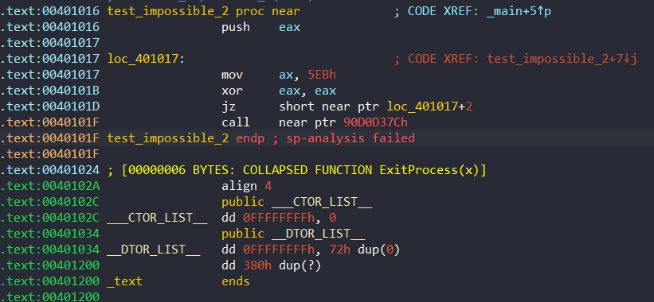
Ta có thể thấy code trông rất rối loạn xạ có thể thấy lệnh call sau jz như ta đã nói và ở đây nếu dùng D rồi C sẽ khó hơn rất nhiều so với ví dụ trên khi ta phải chuyển hết nó về raw rồi đọc và sau đó code cũng chả đẹp luồng chả đúng. Vì vậy nó mới có tên là Impossible Disassembly.

Để giải quyết mớ bòng bong này, cách thô sơ nhất là tự ngồi đọc raw code sau đó có thể dùng câu lệnh NOP để thay thế cái byte không liên quan lại như ví dụ trên ta có thể thấy các lệnh mov rồi jz ta sửa thành NOP hết lại giữ lại các lệnh thực sự chạy như xor thôi khi đó ta có thể dễ dàng đọc hơn. Tuy nhiên trong phân tích thực tế, việc theo dõi runtime bằng debugger thường chính xác hơn.

Oke có lẽ kỹ thuật này hơi dài vì nhìn chung nó hay ho và thực tế hơn 2 cái trước đó nhiều.

## Các kỹ thuật Obscuring Flow Control
Nếu Anti-Disassembly là kỹ thuật lừa công cụ dịch sai mã máy thì Obscuring Flow Control là kỹ thuật làm rối loạn logic đường đi của chương trình. Mục đích của nó là phá nát đồ thị Control Flow Graph (CFG) của IDA Pro, khiến nhà phân tích (và cả các engine phân tích tự động) nhìn vào không thể biết chương trình đi từ A đến B bằng con đường nào, hàm nào gọi hàm nào.
### 1. The Function Pointer Problem
Các disassembler hiện đại như IDA Pro làm cực kỳ tốt việc liên kết các lời gọi hàm (Function calls) và tự động suy luận ra các thông tin. Nếu code được viết bằng C/C++ chuẩn mực, IDA sẽ vẽ cho bạn một sơ đồ nhánh đẹp như tranh vẽ.

Tuy nhiên, sự thông minh này chỉ xảy ra khi lời gọi hàm phải rõ ràng (Ví dụ: call sub_4011C0). Nếu kẻ tấn công phá vỡ quy tắc này bằng cách gọi hàm gián tiếp thông qua con trỏ, IDA sẽ lập tức bị mù.

Cùng đến ví dụ sau
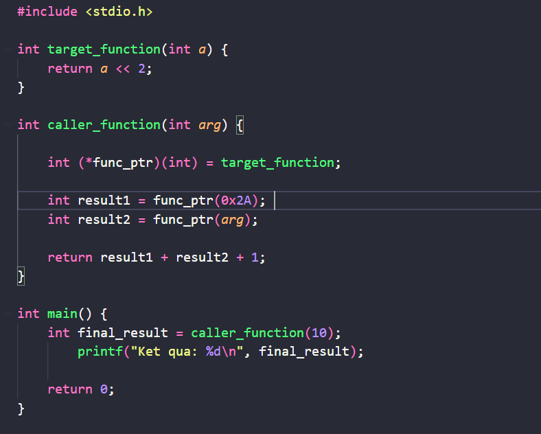
Sau khi bỏ vào IDA
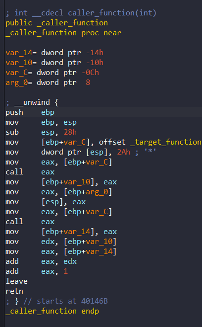

Đoạn code trên thì như ta khi nhìn vào rất dễ đọc, hàm caller_function đã gọi hàm target_function tới 2 lần. Nhưng ở đây nó không gọi trực tiếp mà nó gọi qua eax dẫn tới việc khi ấn Xref (X) vào target_function, ta chỉ thấy ida báo duy nhất 1 chỗ gọi hàm đó là chỗ gán biến ban đầu
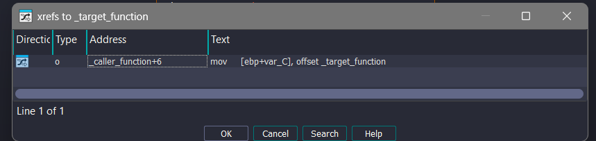

Đây chính là điểm mù của IDA phân tích tĩnh đến lệnh call eax, nó hoàn toàn chịu chết. Nó không có khả năng mô phỏng ngược lên trên để nhớ rằng eax đang chứa var_C, và var_C lại đang chứa targetfunction. Với IDA luồng thực thi lập tức bị đứt đoạn tại đây. Không có một mũi tên nào được vẽ nối từ hàm này sang hàm _target_function cả!

### 2. Return Pointer Abuse
Trong lập trình Assembly thông thường, lệnh call và jmp không phải là những lệnh duy nhất có khả năng chuyển hướng luồng điều khiển của chương trình.

Để hiểu kỹ thuật này, chúng ta phải lật lại nền tảng của CPU:

* Lệnh call thực chất là sự kết hợp của 2 hành động: push (đẩy địa chỉ trả về lên Stack) và jmp (nhảy đến hàm đích).
* Ngược lại, lệnh retn (hay ret) là sự kết hợp của: pop (lấy địa chỉ từ đỉnh Stack ra) và jmp (nhảy thẳng về địa chỉ đó).

Thông thường, retn chỉ được dùng một cách ngoan ngoãn ở cuối mỗi hàm để quay về nơi nó được gọi nhưng chả ai cấm việc sử dụng lệnh này để điều hướng luồng đi lung tung cả. Kẻ tấn công lợi dụng đặc điểm này để ép retn làm công việc của lệnh jmp, khiến các Disassembler thông minh nhất cũng phải khóc thét.

ví dụ minh họa
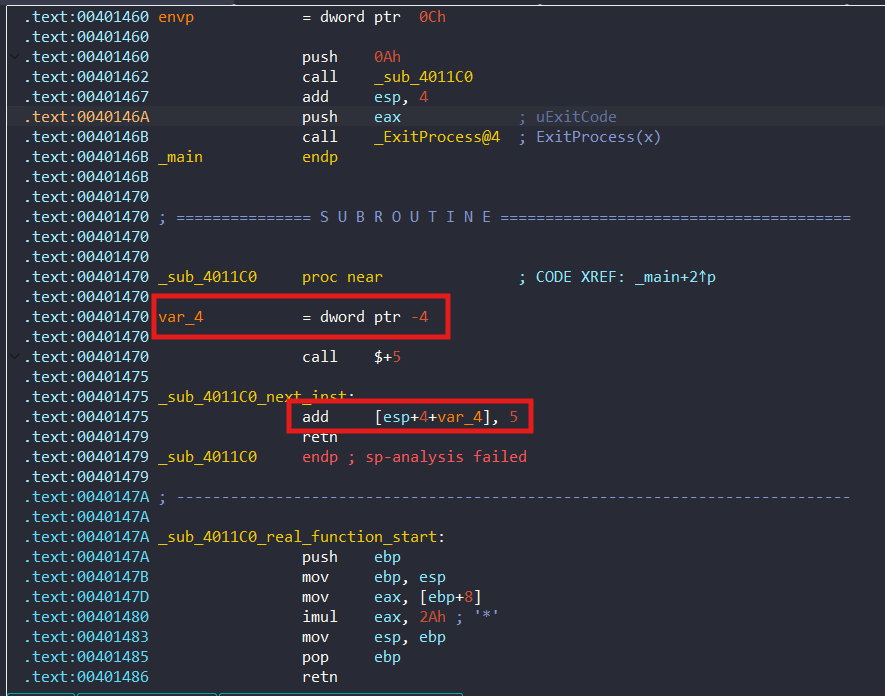


* call $+5: Lệnh này đơn giản là gọi đến vị trí bộ nhớ ngay sát bên dưới nó. Tác dụng duy nhất của nó là lừa CPU push địa chỉ của lệnh tiếp theo (là 0x00401475) lên đỉnh Stack. (Kỹ thuật này rất phổ biến trong các mã độc cần viết code độc lập vị trí - Position-Independent Code).
* add [esp+4+var_4], 5: Nhìn lướt qua, IDA Pro lầm tưởng đây là một biến cục bộ trên Stack tên là var_4. Tuy nhiên, phân tích Stack-frame của IDA đã sai bét! Hãy nhìn lên đầu hàm, kẻ tấn công đã định nghĩa hằng số var_4 = -4. Vậy phép toán thực sự là: [esp + 4 + (-4)], rút gọn lại chỉ còn là [esp] (đỉnh Stack).
-> Lệnh này lấy địa chỉ 0x00401475 đang nằm trên đỉnh Stack cộng thêm 5, kết quả biến thành 0x0040147A.
* retn: Lệnh này vô tư bốc giá trị 0x0040147A ra khỏi Stack và nhảy thẳng tới đó. Và bùm! 0x0040147A chính là tọa độ bắt đầu của khối mã lệnh thật sự.

IDA không hề ngu ngốc, nó nhận ra thao tác add [esp+4+var_4], 5 cộng với lệnh retn đang làm sai lệch con trỏ Stack (Stack Pointer - SP) nên nó đã ném ra một cảnh báo lỗi đỏ chót (sp-analysis failed). Nó biết có điều gì đó sai sai, nhưng thuật toán phân tích tĩnh của nó đành bó tay không biết cách dò tiếp luồng thực thi.
### 3. Misusing Structured Exception Handlers
Trong kiến trúc x86 của hệ điều hành Windows, SEH là một cơ chế tích hợp cho phép ứng dụng xử lý các ngoại lệ phần cứng hoặc phần mềm (ví dụ: lỗi chia cho 0, vi phạm quyền truy cập vùng nhớ - Access Violation).

Cơ chế này hoạt động dựa trên một danh sách liên kết đơn (Singly Linked List) chứa các cấu trúc dữ liệu EXCEPTION_REGISTRATION_RECORD. Danh sách này được lưu trữ trực tiếp trên Stack của luồng (thread) hiện tại.

Mỗi bản ghi SEH có kích thước 8 bytes, bao gồm hai con trỏ:

* prev (4 bytes): Con trỏ trỏ đến bản ghi EXCEPTION_REGISTRATION_RECORD tiếp theo trong chuỗi.
* handler (4 bytes): Con trỏ trỏ đến địa chỉ của hàm chịu trách nhiệm xử lý ngoại lệ (Exception Handler).
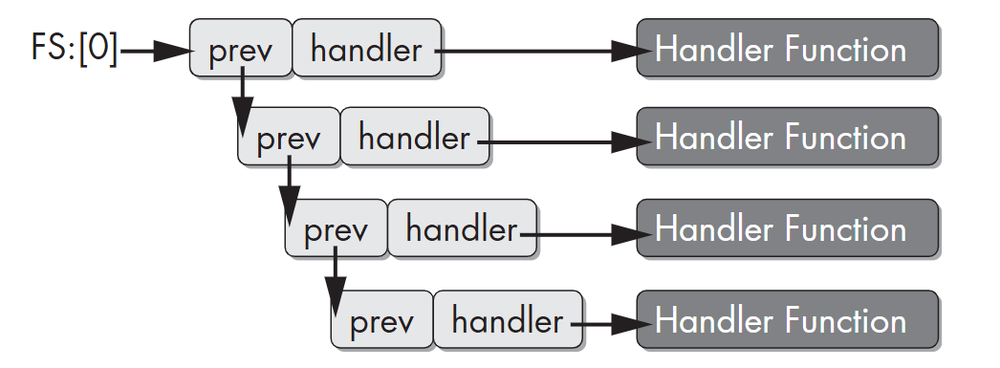

Hệ điều hành xác định vị trí bắt đầu của chuỗi SEH thông qua thanh ghi phân đoạn FS. Cụ thể, FS:[0] trỏ vào Thread Information Block (TIB) bên trong Thread Environment Block (TEB), trong đó DWORD đầu tiên của TIB chính là con trỏ trỏ đến đỉnh của chuỗi SEH. Khi một ngoại lệ xảy ra, hệ điều hành sẽ duyệt qua chuỗi SEH từ đỉnh (FS:[0]) xuống dưới, gọi tuần tự các hàm handler cho đến khi ngoại lệ được xử lý thành công.

Các tác giả mã độc lạm dụng đặc tính của chuỗi SEH để thay thế các lệnh nhảy tĩnh (CALL, JMP) bằng các ngoại lệ động. Mã độc sẽ tự động tính toán địa chỉ của đoạn mã payload (mã độc hại thực sự) và khởi tạo một bản ghi SEH mới trên Stack, sau đó ép FS:[0] trỏ vào bản ghi này. 

Đến với ví dụ ta thấy ở đây khai báo hàm dummy_target là 1 decoy khi add 7 sẽ ra địa chỉ hàm secret_handler, mục đích để giấu đi đường XREF tới hàm bí mật kia. 
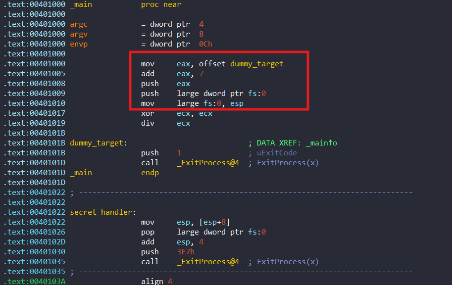

Sau khi hàm handler độc hại đã được chèn lên đỉnh chuỗi SEH, mã độc tiến hành thực thi một tập lệnh cố ý gây lỗi phần cứng.
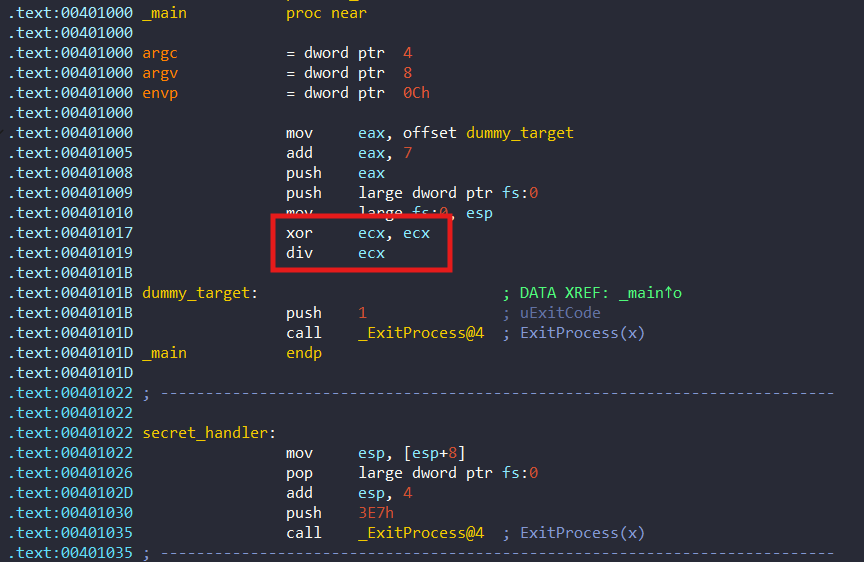

Khi lệnh div ecx gây ra ngoại lệ, hệ điều hành lập tức can thiệp, truy xuất FS:[0] và chuyển hướng quyền điều khiển  tới địa chỉ được lưu trong thanh ghi EAX trước đó. Quá trình chuyển hướng này hoàn toàn vô hình đối với các phân tích viên và công cụ phân tích tĩnh thông thường.
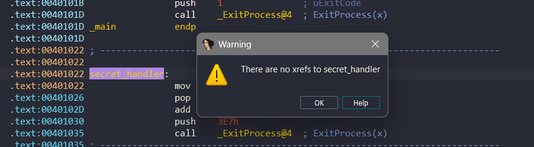
Và như thế thì IDA đã bị lừa còn khi chạy thật CPU sẽ xử lý hàm bí mật như mục đích tác giả.
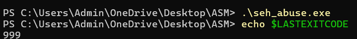

### 4. Compiler-Level Obfuscation — Tấn công ở cấp độ trình biên dịch

**Ý tưởng nền tảng**

Nếu các kỹ thuật Anti-Disassembly thông thường chỉ can thiệp vào file thực thi  đã hoàn thiện, thì nhóm kỹ thuật này lại can thiệp ở một giai đoạn sớm hơn rất nhiều: **Quá trình biên dịch**.

Bằng cách thay đổi mã ngay tại bước tối ưu hóa (Optimization) của trình biên dịch, cấu trúc logic của chương trình sẽ bị viết lại hoàn toàn trước khi mã máy (Assembly) được sinh ra. Công cụ nổi tiếng nhất trong mảng này chính là **Obfuscator-LLVM (OLLVM)**.

Quy trình biên dịch của LLVM thường diễn ra như sau:

Plaintext

> Mã nguồn (C/C++) → [Clang] → Mã trung gian (LLVM IR) → [Optimizer - Nơi OLLVM can thiệp] → Mã máy (.exe, .elf)
> 

OLLVM là một phiên bản tùy chỉnh của LLVM. Nó chèn các thuật toán làm rối vào bước Optimizer. Hậu quả là mã Assembly đầu ra bị thay đổi hoàn toàn về mặt cấu trúc. Bạn không thể đơn giản dùng lệnh `NOP` để xóa bớt byte rác như các kỹ thuật cũ, vì mọi đoạn code sinh ra đều là code hợp lệ của chương trình.

Để làm rõ sức mạnh của OLLVM, chúng ta sẽ sử dụng đoạn mã nguồn C cực kỳ đơn giản dưới đây làm mục tiêu thử nghiệm. Chương trình chỉ bao gồm hai hàm với những phép tính toán và rẽ nhánh rất cơ bản:

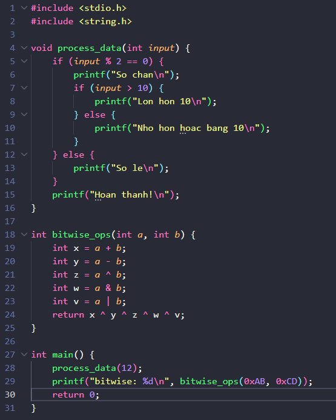

Bây giờ, hãy cùng xem OLLVM sẽ dùng 3 kỹ thuật cốt lõi nào để xào nấu đoạn mã trên.

#### 4.1 Control Flow Flattening (CFF) — Làm phẳng luồng điều khiển

CFF là kỹ thuật cốt lõi và thường xuyên được sử dụng nhất của OLLVM để che giấu logic chương trình.

**Cách hoạt động:**
CFF phá vỡ các cấu trúc điều khiển luồng cơ bản như `if/else`, vòng lặp `for`, `while`. Thay vì các khối lệnh thực thi nối tiếp nhau từ trên xuống dưới, CFF cắt nhỏ chúng ra và nhét tất cả vào một vòng lặp `switch-case` khổng lồ. Thứ tự thực thi lúc này được quyết định bởi một biến trạng thái (Dispatcher).

Để dễ hình dung: Thay vì đọc một cuốn sách từ trang 1 đến trang 10, xé rời 10 trang sách ra, xáo trộn chúng, và thêm vào cuối mỗi trang một chỉ dẫn: *"Để đọc tiếp, hãy tìm trang số X"*.

Trước tiên, hãy nhìn vào kết quả dịch ngược  của hàm `process_data` **nguyên thủy** trên IDA Pro. Mã C giả hiện ra cực kỳ trong sáng và bám sát logic gốc:


Thế nhưng, sau khi đi qua bộ biến đổi của OLLVM, đoạn code mượt mà kia đã bị băm nát. Thay vào đó là sự xuất hiện của hàng loạt các biến trạng thái (`v4`, `v1`, `v2`) đóng vai trò điều hướng luồng đi trong một mê cung các khối lệnh `if/break`:


**Hậu quả trên IDA Pro:**
Dù mã C giả trông rất dài dòng, nhưng thảm họa thực sự chỉ lộ diện khi chúng ta mở chế độ Đồ thị luồng điều khiển (Graph View).

CFG trên IDA Pro vẫn dịch đúng mọi lệnh, nhưng đồ thị đã biến thành một "mạng nhện" hoặc "ngôi sao". Tất cả các khối lệnh không còn liên kết trực tiếp với nhau mà đều phải trỏ ngược về một khối trung tâm ở dưới cùng để nhận chỉ thị tiếp theo. Việc phân tích tĩnh bằng mắt thường lúc này trở nên bất khả thi vì bạn hoàn toàn mất đi khái niệm về trình tự thời gian và luồng logic gốc!


---

#### 4.2 Bogus Control Flow (BCF) — Ngã rẽ ma & Opaque Predicates

Nếu Flattening làm mất phương hướng, thì BCF làm tăng khối lượng công việc phân tích lên gấp nhiều lần bằng cách nhồi nhét mã rác.

**Cách hoạt động:**

OLLVM tự động chèn thêm rất nhiều lệnh rẽ nhánh (`if/else`) vào chương trình. Tuy nhiên, điều kiện của các ngã rẽ này luôn được tính toán sao cho **kết quả luôn cố định** (chắc chắn True hoặc chắc chắn False). Kỹ thuật này gọi là **Opaque Predicate**.

Thay vì dùng các mẹo đơn giản, OLLVM sử dụng các quy luật toán học. Đoạn code sau khi dùng kĩ thuật sẽ trông như sau:

- OLLVM tự động chèn thêm rất nhiều lệnh rẽ nhánh (`if/else`) vào chương trình. Tuy nhiên, điều kiện của các ngã rẽ này luôn được tính toán sao cho **kết quả luôn cố định** (chắc chắn True hoặc chắc chắn False). Kỹ thuật này gọi là **Opaque Predicate**.
- Thay vì dùng các mẹo nhảy tĩnh đơn giản, OLLVM sử dụng các quy luật toán học để đánh lừa công cụ phân tích. Đoạn code dưới đây là một ví dụ điển hình sau khi bị áp dụng kỹ thuật BCF. Bạn có thể thấy sự xuất hiện dày đặc của một biểu thức toán học kỳ lạ:
`((((_BYTE)x - 1) * (_BYTE)x) & 1) != 0`
- Về mặt toán học, tích của hai số tự nhiên liên tiếp `(x - 1) * x` **luôn luôn là một số chẵn**. Khi một số chẵn thực hiện phép AND bitwise với `1` (`& 1`), kết quả chắc chắn bằng `0`. Do đó, điều kiện `!= 0` kia là một điều kiện **luôn luôn Sai (False)**.

OLLVM dùng điều kiện luôn sai này để chèn hàng loạt các khối lệnh nhân bản và vòng lặp `while (1)` vô nghĩa:


Như bạn thấy ở hai bức ảnh trên, các hàm `printf` gốc như `"So chan\n"` hay `"Lon hon 10\n"` đã bị nhân bản (clone) và giấu vào bên trong những ngã rẽ ma mà CPU thực tế sẽ không bao giờ nhảy vào.

**Sự nguy hiểm:** Các khối `fake_code` được OLLVM sinh ra bằng cách nhân bản trực tiếp một phần code thật. Điều này khiến IDA Pro lầm tưởng đây là những nhánh logic hợp lệ (vì chứa các lệnh Assembly chuẩn) và ngoan ngoãn vẽ toàn bộ chúng lên đồ thị.

Chỉ từ một đoạn code kiểm tra chẵn lẻ ngắn ngủi, đồ thị CFG giờ đây đã bị kéo dài thườn thượt, 

phình to một cách điên rồ:


Hậu quả là người phân tích sẽ phải đốt rất nhiều thời gian và công sức để đọc, dịch ngược và bóc tách những đoạn code không bao giờ được thực thi này ra khỏi luồng logic thật của chương trình.

---

#### 4.3 Instruction Substitution — Đánh tráo tập lệnh

Kỹ thuật này nhắm trực tiếp vào các biểu thức toán học và logic bên trong từng khối lệnh. Nếu CFF và BCF tàn phá ở cấp độ cấu trúc (vĩ mô), thì Substitution tàn phá ở cấp độ lệnh (vi mô).

**Cách hoạt động:**
OLLVM lùng sục các phép toán cơ bản (như cộng, trừ, AND, OR, XOR) và thay thế chúng bằng một chuỗi biểu thức phức tạp hơn, cồng kềnh hơn nhưng vẫn **bảo toàn giá trị cuối cùng** (ngữ nghĩa không đổi).

Ví dụ, thay vì dịch một phép cộng đơn giản `a = b + c`, OLLVM có thể "thêu dệt" nó thành:

```c
// r là một hằng số ngẫu nhiên sinh ra lúc compile
int r = 0x8A4B; 

a = b + r;
a = a + c;
a = a - r;  // Kết quả cuối cùng vẫn là b + c
```

Để thấy rõ mức độ tàn bạo, hãy nhìn lại đoạn mã Assembly nguyên thủy của hàm `bitwise_ops`. Ban đầu, nó chỉ là một tập hợp gọn gàng của các lệnh `add`, `sub`, `xor`, `and`, `or` trơn tru và dễ hiểu:


Nhưng đó chỉ là khi chưa có OLLVM. Kẻ thù của chúng ta hỗ trợ lồng ghép nhiều quy tắc thay thế và thực hiện lặp lại đệ quy nhiều vòng. Một phép tính `a ^ b` bé nhỏ có thể bị xé xác, nhào nặn qua lại giữa `NOT` (`~`), `AND` (`&`), `OR` (`|`) cùng hàng loạt hằng số rác ngẫu nhiên.

**Hậu quả kinh hoàng trên IDA Pro:**
Tính năng decompile Hex-Rays (phím F5) thần thánh của IDA Pro lúc này không còn là cứu cánh nữa, mà trở thành một cỗ máy in rác. Từ vỏn vẹn 5 dòng code C ban đầu, Hex-Rays sẽ ói ra một mớ bùi nhùi mã giả dài đến mức bạn lăn chuột mỏi tay.

Nhìn vào phần đầu của hàm sau khi bị biến đổi, số lượng biến tạm đã lên tới hàng chục (`v64`, `v65`,...), kèm theo những phương trình bitwise đọc lú cả mắt:


Và khi bạn cuộn chuột xuống tận dòng thứ 376, hàm mới chịu kết thúc bằng một biểu thức `return` dài như một bài sớ:


Sự xáo trộn này che giấu hoàn toàn mục đích thực sự của thuật toán. Giả sử đây không phải là phép toán vô thưởng vô phạt, mà là thuật toán giải mã chuỗi  hay hàm băm mật khẩu, thì người phân tích chắc chắn sẽ gục ngã hoàn toàn nếu cố gắng ngồi dịch ngược từng dòng bằng mắt thường.

---

#### 4.4 "Full Combo": Khi cả 3 kỹ thuật kết hợp

Sức mạnh thực sự của OLLVM không nằm ở từng kỹ thuật đơn lẻ, mà là khả năng cộng hưởng khi bạn kích hoạt cả 3 cờ cùng một lúc trong quá trình biên dịch.

Lúc này, trình biên dịch sẽ tạo ra một cỗ máy xay thịt ba tầng:

1. **Chia cắt và Trộn lẫn (CFF):** Đầu tiên, các lệnh rẽ nhánh và khối lệnh cơ bản bị băm nát và ném vào một vòng lặp `switch-case`.
2. **Bơm mã rác (BCF):** Tiếp theo, Bogus Control Flow bơm thêm hàng tá các nhánh rẽ điều kiện giả (Opaque Predicates) vào giữa các khối lệnh vừa bị làm phẳng, khiến đồ thị phình to gấp 3-4 lần.
3. **Mã hóa biểu thức (Sub):** Cuối cùng, Instruction Substitution rà soát lại toàn bộ chương trình, thay thế tất cả các phép tính toán học thật và cả những biểu thức so sánh giả mạo của BCF thành những phương trình khổng lồ.

Hãy cùng xem ví dụ của chúng ta thê thảm đến mức nào dưới lăng kính của Hex-Rays.

#### Nạn nhân 1: Hàm `process_data` (Sự sụp đổ của luồng điều khiển)

Từ một hàm `if/else` trong sáng, Hex-Rays giờ đây hoàn toàn bị tẩu hỏa nhập ma và dịch ra một cái hố đen sâu thẳm gồm các vòng lặp `while(1)` lồng nhau liên tiếp:

> 
> 
> 
> 
> 

Và nếu bạn kiên nhẫn cuộn xuống dưới, bạn sẽ thấy điều kiện để thoát khỏi các vòng lặp này không còn là `input % 2 == 0` nữa. Nó đã bị Substitution nhào nặn thành một mớ hỗn độn của các phép toán logic, ép kiểu (`_BYTE`), và toán tử `~`, `^`, `&` đan xen với các hằng số khổng lồ:


Và đây là bức tranh toàn cảnh của một hàm `if/else` đơn giản ngày nào. Nó không còn là hình ngôi sao hay mạng nhện nữa, mà đã biến thành một khối mã vạch dày đặc đứt gãy mọi manh mối logic:


#### Nạn nhân 2: Hàm `bitwise_ops` (Sự biến dạng của toán học)

Nếu bạn nghĩ hàm `bitwise_ops` chỉ có tính toán thuần túy nên sẽ thoát khỏi bẫy của Flattening hay BCF thì bạn đã lầm. OLLVM đã chủ động **bơm thêm các luồng điều khiển giả** vào ngay giữa các phép tính.

Hex-Rays lại tiếp tục nôn ra các vòng lặp `while(1)` và `do-while` vô nghĩa, gán biến trạng thái `v130`, `v133` để điều hướng ngay trong một hàm tính toán:


Khúc cuối của hàm là màn phô diễn đỉnh cao của Instruction Substitution kết hợp với Opaque Predicate. Hex-Rays đã đầu hàng và vứt ra màn hình hàng loạt các lệnh `LOBYTE` liên tiếp để cố gắng ép kiểu các phương trình toán học dài vô tận:


Đồ thị CFG của hàm `bitwise_ops` lúc này cũng bị kéo dài thườn thượt, chứa đầy các ngã rẽ ma không bao giờ được thực thi:


### Kết luận

Khi ném một file Binary full combo này vào IDA Pro, bạn sẽ đối mặt với một bức tường phòng thủ tĩnh học kiên cố:

- **Đồ thị CFG** biến thành một mê cung không thể dò bằng mắt thường.
- **Dung lượng hàm** phình to gấp hàng chục lần so với thực tế.
- **Mã C giả** sinh ra từ Hex-Rays hoàn toàn vô dụng và gây rối trí thêm.
- **Patching thủ công** bằng NOP không còn tác dụng vì không biết đâu là code thật, đâu là rác.

Đối mặt với cấp độ làm rối này, kỹ năng Reverse Engineering tĩnh  gần như chạm đến giới hạn. Lúc này, người phân tích bắt buộc phải thay đổi chiến thuật: chuyển sang **Phân tích động**, sử dụng Debugger để theo vết luồng thực thi, hoặc áp dụng các công cụ **Symbolic Execution** để tự động hóa việc tính toán và khôi phục lại đồ thị gốc.

## Thwarting Stack-Frame Analysis
Các Disassembler xịn xò như IDA Pro không chỉ dịch mã máy sang Assembly. Chúng còn cố gắng mô phỏng lại cấu trúc của Stack Frame cho từng hàm để tìm ra đâu là biến cục bộ, đâu là tham số truyền vào.

Để làm được việc này, thuật toán của IDA liên tục cộng/trừ các giá trị mô phỏng của thanh ghi ESP (Stack Pointer) mỗi khi nó thấy các lệnh như push, pop, add esp, X, sub esp, Y.

Tuy nhiên, việc theo dõi này mang nặng tính dự đoán và tính toán tuần tự. Và kẻ viết mã độc rất biết cách tạo ra những "ngã rẽ nghịch lý" để bẻ gãy thuật toán này!

Hãy xem xét đoạn mã dưới đây. Thực tế, hàm này chỉ thực hiện vài phép gán và cộng trừ biến cục bộ rất bình thường. Nhưng mã độc đã giăng một cái bẫy mồi nhử tinh vi:
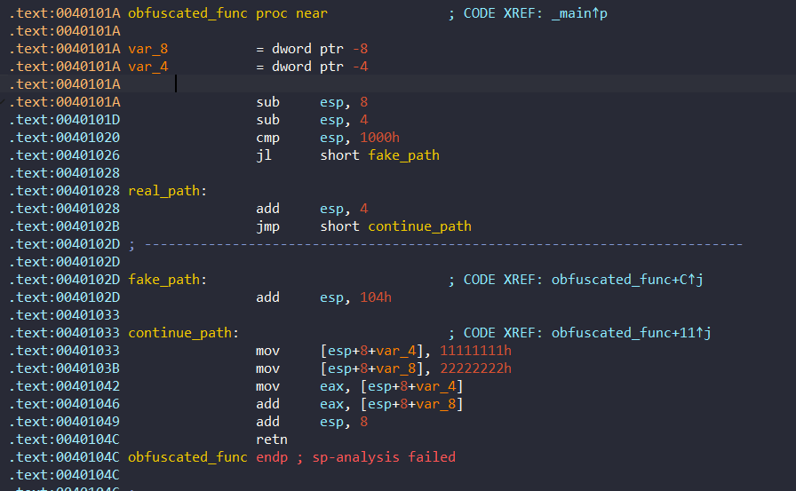

Điểm mấu chốt nằm ở lệnh so sánh cmp esp, 1000h. Trong kiến trúc Windows, bộ nhớ ở dải thấp nhất (dưới 0x1000) không bao giờ được cấp phát làm Stack. Do đó, điều kiện ESP < 0x1000 là một điều kiện luôn luôn False. CPU ngoài đời thực sẽ không bao giờ nhảy vào fake_path.

Tuy nhiên, IDA Pro không có kiến thức đó. Nó chỉ đọc text tĩnh và phân tích đệ quy. Nó tin rằng nhánh fake_path là hoàn toàn có thật!

Sự cố "Tẩu hỏa nhập ma" (SP Collision)
Khi IDA Pro phân tích hàm này, nó gặp phải một bài toán không thể có lời giải:

* Nếu đi theo nhánh real_path, khi đến điểm giao continue_path, giá trị Stack Pointer (SP) được tính toán là 8.
* Nếu đi theo nhánh fake_path, giá trị SP bị lệnh add esp, 104h làm cho thay đổi nghiêm trọng, tạo ra một giá trị hoàn toàn khác.

> Nếu bạn đọc các tài liệu cũ, bạn sẽ thấy cột SP bị tính ra số âm (ví dụ -F8). Tuy nhiên, trên các bản IDA Pro hiện đại, thuật toán đã thông minh hơn. Khi gặp xung đột (SP Collision), IDA mới sẽ từ chối hiển thị số âm vô lý mà giữ lại giá trị dương của nhánh đầu tiên (008).

Khi 2 luồng thực thi này gộp lại tại continue_path, IDA Pro bị xung đột Stack Pointer (SP Collision). Nó không biết phải tin vào con số nào để phân tích các biến var_4, var_8 ở bên dưới. Kết quả là nó đầu hàng và in ra dòng chữ đỏ chót ở cuối hàm: sp-analysis failed. 

## Conclusion

Oke vậy là hết phần 1 nói về việc anti Disassembly. Hiện tại mình vẫn đang là sinh viên và cũng đang mới bắt đầu nghiên cứu nên có thể nói sai ở đâu đó, nếu có góp ý hãy liên lạc với mình để ta có thể cùng bàn luận nhée.

