# Write-up – XÌ DÁCH ISC CASINO

---
 
Tác giả: soobinHoangDo

Team: K2_2H

## 1. Tổng quan challenge

### Mô tả: 

> Ở đây chúng tôi không dằn dơ, gấp đôi tới chết.

Challenge là một game Blackjack (Xì dách) viết bằng Python + Tkinter, mô phỏng trò chơi xì dách

Ban đầu đề bài cung cấp một file duy nhất:
```
XiDachCTF.exe
```

Sử dụng Detect It Easy (DIE), dễ dàng xác định đây là một chương trình được đóng gói từ Python (PyInstaller).
    
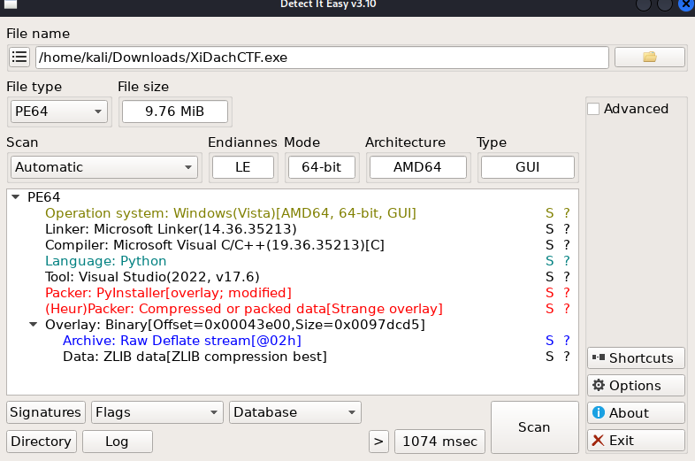
    
Tiếp theo, sử dụng pyinstxtractor.py để trích xuất các file .pyc từ executable, sau đó đưa các file này lên pylingual.io để decompile ngược lại mã Python.

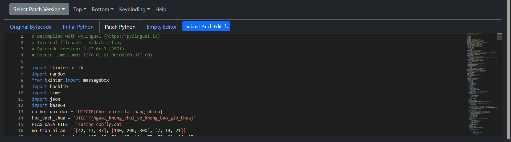


## 2. Nhận định ban đầu
Trong code tồn tại nhiều câu nói có dạng {…}, được mở khóa thông qua:

1. Chiến thắng nhà cái
2. Mốc tiền cược
3. Điều kiện thắng nhà cái nhiều ván
4. Mở khóa triết lý 

Những câu có thể dễ dàng thấy trong code như:
```
co_hoi_doi_doi = "{Choi_nhieu_la_thang_nhieu}"
hoc_cach_thua = "{Nguoi_khong_choi_se_khong_bao_gio_thua}"
giau_co_nhanh = "{All_in_la_chien_thuat_tot_nhat}"
lam_giau_khong_kho = "{Dealer_luon_thang_ban_oi}"
tam_ly_chien_thang = "{Ban_da_chien_thang_casino_xin_chuc_mung}"
bi_quyet_thanh_cong = "{Khong_co_gi_quy_hon_su_kien_tri}"
loi_thanh_nhan_da_dan = "{Co_bac_100_phan_tram_la_bip}"

```

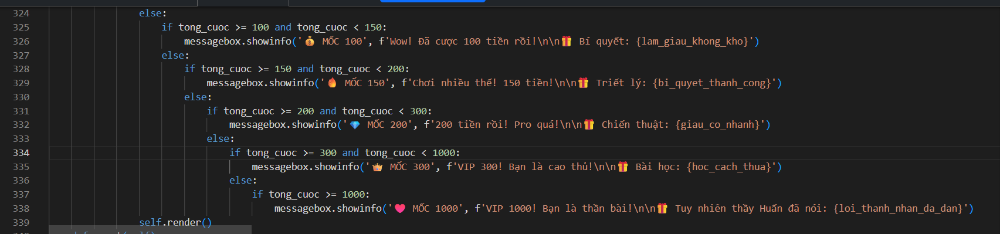


Tất nhiên toàn bộ là decoy rồi, đâu lộ liễu vậy được

## 3. Phân tích 

Trong quá trình chạy game, hàm tao_file_cau_hinh() tạo ra file casino_config.dat (dạng JSON), chứa nhiều dữ liệu quan trọng:

```
{
  "version": "1.0.3",
  "casino_settings": {
    "min_bet": 1,
    "max_bet": 100,
    "dealer_hit_on": 17,
    "blackjack_payout": 1.5
  },
  "game_rules": {
    "can_split": false,
    "can_double": false,
    "can_surrender": false
  },
  "visual_theme": {
    "background": "#0b3d2e",
    "card_color": "white", 
    "text_color": "#ffd700"
  },
  "system_data": {
    "checksum": "a3f5b891c2d4e67f",
    "validation_key": "DSUq",
    "component_alpha": "WHFvTnFsdmtNeEpDUk5C",
    "component_beta": "YktNUkZCYkx1YUR1Y0I=",
    "component_gamma": "X2JMdXlNS2NCVw==",
    "secret_payload": "DwwLCgM7BgULOwMNCzs=",
    "magic_offset": 8
  },
  "analytics": {
    "session_id": "021715e8da34f5e03057c67fd909c6df",
    "tracking_enabled": true
  }
}
```

Đọc qua toàn bộ code ta thấy có 2 hàm sinh chuỗi UTECTF{...} như sau
```
def Qua_tang_cuoc_song():
    base = "UTECTF{"
    decoded = "".join(chr(x ^ 0x20) for x in qua_tang_cuoc_song)
    return base + decoded + "}"

def phan_thuong_cho_ke_chien_thang(pattern):
    Huan_rose = f"co_lam_{pattern}"
    Phan_thuong = [f"UTECTF{{{Huan_rose}_co_an}}"]
    return Phan_thuong
```

Hàm Qua_tang_cuoc_song() là decoy vì trong code không gọi tới 1 lần nào còn hàm phan_thuong_cho_ke_chien_thang() gọi khi win nhà cái 10 ván

```
            if self.game.so_van_thang == 10:
                phan_thuong_dac_biet = phan_thuong_cho_ke_chien_thang("thi_moi")
                messagebox.showinfo("🏆 THÀNH TỰU ĐẶC BIỆT!", 
                    f"Bạn đã thắng 10 ván!\n\n🎁 PHẦN THƯỞNG:\n{phan_thuong_dac_biet}")
```

Kết quả: UTECTF{co_lam_thi_moi_co_an} vẫn là DECOY

Sau đó ta dễ dàng thấy Cơ chế unlock TRIẾT LÝ CASINO

```
chi_so_dac_biet = [13, 37, 42]

def kiem_tra_chuoi_phep_thuat(self):
    if len(self.bet_history) != 3:
        return False
    return self.bet_history == chi_so_dac_biet

```
Người chơi phải cược đúng thứ tự 13 → 37 → 42 không cần biết ván đó thắng hay thua để mở khóa TRIẾT LÝ CASINO

```
def lay_thong_diep_triet_ly(self):
    cac_thanh_phan = [
        thanh_phan_thieu_nang,
        thanh_phan_ca_biet,
        thanh_phan_than_bai
    ]
    return xu_ly_du_lieu_phuc_tap(cac_thanh_phan, chi_so_dac_biet)
    
def xu_ly_du_lieu_phuc_tap(data_parts, key_list):
    full_data = data_parts[0] + data_parts[1] + data_parts[2]
    result = ""
    for i, v in enumerate(full_data):
        result += chr(v ^ key_list[i % len(key_list)])
    return result

```
Đơn giản là XOR tuần hoàn với key [13, 37, 42] cũng là thứ tự cược
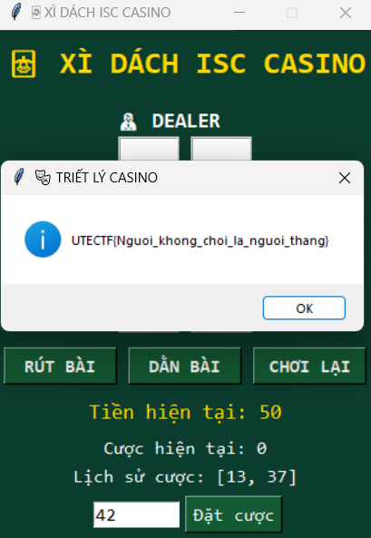

Vâng và vẫn là DECOY, tiếp tục tìm ta thấy có 1 điều kiện khá phưc tạp như sau:

```
def lam_vao_duong_cung(money, bet_count, unlock, history):
    return (
        money == 0 and
        bet_count >= 3 and
        unlock and
        len(history) >= 3
    )
```
Điều kiện bắt buộc:

1. Tiền = 0
1. Đã chơi ≥ 3 ván 
1. Đã mở khóa triết lý

Sau khi thỏa điều kiện gọi hàm
```
def bai_hoc_cuoc_song(self):
        # ***<module>.BlackjackCTF.bai_hoc_cuoc_song: Failure: Compilation Error
        comp_a, comp_b, comp_g, secret, offset = self.trich_xuat_thanh_phan_tu_file()
        return tam_ly_chien_thang if comp_a is None else self.lay_thong_diep_triet_ly()
            mot_nua_su_that = thong_diep_be_ngoai.split('thang}')[0]
            khoa_dinh_menh = sum(chi_so_dac_biet) + offset
            su_that_bi_giau = ''.join((chr(x ^ khoa_dinh_menh) for x in secret))
            ket_cuc_dinh_menh = 'thang}'
            chan_ly_cuoi_cung = mot_nua_su_that + su_that_bi_giau + ket_cuc_dinh_menh
            return chan_ly_cuoi_cung
```

Dễ thấy chia làm 3 phần:

Phần 1 là cái triết lý nãy tìm ra cắt vài chữ cuối:
> UTECTF{Nguoi_khong_choi_la_nguoi_


Phần 2 được xử lý bằng phép XOR
Secret và offset được lấy từ file JSON tạo khi chạy game. Kết quả:
> "khong_bao_gio_"

Phần 3 ghép lại "thang}" vào

#### Flag cuối cùng:
> UTECTF{Nguoi_khong_choi_la_nguoi_khong_bao_gio_thang}

#### BONUS
Ta chỉ cần đơn giản hơn là chơi game cược lần lượt 13 → 37 → 42 để unlock Triết Lý sau đó thua hết tiền là ra cờ
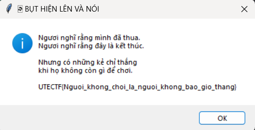

# Write-up – Ez login mobile

## 1. Tổng quan challenge

### Mô tả: 
> Bạn có từng chơi những trò chơi trên android chưa? Có những trò chơi có thể "hack" tiền hay các vật phẩm. Muốn làm được vậy đầu tiên phải dịch ngược chương trình. Cùng thử làm 1 bài đơn giản nào!!

Challenge cung cấp một file APK Android.
Ứng dụng có giao diện đăng nhập gồm username và password. Khi nhập đúng thông tin, ứng dụng hiển thị một Toast chứa flag.

Mục tiêu của bài là reverse APK để xác định chính xác username và password hợp lệ.
## 2. Nhận định ban đầu

Dùng jadx để decompile APK.
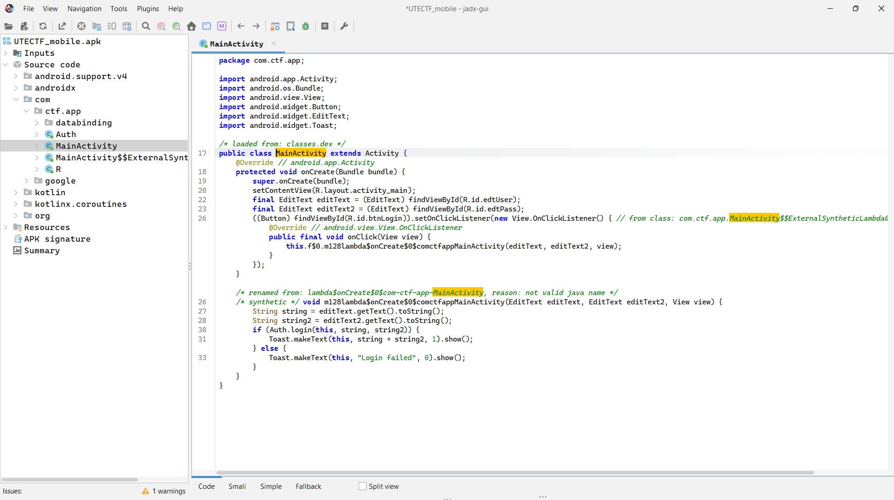
Quan sát MainActivity, khi đăng nhập thành công, nội dung Toast là:
```
Toast.makeText(this, user + pass, Toast.LENGTH_LONG).show();
```
Do đó flag = user + pass
Tiếp tục phân tích Auth.java, nhận thấy ứng dụng load thư viện native:
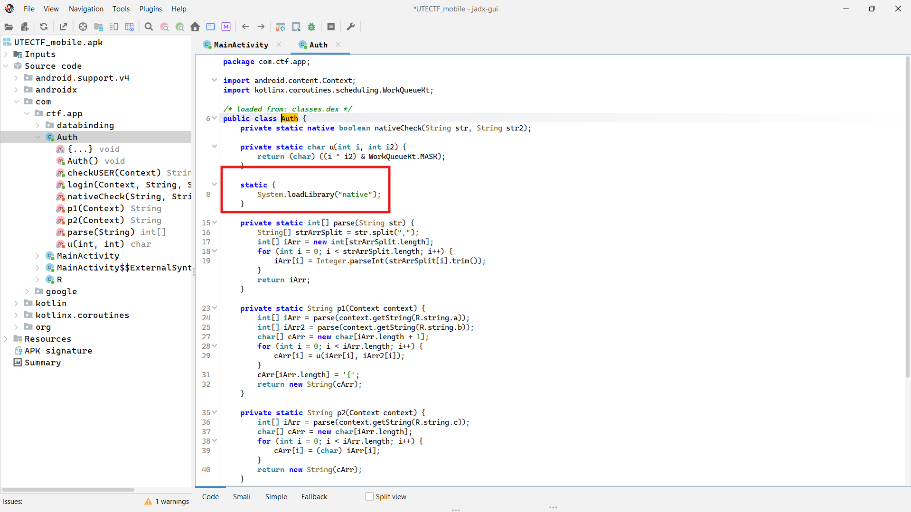
Điều này cho thấy phần kiểm tra đăng nhập không hoàn toàn nằm ở Java mà có liên quan đến JNI / native code.
## 3. Phân tích 
Hàm login() trong Auth.java:
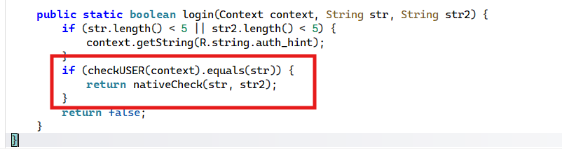
Từ đây có thể kết luận:
* Username được kiểm tra hoàn toàn ở Java layer
* Password được kiểm tra trong native thông qua JNI

Đầu tiên là user ta thấy cơ chế checkUSER như sau:
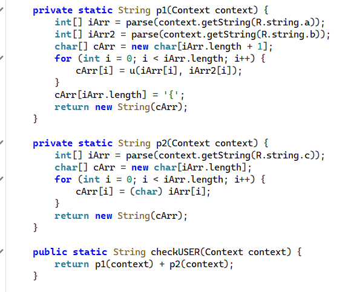
Ta thấy:
1. p1() lấy 2 chuỗi số được từ strings.xml xong XOR với nhau rồi thêm "{" ở cuối
2. p2() chỉ đơn giản lấy biến c trong strings.xml ra
3. checkUSER() ghép 2 phần vào

> Kết quả: UTECTF{L0g1n_By

Sau khi xác định được username, bước tiếp theo là phân tích phần kiểm tra password nằm trong native library.

Do APK về bản chất là một file nén (tương tự ZIP), ta có thể giải nén APK để trích xuất thư viện native libnative.so, sau đó sử dụng các công cụ reverse như IDA hoặc Ghidra để tiếp tục phân tích. 
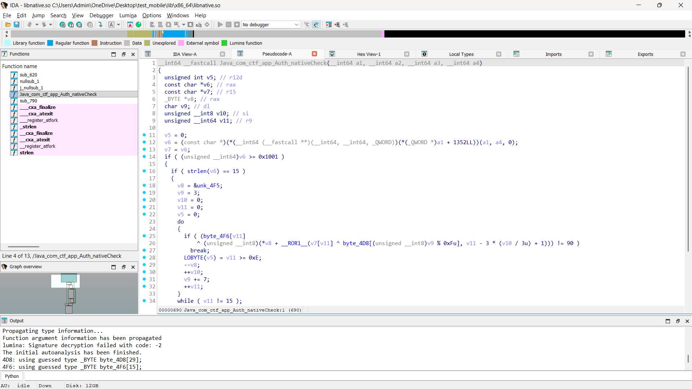
Ta có thể thấy qua logic kiểm tra chính như sau:
1. Kiểm tra độ dài chuỗi đủ 15 kí tự
2. Thực hiện một vòng lặp kiểm tra từng byte của password
3. Nếu toàn bộ 15 byte đều thỏa mãn điều kiện → password hợp lệ

```
do
      {
        if ( (byte_4F6[v11]
            ^ (unsigned __int8)(*v8 + __ROR1__(v7[v11] ^ byte_4D8[(unsigned __int8)v9 % 0xFu], v11 - 3 * (v10 / 3u) + 1))) != 90 )
          break;
        LOBYTE(v5) = v11 >= 0xE;
        --v8;
        ++v10;
        v9 += 7;
        ++v11;
      }
      while ( v11 != 15 );
      LOBYTE(v5) = v5 & 1;
    }
```
Với mỗi ký tự của password, chương trình thực hiện các phép biến đổi sau:
1. XOR ký tự password với một byte trong byte_4D8
1. Thực hiện phép rotate right 8-bit, với số bit xoay phụ thuộc vào vị trí ký tự 
1. Cộng với một byte key phụ (unk_4F5) được duyệt theo thứ tự đảo ngược
1. XOR với giá trị tương ứng trong byte_4F6 và so sánh với hằng số 0x5A

Nếu bất kỳ ký tự nào không thỏa mãn điều kiện, vòng lặp sẽ bị dừng ngay lập tức và password bị coi là không hợp lệ.
Ngược lại, nếu toàn bộ 15 ký tự đều vượt qua kiểm tra, password được xác nhận là đúng.
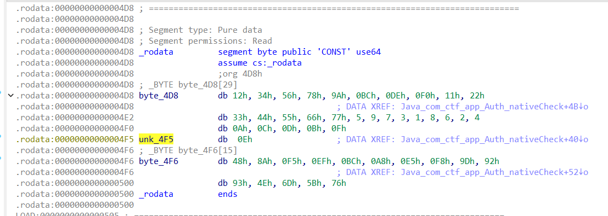
Do toàn bộ các phép biến đổi đều mang tính tuyến tính và khả nghịch, chỉ cần lấy ra các hằng số trong .rodata và đảo ngược thứ tự các phép toán, ta có thể dễ dàng viết script để khôi phục password ban đầu.
```
def ror(v, r):
    return ((v >> r) | (v << (8 - r))) & 0xFF

def rol(v, r):
    return ((v << r) | (v >> (8 - r))) & 0xFF

key1 = [
    0x12, 0x34, 0x56, 0x78, 0x9A,
    0xBC, 0xDE, 0xF0, 0x11, 0x22,
    0x33, 0x44, 0x55, 0x66, 0x77
]

key2 = [
    0x05, 0x09, 0x07, 0x03, 0x01,
    0x08, 0x06, 0x02, 0x04, 0x0A,
    0x0C, 0x0D, 0x0B, 0x0F, 0x0E
]

ref = [
    0x48, 0x8A, 0xF5, 0xEF, 0xBC,
    0xA8, 0xE5, 0xF8, 0x9D, 0x92,
    0x93, 0x4E, 0x6D, 0x5B, 0x76
]


password = []

for i in range(15):
    v = ref[i] ^ 0x5A

    v = (v - key2[14 - i]) & 0xFF

    r = (i % 3) + 1
    v = rol(v, r)

    idx = (3 + 7 * i) % 15
    v ^= key1[idx]

    password.append(chr(v))


print("Password:", "".join(password))
```
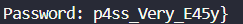

> Flag cuối cùng:
> UTECTF{L0g1n_Byp4ss_Very_E45y}

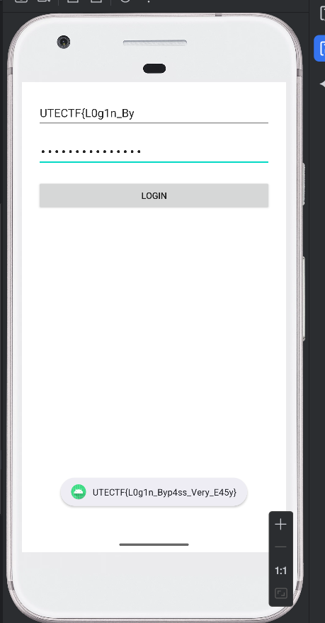
