# VCS Pass-port Blue For3

Gimme your Point
---

Tác giả: soobinHoangDo
Team: K2_2H
___

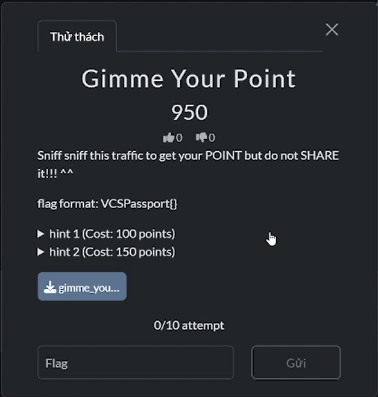
---
Bài cho 1 file pcap sau khi kiểm tra sơ bộ và lọc theo "http" ta thấy:
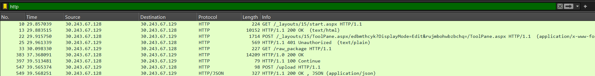

sau khi xem qua stream thấy có các truy vấn bất thường:
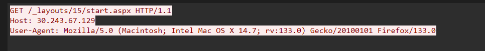
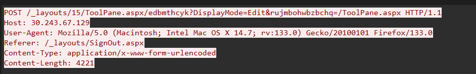

sau khi research thì biết được đây là lỗ hỏng CVE có tên là toolshell cũng do chính VCS phát hiện
> tham khảo blog: https://blog.viettelcybersecurity.com/toolshell-chuoi-lo-hong-sharepoint-nghiem-trong-dang-bi-khai-thac-trong-thuc-te/

Đây là payload được sử  dụng
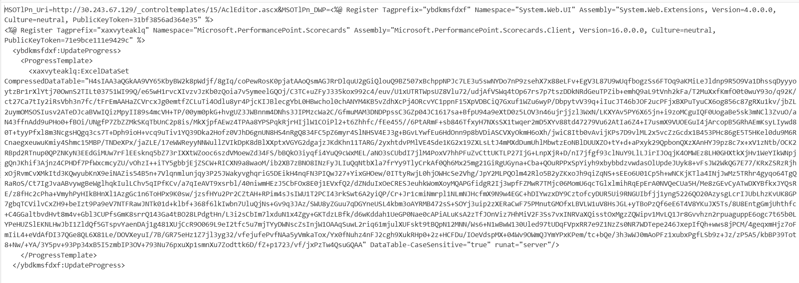

sau khi decode base64 cái đoạn dài ngoằng kia ta được 1 file .gz, sau khi giải nén và kiểm tra thì thấy được:
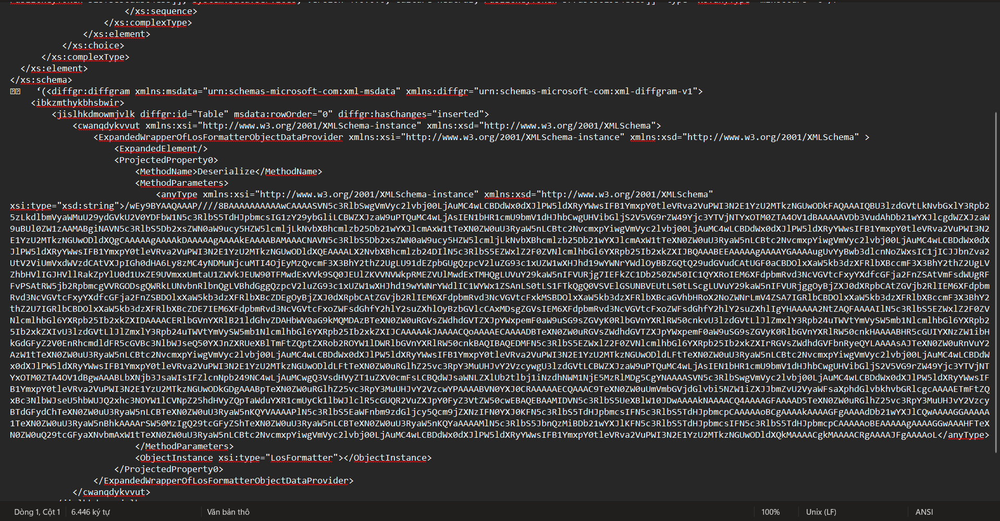

Biết phải làm gì rồi đấy, tiếp tục decode base64 đoạn dài ngoằng kia tiếp thôi
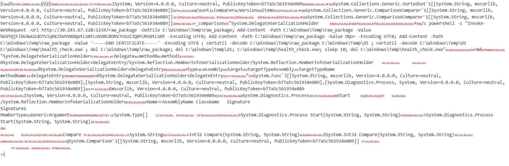

Payload trên làm những việc sau:

1. Download /raw_package
2. GHI THÊM base64 vào file
3. Decode 2 lần ra file .exe

Quay lại pcap ở stream tiếp theo ta có raw_package
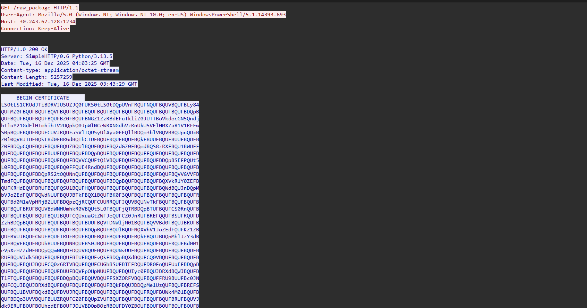

bỏ phần -----BEGIN CERTIFICATE----- và phần -----END CERTIFICATE----- chỉ decode base64 đoạn giữa
Decode lần 1:
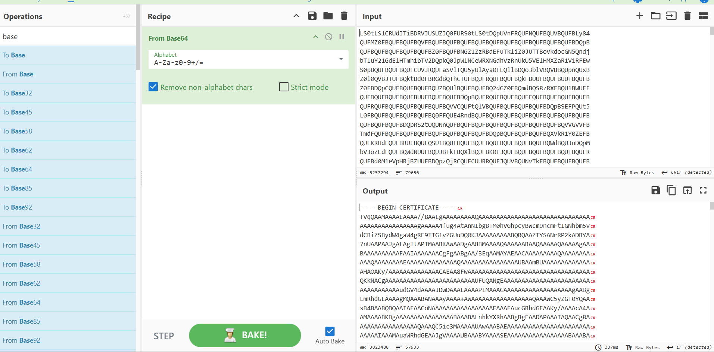

Tiếp tục bỏ begin với end để decode lần 2
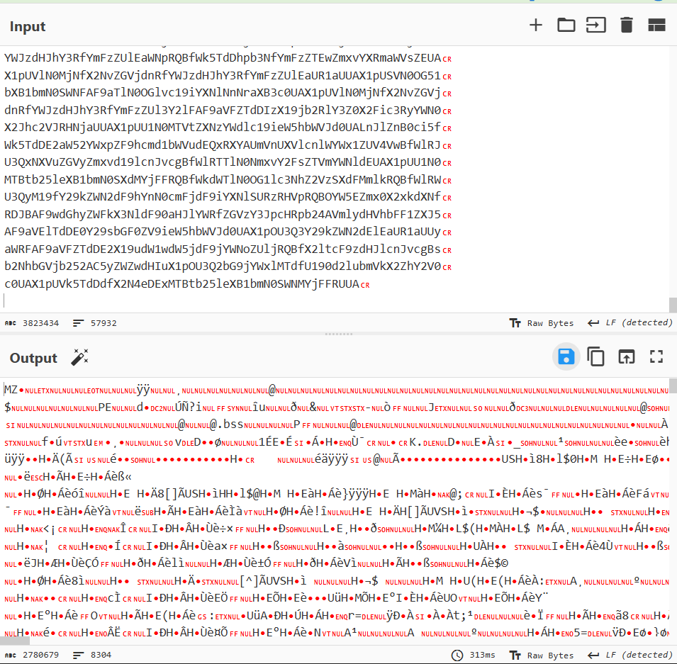

oke giờ ta đã có file `health_check.exe` 
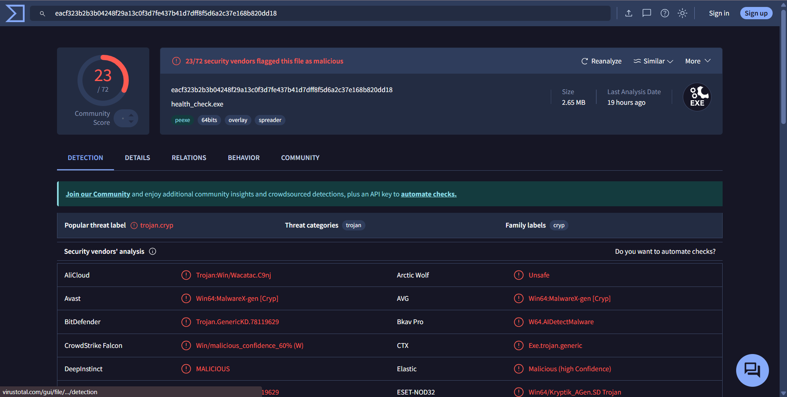

Mở Ida lên để phân tích nào
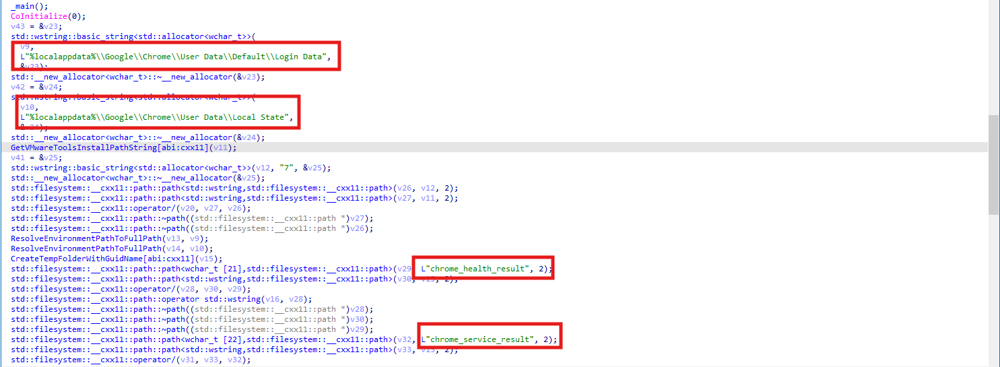
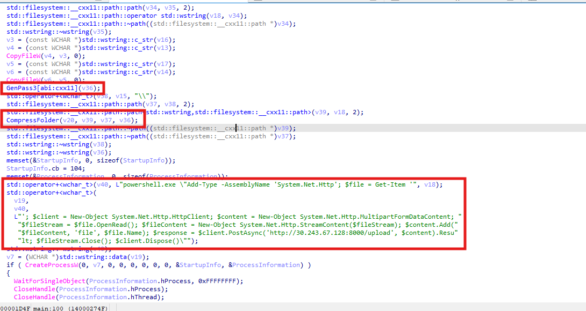

Hiểu sơ qua là con mèo này sẽ copy 2 file Login Data và Local State thành chrome_health_result và chrome_service_result sau đó nén .zip lại đặt pass và gửi lại về server của attacker
File zip thì ở stream cuối cùng trong pcap đã có, chỉ cần lấy về
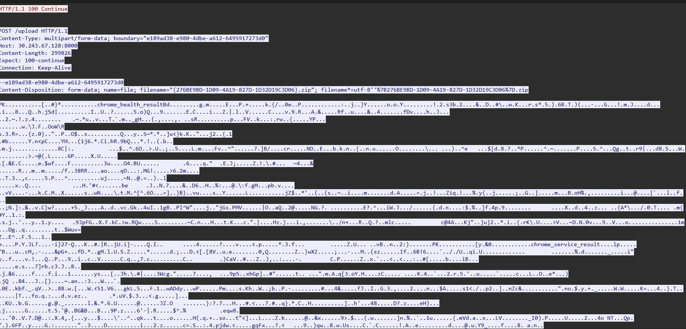

Việc còn lại chỉ là RE 3 cái hàm GenPass để lấy pass mở (Đến đây tôi đã ngồi nhìn IDA 45 phút trong phòng thi nhưng không  ghép được pass đúng dm). Sau khi nhận thấy phân tích static không được tôi quyết định chạy debug con mèo để lấy pass cho dễ 
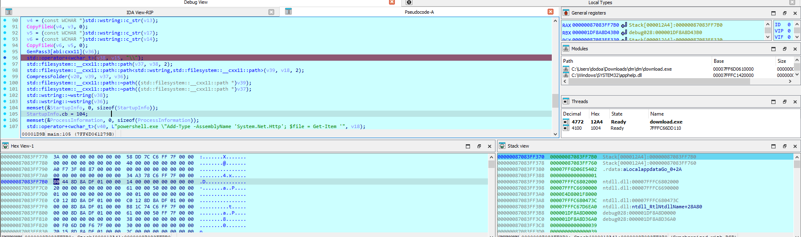

sau khi đến breakpoint tôi lấy địa chỉ của v36 trong thanh ghi rsp+440h hay RAX (vừa return v36) xong nhảy tới đó trong hexView ta thấy địa chỉ này lưu 8 byte con trỏ trỏ tới giá trị v36 nên khi nhảy phát nữa thì
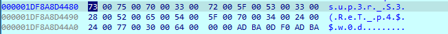

oke có pass rồi mở zip xem dữ liệu bị đánh cắp ta được
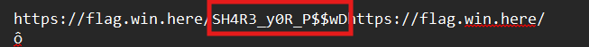

Sau khi viết WU bài này tôi cảm giác dejavu hình như tôi đã làm bài giống vậy ở đâu đó rồi. Anyway tôi đã không thể hoàn thành bài trong cuộc thi nên sẽ phải luyện thêm nhiều để phục thù tương lai gần vậy.
